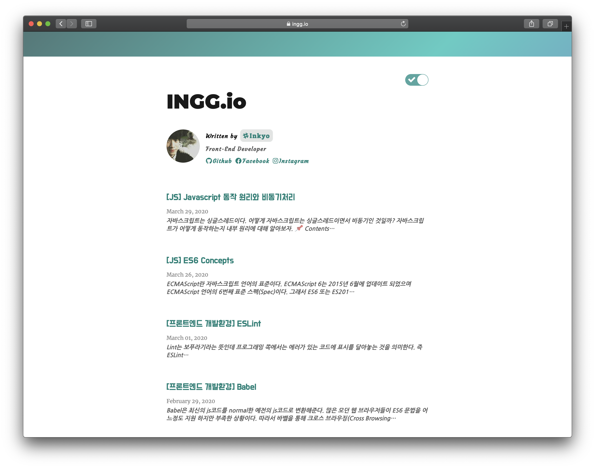

# [ingg.io](https://ingg.io/)

My personal blog using [Gatsby.js](https://github.com/gatsbyjs/gatsby-starter-blog).


## 💫 Deploy

[](https://app.netlify.com/start/deploy?repository=https://github.com/gatsbyjs/gatsby-starter-blog)

## 🛠 Features I added

- 🌙DarkMode : react-switch
- ✅Icon : fortawesome/fontawesome
- 💬Comment : disqus-react
- 📈Analysis : google-analytics
- 🖍Code Style : Add Code Label and Highlight

## 📌 Structure

```
src
├── components // Just component with styling
│   ├── dark-mode // Theme Toggle function
│   │   ├── switch.js
│   │   └── switch.css
│   ├── footer  // footer design
│   │   ├── footer.js
│   │   └── footer.scss
│   ├── top // Nav bar design(header)
│   │   ├── top.js
│   │   └── top.css
│   ├── bio.js  // Profile
│   ├── bio-icon.scss
│   ├── bio.css
│   ├── layout.js   // Components collection. Overall design
│   └── seo.js
├── context // ThemeContext.js
├── pages // 404error page, /(home), /about
│   ├── 404.js
│   ├── about.js
│   ├── about.css
│   ├── index.js    // home(post) style. title, description, date, etc
│   └── index.css
├── styles // Global style
│   └── code.scss   // Code content style
├── templates
│   ├── blog-post.js    // Inside post design.
│   └── blog-post.css   // Post style and Code block styles
└── utils //typography.js

```

## 🔑 LICENSE

[MIT](https://github.com/InKyoJeong/INGG.io/blob/master/LICENSE)

<!-- Function : Scroll Button , Theme Toggle-->
<!-- ## 🧐 What's inside?

    .
    ├── node_modules
    ├── src
    ├── .gitignore
    ├── .prettierrc
    ├── gatsby-browser.js
    ├── gatsby-config.js
    ├── gatsby-node.js
    ├── gatsby-ssr.js
    ├── LICENSE
    ├── package-lock.json
    ├── package.json
    └── README.md

1.  **`/node_modules`**: This directory contains all of the modules of code that your project depends on (npm packages) are automatically installed.

2.  **`gatsby-browser.js`**: This file is where Gatsby expects to find any usage of the [Gatsby browser APIs](https://www.gatsbyjs.org/docs/browser-apis/) (if any). These allow customization/extension of default Gatsby settings affecting the browser.

3.  **`gatsby-config.js`**: This is the main configuration file for a Gatsby site. This is where you can specify information about your site (metadata) like the site title and description, which Gatsby plugins you’d like to include, etc. (Check out the [config docs](https://www.gatsbyjs.org/docs/gatsby-config/) for more detail).

4.  **`gatsby-node.js`**: This file is where Gatsby expects to find any usage of the [Gatsby Node APIs](https://www.gatsbyjs.org/docs/node-apis/) (if any). These allow customization/extension of default Gatsby settings affecting pieces of the site build process.

5.  **`gatsby-ssr.js`**: This file is where Gatsby expects to find any usage of the [Gatsby server-side rendering APIs](https://www.gatsbyjs.org/docs/ssr-apis/) (if any). These allow customization of default Gatsby settings affecting server-side rendering.

6.  **`LICENSE`**: Gatsby is licensed under the MIT license.

7.  **`package-lock.json`** (See `package.json` below, first). This is an automatically generated file based on the exact versions of your npm dependencies that were installed for your project. **(You won’t change this file directly).**

8.  **`package.json`**: A manifest file for Node.js projects, which includes things like metadata (the project’s name, author, etc). This manifest is how npm knows which packages to install for your project.

9.  **`README.md`**: A text file containing useful reference information about your project. -->
