### 브랜치란?

대부분의 프로젝트에서 기능 개발과 에러 수정이 순차적인 흐름으로 진행되지 않기 때문에 작업을 병렬로 진행하기 위해서는 별도의 기능이 필요하다.

그래서 필요한 것이 `브랜치(Branch)`이다. 모든 버전 관리 시스템에는 브랜치라는 개념이 있다. 나뭇가지라는 본래의 뜻에서 알 수 있듯이, 브랜치란 나무에서 가지가 새 줄기를 뻗듯 여러 갈래로 퍼지는 데이터 흐름을 말한다.

깃으로 버전 관리를 시작하면 기본적으로 `master`라는 브랜치가 만들어진다. 사용자가 커밋할 때마다 `master` 브랜치는 최신 커밋을 가리킨다. 즉, 브랜치는 커밋을 가리키는 포인터 같은 것이다.

> #### Git 에서 “master” 브랜치는 특별하지 않다. 다른 브랜치와 다르지 않다. 다만 모든 저장소에서 “master” 브랜치가 존재하는 이유는 git init 으로 초기화할 때 자동으로 만들어진 이 브랜치를 굳이 다른 이름으로 변경하지 않기 때문이다.

<br>

#### 1. 준비

먼저 practice 라는 디렉토리를 만들고 이동한 후 `git init`으로 초기화 한다.
`ls -al` 명령으로 .git 디렉토리를 확인할 수 있다.
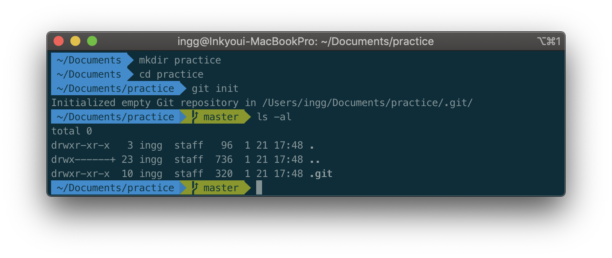

practice 디렉토리 안에 text.txt 파일을 만들고 내용을 입력한다.
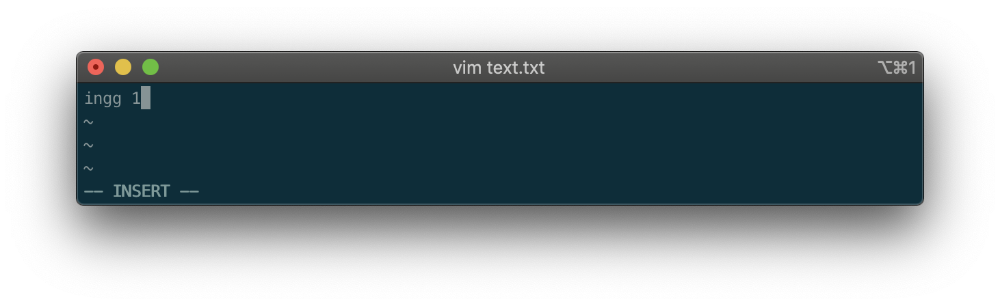

text.txt 파일을 스테이지에 올리고 커밋한다.
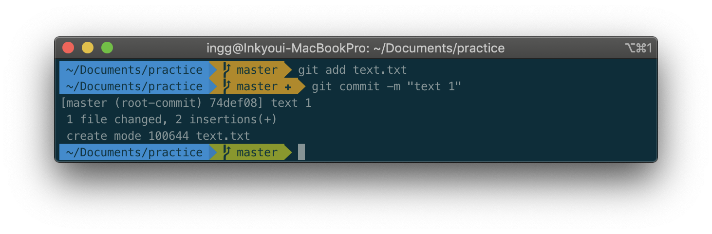

마찬가지로 text 2, text 3도 차례로 커밋한다.
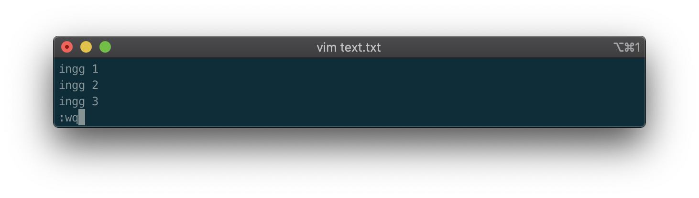
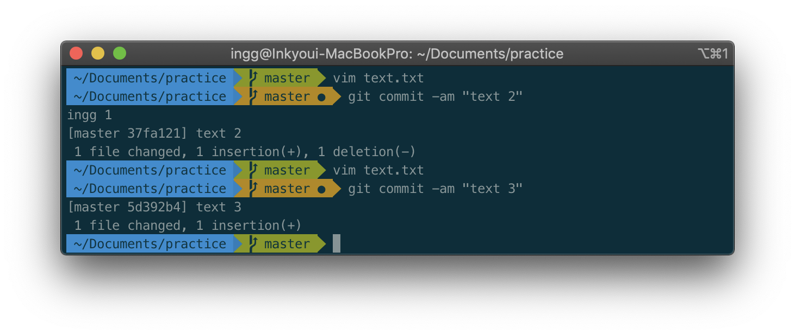

`git log`를 입력하면 커밋 내역을 확인할 수 있다. HEAD가 master 브랜치를 가리키고 있다.
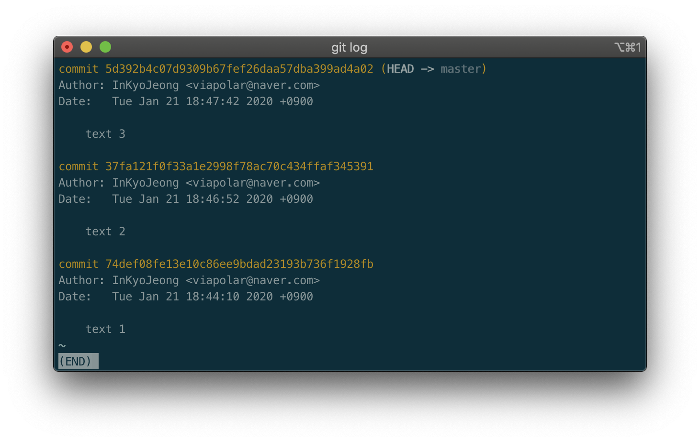

> #### 지금 작업 중인 브랜치가 무엇인지 Git은 어떻게 파악할까. 다른 버전 관리 시스템과는 달리 Git은 'HEAD’라는 특수한 포인터가 있다. 이 포인터는 지금 작업하는 로컬 브랜치를 가리킨다. 기본적으로는 'master'의 선두 부분을 나타낸다. 'HEAD'를 이동하면, 사용하는 브랜치가 변경된다.

<br>

#### 2. 브랜치 생성하기

깃에서 브랜치를 만들거나 확인하는 명령은 `git branch`이다.

```js
$ git branch <branch_name>
```

<br>

`git branch white`를 입력하여 white라는 브랜치를 만들어 보자.
옵션을 지정하지 않고 branch 명령어를 실행하면 브랜치 목록 전체를 확인할 수 있다.
git branch로 현재 브랜치를 확인한다.
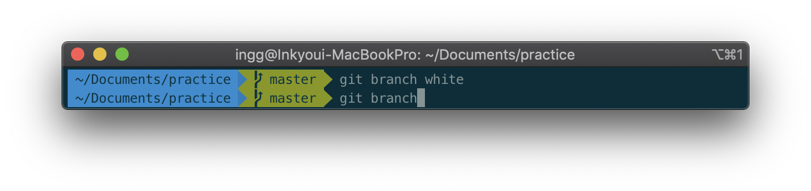
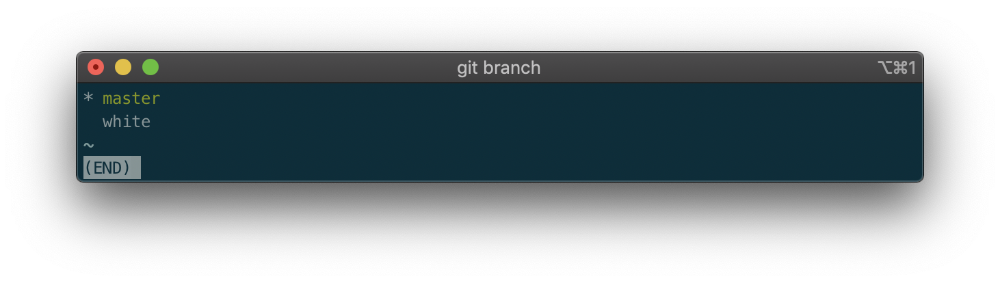
`*`표시는 현재 선택된 브랜치(master)이다.

브랜치를 더 추가한 후 git branch명령으로 모든 브랜치를 확인해보자.
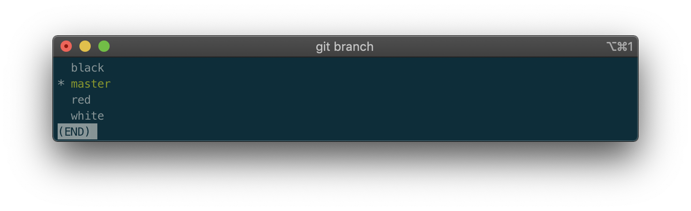
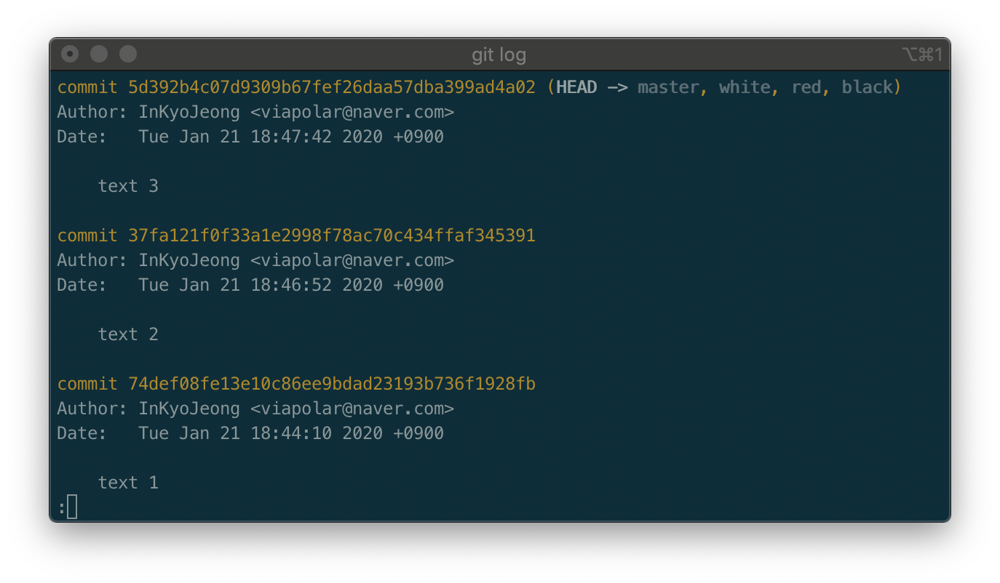

 <br>

#### 3. 브랜치 이동하기

text.txt파일 안에 master를 붙여 내용을 추가한 후 커밋해보자.
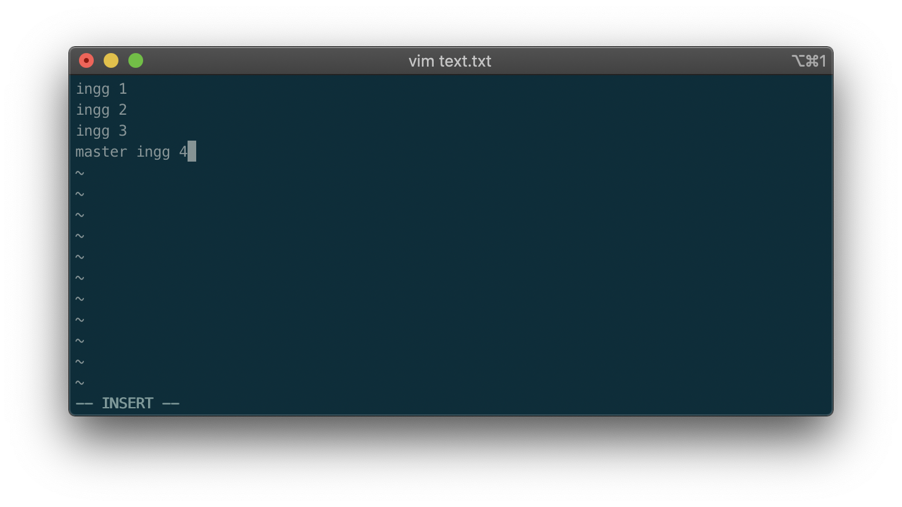
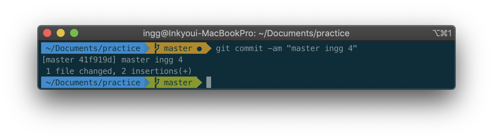

master를 붙인 커밋은 'master'에만 적용되어 있다. 나머지 브랜치는 아직 'text 3'에 머물고 있다.
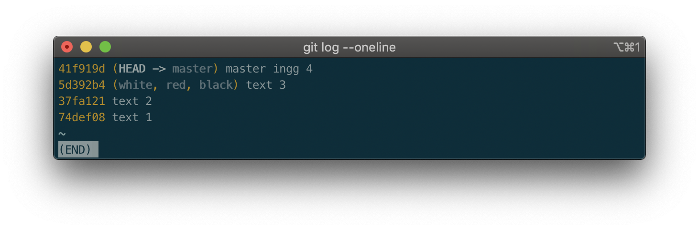

matser에서 다른 브랜치로 이동해보자.
다른 브랜치로 이동하는 명령은 `git checkout`이다.

```js
$ git checkout <branch>
```


이동 후 커밋로그를 확인해보면 **HEAD**가 **white**브랜치를 가리키고 있고, white브랜치를 분기하기 전까지 master브랜치에 있던 커밋들이 그대로 white브랜치에 복사된 것을 알 수 있다.
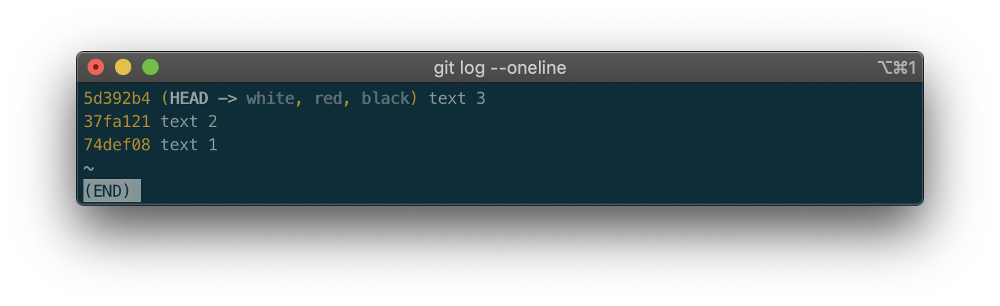

text.txt파일 내용도 물론 'ingg 3'까지만 존재한다.
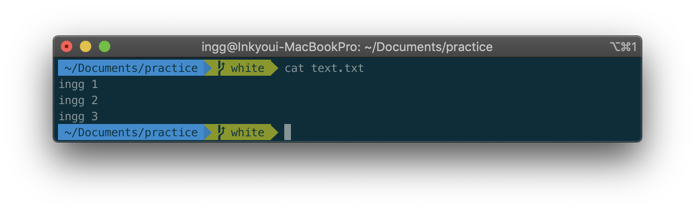

white브랜치가 master브랜치에서 분기된 이후에 master브랜치에 추가된 커밋은 white브랜치에 영향을 미치지 않는다는 것을 알 수 있다.

<br>

#### 4. 브랜치 정보 확인하기

white브랜치의 text파일에 텍스트 추가, white파일을 생성하고 텍스트를 추가한 후 커밋한다.
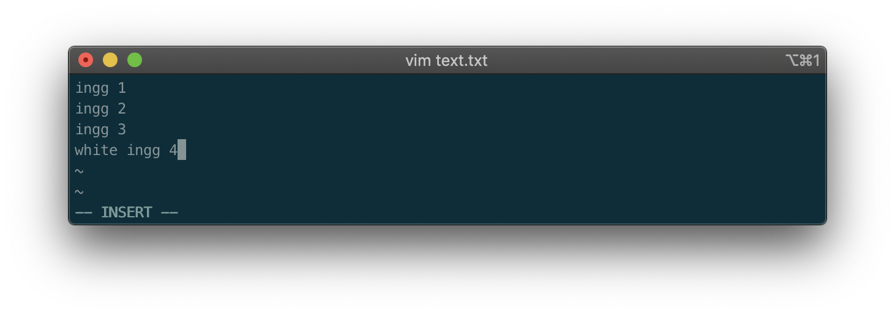
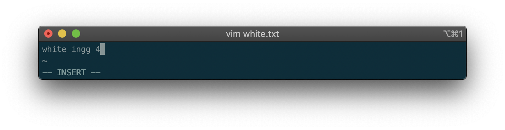
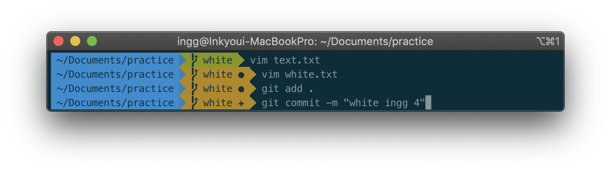

갈라지는 브랜치는 `git log --oneline --branches --graph` 명령으로 쉽게 확인할 수 있다. 현재 브랜치가 가리키고 있는 히스토리가 무엇이고 어떻게 갈라져 나왔는지 보여준다.
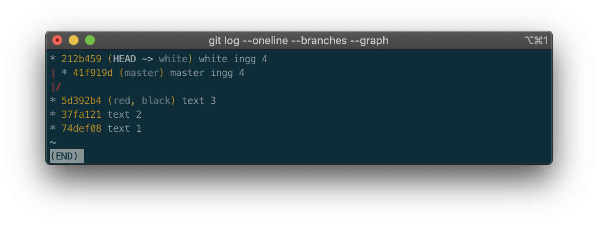
white브랜치에서는 'text 3' 커밋 다음에 'white ingg 4' 커밋이 만들어졌고,
master브랜치와 white브랜치 커밋은 같은 **Parent** 커밋('text 3')을 가지고 있다.

<br>

#### 5. 브랜치 병합하기

브랜치 통합에는 `merge` 를 사용하는 방법과 `rebase`를 사용하는 방법의 2가지 종류가 있다. 어느 쪽을 사용하느냐에 따라 통합 후의 브랜치의 이력이 크게 달라진다.

#### \* merge

`merge`를 이용하면 여러 개의 브랜치를 하나로 모을 수 있다.

아래 그림과 같이 `master`브랜치에서 분기하는 `fix`라는 브랜치가 있다고 하자.
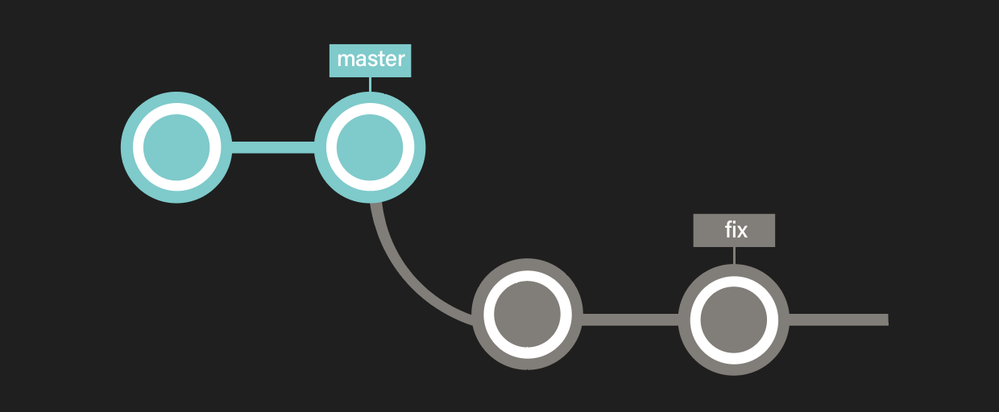

master 브랜치에서 브랜치를 분기한 후 master 브랜치에 **아무 변화가 없다면 (커밋을 만들지 않았으면)** 분기한 브랜치를 매우 쉽게 병합할 수 있다.
**_fix_** 브랜치의 이력은 **_master_** 브랜치의 이력을 모두 포함하고 있기 때문에, **_master_** 브랜치는 단순히 **이동하기만 해도** **_fix_** 브랜치의 내용을 적용할 수 있다.
<br>

이런 병합을 `빨리 감기 병합(fast-forward merge)`이라고 한다. (git merge명령의 결과가 단순히 포인터를 움직인 것이라 따로 커밋 메세지 창은 열리지 않는다.)
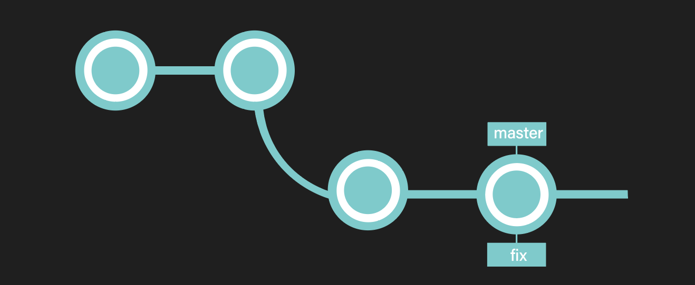

그러나 **_fix_** 브랜치를 분기한 이후 **_master_** 브랜치에 여러 변경 사항이 적용되는 경우, **_master_** 브랜치 내의 변경 내용과 **_fix_** 브랜치 내의 변경 내용을 하나로 통합할 필요가 있다.


따라서 양쪽의 변경을 가져온 `merge commit(병합 커밋)`을 실행하게 된다. 병합 완료 후, 통합 브랜치인 **_master_** 브랜치로 통합된 이력이 아래 그림과 같이 생긴다.
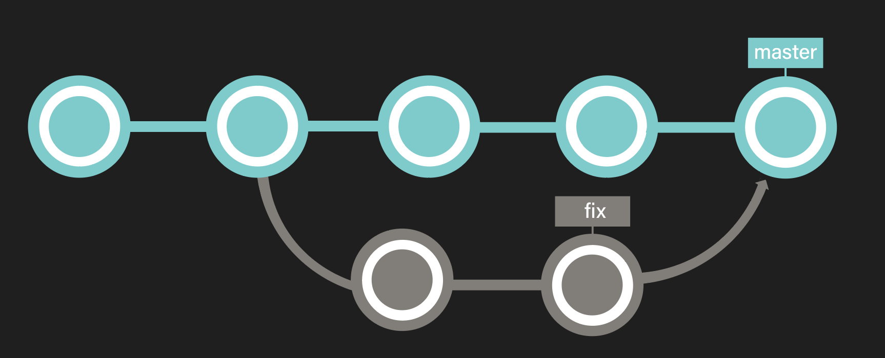

<br>

#### \* rebase
