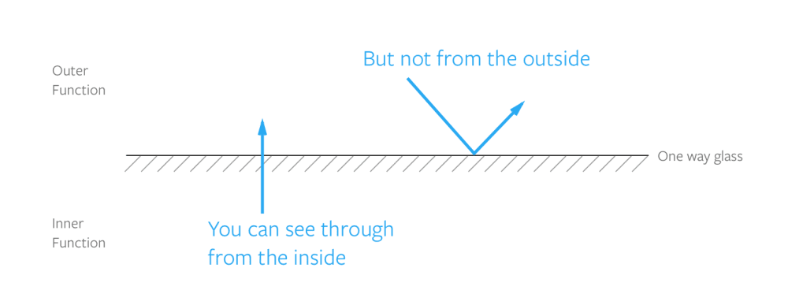
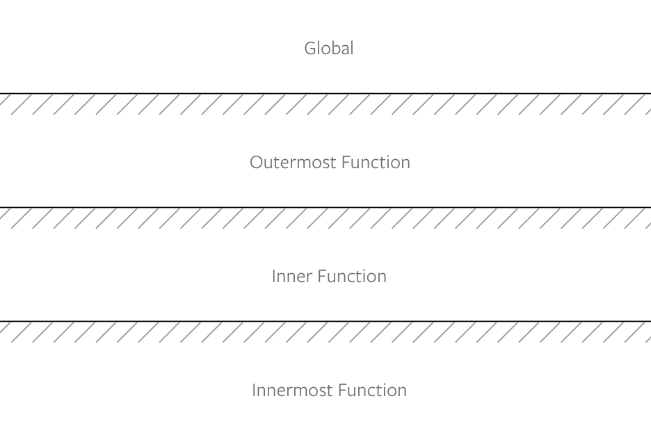
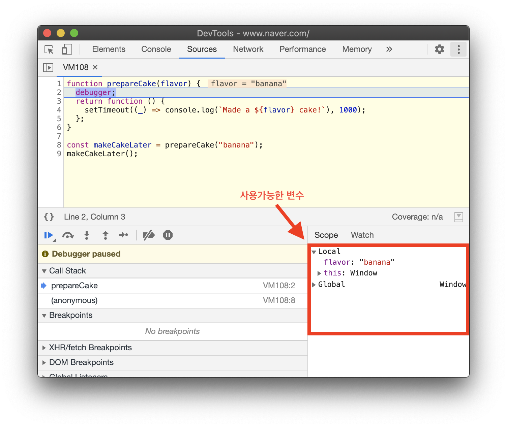
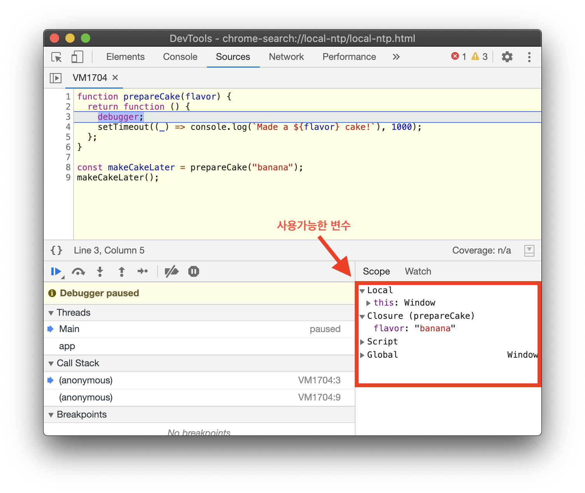
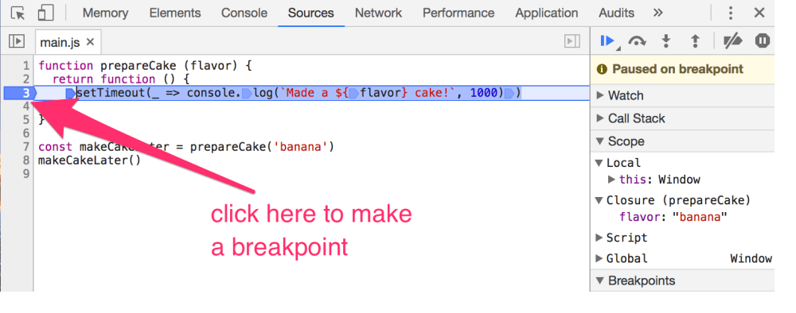

> 이 글은 [JavaScript Scope and Closures by Zell Liew](https://css-tricks.com/javascript-scope-closures/)를 저작자의 동의를 얻고 번역한 글입니다.

<br>

### 📌Contents

1. [스코프(Scope)](#scope)
2. [클로저(Closures)](#closures)
3. [개발자 도구 스코프 디버깅](#debug)

---

<br>

### <a name="scope"></a>스코프(Scope)

<hr>

자바스크립트에서 스코프는 어떤 변수에 접근할 수 있는지를 정의한다. 스코프에는 **전역 스코프(global scope)** 와 **지역 스코프(local scope)** 두가지 종류가 있다.

<br>

### 전역 스코프(global scope)

<hr>

만약 변수가 모든 함수 또는 중괄호 `{}` 바깥에서 선언되었으면 전역 스코프에 정의된다고 한다.

> ##### 이것은 웹 브라우저의 자바스크립트에 대해서만 유효하다. Node.js에서는 전역 스코프를 다르게 정의하지만, 이번 글에서는 다루지 않는다.

```js
const globalVariable = "some value";
```

전역 변수를 선언하면, 여러분의 코드 모든 곳에서, 심지어 함수에서도 해당 변수를 사용할 수 있다.

```js
const hello = "Hello CSS-Tricks Reader!";

function sayHello() {
  console.log(hello);
}

console.log(hello); // 'Hello CSS-Tricks Reader!'
sayHello(); // 'Hello CSS-Tricks Reader!'
```

비록 전역 스코프에 변수를 선언할 수는 있어도, 그러지 않는 것이 좋다. 두 개 이상의 변수의 이름이 충돌하는 경우(naming collisions)가 생길 수도 있기 때문이다. 만약 변수를 `const`나 `let`을 사용하여 선언했다면, 이름에 충돌이 발생할 때마다 에러가 발생한다. 이것은 바람직하지 않다.

```js
// Don't do this!
let thing = "something";
let thing = "something else"; // Error, thing has already been declared
```

만약 변수를 `var`로 선언하면, 두번째 변수는 첫번째 변수를 덮어쓴다. 이것 또한 디버깅을 어렵게 해서 바람직하지 않다.

```js
// Don't do this!
var thing = "something";
var thing = "something else"; // perhaps somewhere totally different in your code
console.log(thing); // 'something else'
```

그러므로 전역변수가 아니라 지역변수로 선언해야 한다.

<br>

### 지역 스코프(local scope)

<hr>


코드의 특정 부분에서만 사용할 수 있는 변수는 지역 스코프에 있다고 할 수 있다. 이런 변수들은 지역 변수라고 불린다.

자바스크립트에서는 두가지 지역 스코프가 존재한다. **함수 스코프(function scope)** 와 **블록 스코프(block scope)** 이다.

#### 함수 스코프(function scope)

함수 안에서 변수를 선언하면, 이 변수를 그 함수 안에서만 접근할 수 있다. 함수 바깥에서는 해당 변수에 접근할 수 없다.

아래 예에서, 변수 `hello`는 `sayHello`의 스코프 내에 존재한다:

```js
function sayHello() {
  const hello = "Hello CSS-Tricks Reader!";
  console.log(hello);
}

sayHello(); // 'Hello CSS-Tricks Reader!'
console.log(hello); // Error, hello is not defined
```

<br>

#### 블록 스코프(block scope)

중괄호 `{}` 내부에서 `const` 또는 `let`으로 변수를 선언하면, 그 변수들은 중괄호 블록 내부에서만 접근할 수 있다.

아래 예에서, `hello`는 중괄호 내의 스코프에 존재한다:

```js
{
  const hello = "Hello CSS-Tricks Reader!";
  console.log(hello); // 'Hello CSS-Tricks Reader!'
}

console.log(hello); // Error, hello is not defined
```

함수는 중괄호를 이용해 선언해야 하므로, 블록 스코프는 함수 스코프의 부분 집합(subset)이다. (화살표함수(arrow functions)를 사용해서 암시적(implicit) 반환을 하는게 아니라면)

<br>

### 함수 호이스팅(Function hoisting)과 스코프

<hr>

함수가 **함수 선언식(function declaration)** 으로 선언되면, 현재 스코프의 최상단으로 `호이스팅(hoisting)`된다. 그러므로 다음 두가지는 동일하다:

```js
// This is the same as the one below
sayHello();
function sayHello() {
  console.log("Hello CSS-Tricks Reader!");
}

// This is the same as the code above
function sayHello() {
  console.log("Hello CSS-Tricks Reader!");
}
sayHello();
```

<br>

반면 함수가 **함수 표현식(function expression)** 으로 선언되면, 함수는 현재 스코프의 최상단으로 호이스팅되지 않는다.

```js
sayHello(); // Error, sayHello is not defined
const sayHello = function () {
  console.log(aFunction);
};
```

이렇게 함수 호이스팅은 혼란스러울 수 있어, 사용하면 안된다. 언제나 함수를 사용하기 전에 선언해야 한다.

> cf) 그러나 원문의 코멘트 중에 이런 의견도 있었다. 참고하면 좋을 것 같다: <br>Nice article. Only your recommendation to not use hoisted functions is not correct in my opinion. Hoisting can make your files more readable and more clear by giving you the opportunity to abstract complex functionality in functions and put those at the end of the file, available for inspection when needed.

<br>

### 함수는 서로의 스코프에 접근할 수 없다

<hr>

함수들이 각각 따로 선언되었을 때, 서로의 스코프에는 접근할 수 없다. (한 함수가 다른 함수에서 사용된다고 하더라도)

아래 예에서, `second`는 `firstFunctionVariable`에 접근할 수 없다.

```js
function first() {
  const firstFunctionVariable = `I'm part of first`;
}

function second() {
  first();
  console.log(firstFunctionVariable); // Error, firstFunctionVariable is not defined
}
```

<br>

### 네스팅된 스코프(Nested scopes)

<hr>

함수가 다른 함수에서 정의되었을때, 그 내부 함수는 외부함수의 변수에 접근할 수 있다. 이러한 행동을 **lexical scoping** 이라고 한다.

그러나, 외부 함수는 내부함수의 변수에 접근할 수 없다.

```js
function outerFunction() {
  const outer = `I'm the outer function!`;

  function innerFunction() {
    const inner = `I'm the inner function!`;
    console.log(outer); // I'm the outer function!
  }

  innerFunction();

  console.log(inner); // Error, inner is not defined
}
```

어떻게 스코프가 작동하는가 시각화하기 위해 단방향 유리(one-way glass)를 생각할 수 있다. 여러분은 바깥을 볼 수 있지만, 바깥에있는 사람들은 내부를 볼 수 없다.



만약 스코프 내부에 스코프가 있다면, 다수의 단방향 유리로 생각할 수 있다.



지금까지의 스코프에 대해 이해했으니, 클로저(Closures)가 무엇인지 이해할 준비가 됐다.

<br>

### <a name="closures"></a>클로저(Closures)

<hr>

함수 내부에 함수를 생성할 때마다, 여러분은 클로저를 생성한 것이다. 내부 함수가 바로 클로저이다. 이 클로저는 보통 반환되어서 차후에 외부 함수의 변수를 사용할 수 있다.

```js
function outerFunction() {
  const outer = `I see the outer variable!`;

  function innerFunction() {
    console.log(outer);
  }

  return innerFunction;
}

outerFunction()(); // I see the outer variable!
```

내부 함수는 반환되기 때문에 함수를 선언하면서 return 문을 작성하여 코드를 약간 줄일 수도 있다.

```js
function outerFunction() {
  const outer = `I see the outer variable!`;

  return function innerFunction() {
    console.log(outer);
  };
}

outerFunction()(); // I see the outer variable!
```

<br>

클로저는 외부 함수의 변수에 접근할 수 있기 때문에, 보통 두가지 목적으로 사용된다.

1. **사이드 이펙트(side effects) 제어**
2. **private 변수 생성**

<br>

#### 클로저로 사이드 이펙트 제어하기

사이드 이펙트는 함수에서 값을 반환할때를 제외하고 무엇인가를 행할때 발생한다. 여러가지 것들이 사이드 이펙트가 될 수 있다. `Ajax요청`이나, `timeout`, `console.log` 를 선언하는 것도 사이드 이펙트이다.

```js
function (x) {
  console.log('A console.log is a side effect!')
}
```

사이드 이펙트를 제어하기 위해 클로저를 사용할 때, 여러분은 **_Ajax_** 나 **_timeout_** 과 같이 코드 흐름을 방해하는 것들에 대해 다룰 것이다.

<!-- When you use closures to control side effects, you’re usually concerned with ones that can mess up your code flow like Ajax or timeouts. -->

더 명확하게하기 위해 예제를 통해 살펴 보자.

여러분 친구의 생일케이크를 만들고 싶다고 하자. 이 케이크를 만드는 데 1초가 걸려서, 1초 후에 `made a cake`을 log 하는 함수를 작성했다.

```js
function makeCake() {
  setTimeout(() => console.log("Made a cake"), 1000);
}
```

보다시피, 케이크를 만드는 함수는 사이드 이펙트가 존재한다. 바로 `timeout`이다.

이제 친구가 케이크 맛을 선택할 수 있게 하기 위해, `makeCake`함수에 맛을 추가하여 작성한다.

```js
function makeCake(flavor) {
  setTimeout(() => console.log(`Made a ${flavor} cake!`), 1000);
}
```

함수를 실행하면, 1초후에 즉시 케이크가 만들어진다.

```js
makeCake("banana");
// Made a banana cake!
```

여기서 문제는 맛을 알고 나서 즉시 케이크를 만들고 싶지 않다는 것이다.

이 문제를 해결하기 위해 맛을 저장하는 함수인 `prepareCake`를 작성하고, `prepareCake`내부에 클로저 `makeCake`를 반환한다.

이 시점부터, 언제든지 원할 때마다 반환된 함수를 호출할 수 있고 1초 안에 케이크가 만들어진다.

```js
function prepareCake(flavor) {
  return function () {
    setTimeout(() => console.log(`Made a ${flavor} cake!`), 1000);
  };
}

const makeCakeLater = prepareCake("banana");

// And later in your code...
makeCakeLater();
// Made a banana cake!
```

이것이 클로저를 사용하여 사이드 이펙트를 줄이는 방법이다. 내부 클로저를 활성화하는 함수를 만드는 것이다.

<br>

#### Private 변수와 클로저

여러분도 알다시피, 함수 내에서 생성된 변수는 함수 바깥에서 접근할 수 없다. 그 변수들은 접근할 수 없기 때문에, `private 변수`라고 불린다.

그러나 가끔 해당 변수들에 접근해야 할 필요가 있다. 클로저의 도움으로 할 수 있다.

```js
function secret(secretCode) {
  return {
    saySecretCode() {
      console.log(secretCode);
    },
  };
}

const theSecret = secret("CSS Tricks is amazing");
theSecret.saySecretCode();
// 'CSS Tricks is amazing'
```

위의 예제에서 `saySecretCode`는 유일하게 secret함수 바깥에서 `secretCode`를 노출하는 함수(클로저)이다. 따라서 이런 함수를 특권 함수(privileged function)라고 부른다.

<br>

### <a name="debug"></a>개발자 도구로 스코프 디버깅하기

<hr>

크롬과 파이어폭스 개발자도구로 현재 스코프에서 접근할 수 있는 변수들을 쉽게 디버깅할 수 있다. 이 기능을 사용하는 두가지 방법이 있다.

첫 번째 방법은 `debugger` 키워드를 코드에 추가하는 것이다. 이렇게 하면 브라우저상에서 자바스크립트의 실행을 일시 정지하여 디버깅할 수 있다.

`prepareCake`의 예시이다:

```js{3}
function prepareCake(flavor) {
  // Adding debugger
  debugger;
  return function () {
    setTimeout(() => console.log(`Made a ${flavor} cake!`), 1000);
  };
}

const makeCakeLater = prepareCake("banana");
makeCakeLater();
```

크롬에서 개발자 도구를 열고 **Source** 탭에 가면 (파이어폭스는 **Debugger** 탭) 이용가능한 변수들을 확인할 수 있다.



<br>

또한 `debugger`키워드를 클로저 내부로 이동시킬 수 있다. 이번에는 스코프의 변수들이 어떻게 변하는지 보자.

```js{4}
function prepareCake(flavor) {
  return function () {
    // Adding debugger
    debugger;
    setTimeout(() => console.log(`Made a ${flavor} cake!`), 1000);
  };
}

const makeCakeLater = prepareCake("banana");
makeCakeLater();
```




<br>

디버깅 기능을 이용하는 두번째 방법은 직접 **Source** 탭에서 라인 번호를 클릭해서 breakpoint를 추가하는 방법이다.



<br>

#### 정리

스코프와 클로저는 이해하기 아주 어려운 개념들은 아니다. 단방향 유리를 통해 보는 원리로 생각하면 간단하다.

함수내에서 변수를 선언하면 그 함수 안에서만 접근할 수 있다. 이러한 변수들은 함수의 스코프내에 있다고 말한다.

다른 함수 안에서 내부 함수를 정의하면, 내부 함수는 클로저라고 한다. 이 클로저는 외부 함수에서 생성된 변수들에 접근할 수 있는 권한을 가지고 있다.
