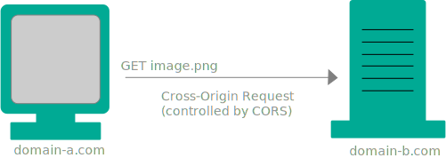
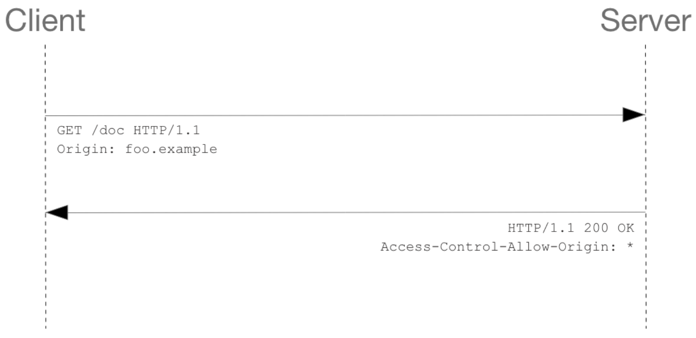
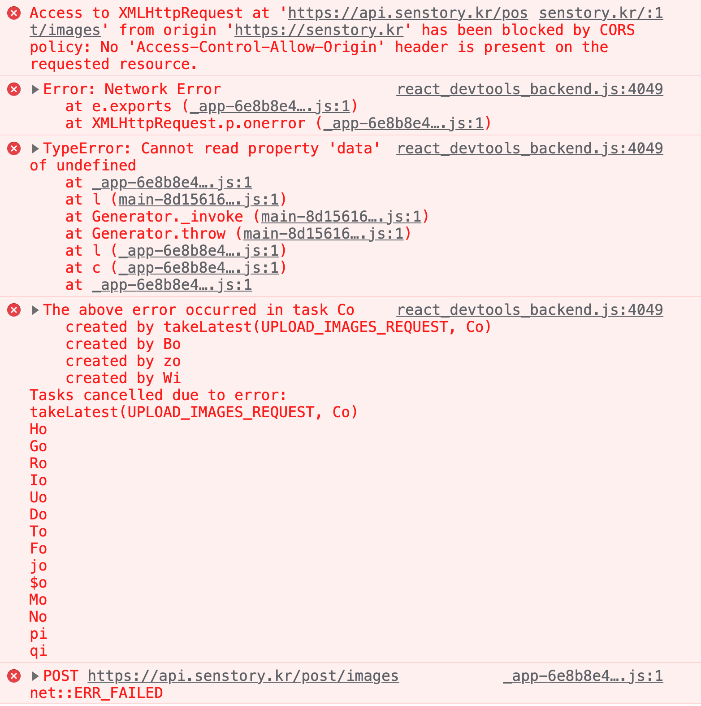

<br>

---

### 📌 Contents
 
1. [CORS 등장 배경](#cors_background)  
2. [CORS 란?](#whatiscors)  
3. [CORS 동작 방식](#cors_way)
4. [CORS 해결 방법](#cors_solution)
5. [nginx와 CORS](#cors_nginx)


---

<br>

### <a name="cors_background"></a>CORS 등장 배경

<hr>

예전에 웹사이트를 만들때는 대부분 하나의 서버에서 브라우저의 모든 요청을 처리했지만 점점 웹사이트에서 할수있는 일이 많아졌다.
(ex 날씨 api 를 이용하여 기능을 넣으려고 할때)

그러나 웹브라우저와 날씨 api 도메인이 서로  달라서 요청을 주고받을 수 없기 때문에, 이를 해결하기 위한 [JSONP](https://ko.wikipedia.org/wiki/JSONP) 라는 방식이 있었다. `<script>` 요소는 외부 출처로부터 조회된 내용을 실행하는 것이 허용되므로 서버에서 데이터를 반환하는 용도로 사용하는 것이다.


```js
// 함수이름을 넣어 요청 
const script = document.createElement("script")
script.src = "ingg.com/test.json?callback=parseResponse"

// 서버에서는 함수이름을 넣고 매개변수로 데이터를 넣어서 반환
parseResponse({
"id" : "123",
"name" : "ingg",
})

function parseResponse(data){
    // ...
}
```

cors가 나오기 전까지 사용 되던 방식이며, 현재는 보안상의 이슈로 거의 사용하지 않는다.


<br>

### <a name="whatiscors"></a>CORS 란
 
<hr>

> #### 교차 출처 리소스 공유(Cross-Origin Resource Sharing, CORS)는 추가 HTTP 헤더를 사용하여, 한 출처에서 실행 중인 웹 애플리케이션이 다른 출처의 선택한 자원에 접근할 수 있는 권한을 부여하도록 브라우저에 알려주는 체제이다. - MDN

여기서 **origin(출처)** 이란 **_scheme(protocol), host(domain), port_** 로 구성된다.  예를들어, _https://www.google.com/maps_ 라는 주소가 있다고하면 

protocol은 `https://` Host는 `www.google.com` Port는 `:443` 이며, **동일 출처(Same Origin)**란 _scheme, host, port_ 가 모두 같을때를 말한다. 

또한 **SOP(Same-Origin Policy)**이란 같은 출처에서만 리소스를 공유할 수 있다는 규칙이다. 브라우저에서 다른 서버에서 요청할 경우에 해당되고, 브라우저를 거치지 않고 서버 간 통신을 할 때는 이 정책이 적용되지 않는다.

그런데 이런 정책이 왜 존재할까? 만약 다른 출처의 어플리케이션이 서로 통신하는 것에 대해 아무런 제약도 존재하지 않는다면 악의를 가진 사용자가 소스 코드를 보고 [CSRF(Cross-Site Request Forgery)](https://ko.wikipedia.org/wiki/%EC%82%AC%EC%9D%B4%ED%8A%B8_%EA%B0%84_%EC%9A%94%EC%B2%AD_%EC%9C%84%EC%A1%B0) 나 [XSS(Cross-Site Scripting)](https://ko.wikipedia.org/wiki/%EC%82%AC%EC%9D%B4%ED%8A%B8_%EA%B0%84_%EC%8A%A4%ED%81%AC%EB%A6%BD%ED%8C%85) 와 같은 방법을 사용하여 정보를 탈취할 수 있다. 
 
CORS는 다른 출처의 리소스가 필요한 경우,  SOP를 우회하기 위한 여러가지 방법 중 가장 권장되는 방법이다.

<br>

### <a name="cors_way"></a>CORS 동작 방식
 
<hr>

cors 접근 제어 시나리오 (교차 출처 리소스 공유가 동작하는 방식)에는 크게 세가지가 있다. 

#### 프리플라이트 요청 (Preflight Request)


Preflight Request는 요청을 예비 요청과 본 요청으로 나눈다. `OPTIONS` 메서드를 통해 다른 도메인의 리소스에 요청이 가능한지 (실제 요청이 전송하기에 안전한지) 확인 작업을 하고, 요청이 가능하다면 실제 요청을 보낸다. Cross-origin 요청은 유저 데이터에 영향을 줄 수 있기 때문에 Preflight 요청을 한다.

클라이언트와 서버간의 첫 번째 통신인 preflight request/response 를 살펴보자.

- **_Preflight Request_**

OPTIONS 요청과 함께 두 개의 다른 요청 헤더가 전송된다. 아래에서 첫 행은 실제 요청을 전송할 때 POST 메서드로 전송된다는 것이고, 두번째 행은 실제 요청을 전송 할 때 X-PINGOTHER 와 Content-Type 사용자 정의 헤더와 함께 전송된다는 것을 서버에 알려준다.

```bash
Access-Control-Request-Method: POST	# 실제요청의 메서드
Access-Control-Request-Headers: X-PINGOTHER, Content-Type # 실제요청의 추가헤더
```

- **_Preflight Response_**

서버가 메서드와 헤더를 받을 수 있음을 알려준다. 마지막행은 preflight request에 대한 응답을 캐시할 수 있는 시간(초)이다. 아래에서는 86400초 (=24시간) 

프리플라이트를 보내면 사전, 실제 요청 두번이 매번 왔다갔다 하므로 브라우저가 캐싱을 해두고 똑같은 요청을 보낼때, 사전 요청을 보내지 않고 바로 본 요청을 보낸다.

```bash
Access-Control-Allow-Origin: http://foo.example	# 서버측 허가출처
Access-Control-Allow-Methods: POST, GET, OPTIONS # 허가 메서드
Access-Control-Allow-Headers: X-PINGOTHER, Content-Type	# 서버측 허가헤더
Access-Control-Max-Age: 86400 # Prefilght 응답 캐시기간
```


preflight request가 완료되면 실제 요청을 전송한다.


<!-- [Preflight Response] 가 가져야하는 특징
- 응답 코드는 200대여야함
- 응답 바디는 비어있는것이 좋음 -->


<br>

#### 단순 요청 (Simple Request)



Simple Request는 Preflight Request와 다르게 요청을 보내면서 즉시 cross origin인지 확인하는데, 다음 조건을 모두 충족해야한다.

- 메서드는 _GET POST HEAD_ 중 하나
- 헤더는 _Accept, Accept-Language, Content-Language, Content-Type_ 만 허용
- Content-Type 헤더는 다음의 값들만 허용
  - application/x-www-form-urlencoded
  - multipart/form-data
  - text/plain

<br>

#### 인증정보 포함 요청 (Credentialed Request)

인증 관련 헤더를 포함할 때 사용하는 요청이다. 브라우저가 제공하는 비동기 리소스 요청 API인 XMLHttpRequest 객체나 fetch API는 별도의 옵션 없이 브라우저의 쿠키 정보나 인증과 관련된 헤더를 기본적으로 요청에 담지 않으므로, credentials 옵션을 변경하지 않고서는 cookie를 주고 받을 수 없다.

옵션은 세가지가 있다.

- **_omit_** : 절대로 cookie 들을 전송하거나 받지 않는다.
- **_same-origin_** : 동일 출처(same origin)이라면, user credentials (cookies, basic http auth 등..)을 전송한다. (default 값)
- **_include_** : cross-origin 호출이라 할지라도 언제나 user credentials (cookies, basic http auth 등..)을 전송한다.

<br>

_예시)_

```js
fetch('주소', {
 credentials: 'include', // 모든 요청에 인증 정보 포함
});
```

**axios** 로 통신할 시, **_withCredentials_** 설정을 **_true_** 로 넣어주면 된다.

```js
axios.post(주소, 데이터, { withCredentials: true });

// 또는 공통으로 추가
axios.defaults.withCredentials = true;
```

또한 credentials 설정을 _include/true_ 로 설정하면 CORS정책에 의해 **Access-Control-Allow-Origin**을 모든 출처를 허용하는 `'*'` 로 지정할 수 없다는 에러가 발생하며, 따라서 cors 설정에서 `*`을 입력하여 모든 출처를 허용한 경우에는 **특정 출처를 정확히 명시해야 한다.**


<br>


### <a name="cors_solution"></a>CORS 해결 방법

<hr>

CORS 정책 위반으로 에러가 발생했을때 해결하는 방법을 알아보자.


#### Access-Control-Allow-Origin 응답 헤더 세팅

- 서버측 응답에서 접근 권한을 주는 헤더를 추가하여 해결

```js
app.use((req, res, next) => {
  res.header("Access-Control-Allow-Origin", "*"); // 모든 도메인
  res.header("Access-Control-Allow-Origin", "https://example.com"); // 특정 도메인
});
```

<br>

#### cors 모듈 사용

```js
const cors = require("cors");
const app = express();

app.use(cors());
```

아무 옵션없이 설정하면 모든 cross-origin 요청에 대해 응답이므로, 특정 도메인이나 특정 요청에만 응답하게 옵션을 설정하는 것이 좋다.

- 특정 도메인 접근 허용

```js
const options = {
  origin: "http://example.com", // 접근 권한을 부여하는 도메인
  credentials: true, // 응답 헤더에 Access-Control-Allow-Credentials 추가
  optionsSuccessStatus: 200, // 응답 상태 200으로 설정
};

app.use(cors(options));
```

- 특정 요청 접근 허용

```js
app.get("/example/:id", cors(), function (req, res, next) {
  res.json({ msg: "example" });
});
```

<br>

#### webpack-dev-server proxy 기능

- 리액트 **개발환경**에서, 서버쪽 코드를 수정하지 않고 해결할 수도 있다. 아래와 같이 프록시 속성을 설정하면, 서버에서 해당 요청을 받아준다.

```js
// 프록시 쓰지 않았을때
// localhost:8080(클라이언트 측) --X (CORS)--> domain.com (서버 측)

// 프록시를 설정 후
// localhost:8080(클라이언트 측) --O 프록시가 설정된 Webpack Dev Server--> domain.com (서버 측)

module.exports = {
  devServer: {
    proxy: {
      "/api": {
        target: "domain.com",
        changeOrigin: true,
      },
    },
  },
};
```

중간의 프록시 서버 덕분에, domain.com 서버에서는 같은 도메인(domain.com)에서 온 요청으로 인식하여 CORS 에러가 발생하지 않는다.

<br>

#### package.json에 proxy값을 설정

**_create-react-app_** 으로 생성한 프로젝트에서는, _package.json_ 에 _proxy_ 값을 설정하여 _proxy_ 기능을 활성화 하는 방법도 있다.

```json
{
    //...
    "proxy": "http://localhost:4000"
}
```

<br>

### <a name="cors_nginx"></a>nginx와 CORS

<hr>

최근 개인 프로젝트를 배포해 보았는데, CORS 관련 설정을 했음에도 또 다시 CORS 이슈가 발생하여 어려움을 겪었다. 먼저 프로젝트를 배포한 뒤에 우분투에 nginx를 설치하고 https를 적용하였다. 그러나 이 과정 후에, 사진 파일을 업로드하면 CORS 에러가 발생하였다.



#### 이것도 CORS?

발생하는 이유를 알 수가 없어서 해결하기 어려웠다. 사진이 가끔은 정상적으로 업로드가 되기도 했는데 알고 보니 작은 용량이라서 등록이 되는 것이었다.

즉, 사진 파일 크기가 문제였고, nginx가 가지고 있는 설정 변수 때문이였다. 서버 자체에서 어느 정도 크기의 파일을 받아들일 것인지 설정하는 `client max body` 기본값이 `1mb`로 설정되어 있다고 한다. [참고: nginx docs](http://nginx.org/en/docs/http/ngx_http_core_module.html#client_max_body_size) 

따라서 _nginx.conf_ 파일 내부에 `client_max_body 20m` 를 추가해준 뒤에 nginx를 재실행 하여 문제를 해결할 수 있었다.
 
<br>

### Reference

- https://developer.mozilla.org/ko/docs/Web/HTTP/CORS
- https://developer.mozilla.org/ko/docs/Web/API/Request/credentials
- https://joshua1988.github.io/webpack-guide/devtools/webpack-dev-server.html#%ED%94%84%EB%A1%9D%EC%8B%9C-proxy-%EC%84%A4%EC%A0%95


