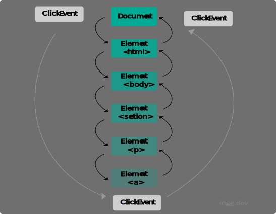
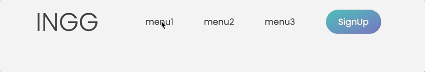
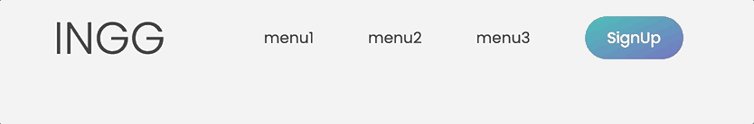
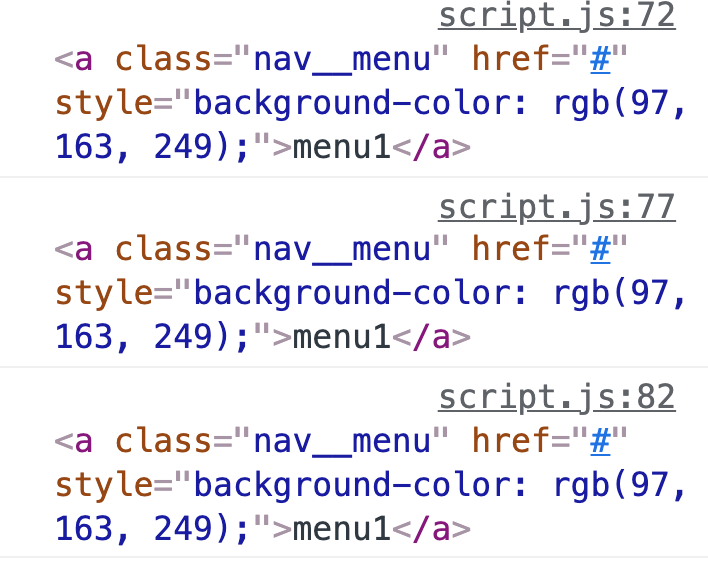
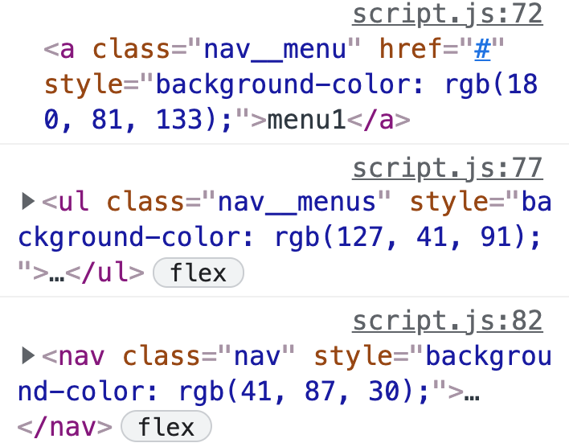
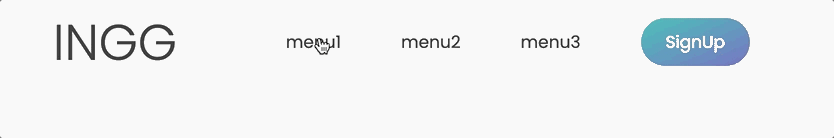
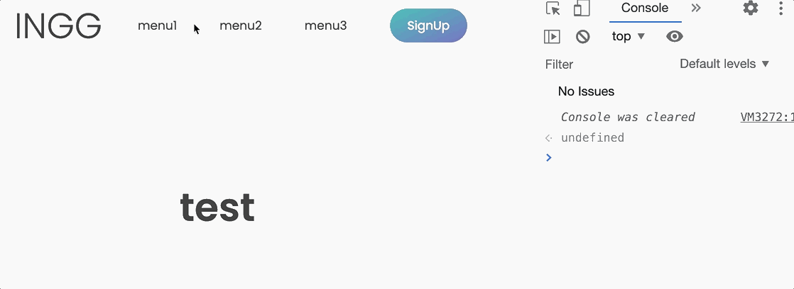

### 📌 Contents

1. [이벤트 전파(Event Propagation)](#event-propagation)
2. [이벤트 버블링(Event Bubbling)](#event-bubbling)
3. [target, currentTarget](#target-currentarget)
4. [stopPropagation()](#stop-propagation)
5. [이벤트 캡쳐링(Event Capturing)](#event-capturing)
5. [이벤트 위임(Event Delegation)](#event-delegation)

---

<br>


### <a name="event-propagation"></a>이벤트 전파(Event Propagation)

<hr>

자바스크립트 대부분의 이벤트는 캡쳐링 단계와 버블링 단계를 가진다. 아래와 같은 HTML에서 Link 클릭하면 DOM은 click event를 발생시키는데, 이벤트는 정확히 target element에서 발생하지 않는다. 세가지 단계를 거친다.

```html
<body>
  <section>
    <p>paragraph<a>Link</a></p>
  </section>
</body>
```



<br>

#### 1. 캡쳐링(Capturing) 단계
   
Link를 클릭할때, DOM 트리의 꼭대기인 Document root 에서 이벤트가 발생한다. 그리고 거기서 캡쳐링이 발생한다. 그러면 이벤트는 document root 부터 target element 까지 내려온다. 그때 이벤트는 target element의 모든 부모 요소를 지나간다.


#### 2. target 단계

이벤트가 target에 도착하면, 이벤트가 바로 처리되는 target 단계가 시작된다. 이벤트 리스너는 이벤트 발생을 기다린다. 그리고 이벤트가 발생하자마자 콜백함수를 실행한다.

```js
document.querySelector("a").addEventListener("click", () => {
  alert("Link 클릭!");
});
```

#### 3. 버블링(Bubbling) 단계

그리고 다시 이벤트가 target부터 document root로 올라간다. 캡쳐링 단계처럼 모든 부모 요소를 지나간다.

<br/>

### <a name="event-bubbling"></a>이벤트 버블링

<hr>

이벤트 버블링(Event Bubbling)이란 특정 화면 요소에서 이벤트가 발생했을 때 해당 이벤트가 더 상위의 화면 요소들로 전달되어 가는 특성이다. 이벤트 버블링이 어떻게 발생하는지 알아보자.

<!-- HTML 요소는 기본적으로 트리 구조이고, 트리 구조상으로 한 단계 위에 있는 요소를 상위 요소라고 한다. body 태그는 최상위 요소다. -->

다음과 같은 nav 메뉴가 있다. **_.nav__menu_** 에 랜덤한 배경색을 넣는 이벤트를 등록해보자.

```html
<nav>
  <ul class="nav__menus">
    <li>
      <a class="nav__menu" href="#">menu1</a>
    </li>
    <li>
      <a class="nav__menu" href="#">menu2</a>
    </li>
    <li>
      <a class="nav__menu" href="#">menu3</a>
    </li>
    <li>
      <a>SignUp</a>
    </li>
  </ul>
</nav>
```

<br>

먼저 두 값 사이의 난수를 생성하는 함수를 만든다.

```js 
const getRandom = (min, max) => {
  return Math.floor(Math.random() * (max - min + 1) + min);
};

const randomColor = () => {
  return `rgb(${getRandom(0, 255)},${getRandom(0, 255)},${getRandom(0, 255)})`;
};
```

<br>

그리고 첫번째 링크(menu1)인 **_.nav__menu_** 에 이벤트를 등록한다.

```js
document.querySelector(".nav__menu").addEventListener("click", function (e) {
  this.style.backgroundColor = randomColor();
});
```

이벤트핸들러 안에서 `this`는 이벤트 핸들러가 연결된 요소를 가리킨다. 여기서는 **_document.querySelector(".nav__menu")_** 이다.

<br>

이번에는 _**.nav__menu**_ 의 **상위요소(parent element)** 인 _**nav__menus**_ 에도 같은 이벤트를 등록해보자.

```js
document.querySelector(".nav__menus").addEventListener("click", function (e) {
  this.style.backgroundColor = randomColor();
});
```

이제 첫번째 menu1을 클릭하면, 배경이 같이 바뀌는 것을 볼 수 있다.




_nav_ 전체에 적용하고 _**nav__menu**_ 부분을 클릭해도 클릭이벤트가 세곳 모두 발생하는것을 볼 수 있다.

```js
document.querySelector(".nav").addEventListener("click", function (e) {
  this.style.backgroundColor = randomColor();
});
```




<br>

### <a name="target-currentarget"></a>target, currentTarget

<hr>

#### event.target

```js
document.querySelector(".nav__menu").addEventListener("click", function (e) {
  this.style.backgroundColor = randomColor();
  console.log(e.target);
});
```

위의 예시에서 각 이벤트리스너에 **_e.target_** 을 콘솔로 찍어보면 모두 같은 결과가 나온다. `target`은 이벤트가 처음 발생한 곳. 즉 클릭이 발생한 곳이기 때문이다.



<br>

#### event.currentTarget

```js
document.querySelector(".nav__menu").addEventListener("click", function (e) {
  this.style.backgroundColor = randomColor();
  console.log(e.currentTarget);
});
```

반면 **_currentTarget_** 은 모두 다른것을 볼 수 있다. 이벤트핸들러에서 `currentTarget` 은 `this` 와 같아서 현재 실행중인 handler가 할당된 요소이다.




<br>

### <a name="stop-propagation"></a>event.stopPropagation()

<hr>

`event.stopPropagation()` 으로 이벤트 전파를 막을수있다.

```js{3}
document.querySelector(".nav__menu").addEventListener("click", function (e) {
  this.style.backgroundColor = randomColor();
  e.stopPropagation();
});
```




첫번째 요소에 코드를 추가하고 다시 클릭해보면 더이상 이벤트가 전파되지 않는 것을 확인할 수 있다.

<br>

### <a name="event-capturing"></a>이벤트 캡쳐링

<hr>


캡쳐링 단계에서 이벤트를 캐치하려면 **_addEventListener_** 의 세번째 파라미터를 정의할 수 있다. 기본적으로 **_default_** 는 **_false_**인데, 이때 핸들러는 버블링 단계로 설정된다. 이벤트 캡쳐링은 흔히 사용 되지는 않지만 옵션을 `true` 로 설정하면 이벤트 버블링과 반대 방향으로 탐색한다.

```js{7}
document.querySelector(".nav__menu").addEventListener(
  "click",
  function (e) {
    this.style.backgroundColor = randomColor();
    console.log(e.currentTarget.className);
  },
  true
);

document.querySelector(".nav__menus").addEventListener(
  "click",
  function (e) {
    this.style.backgroundColor = randomColor();
    console.log(e.currentTarget.className);
  },
  true
);

document.querySelector(".nav").addEventListener(
  "click",
  function (e) {
    this.style.backgroundColor = randomColor();
    console.log(e.currentTarget.className);
  },
  true
);
```

각 이벤트리스너에 console을 추가하고 `menu1`를 클릭해보면 결과는 아래와 같다.

```
nav
nav__menus
nav__menu
```

<br>

### <a name="event-delegation"></a>이벤트 위임(Event Delegation)

<hr>

이벤트 위임이란 하위 요소마다 이벤트를 붙이지 않고 상위 요소에서 하위 요소의 이벤트들을 제어하는 방식을 말한다.

예를들어 위의 _nav_ 예시에서, 메뉴를 눌렀을때 메뉴에 맞는 섹션으로 이동하는 스크롤 기능을 추가한다고 하자.

```html
<nav class="nav">
  <ul class="nav__menus">
    <li class="nav__item">
      <a class="nav__menu" href="#menu1">menu1</a>
    </li>
    <li class="nav__item">
      <a class="nav__menu" href="#menu2">menu2</a>
    </li>
    <li class="nav__item">
      <a class="nav__menu" href="#menu3">menu3</a>
    </li>
    <li class="nav__item">
      <a>SignUp</a>
    </li>
  </ul>
</nav>

<section id="menu1">...</section>
<section id="menu2">...</section>
<section id="menu3">...</section>
```

```js
document.querySelectorAll(".nav__menu").forEach(function (el) {
  el.addEventListener("click", function (e) {
    e.preventDefault();
    const id = this.getAttribute("href");
    document.querySelector(id).scrollIntoView({
      behavior: "smooth",
    });
  });
});
```

문제는 element마다 이벤트 핸들러를 추가하므로 여기서는 element가 세개지만 만약 리스트 아이템이 많아진다면 비효율적이다. 이 번거로운 작업을 해결할 수 있는 방법이 바로 이벤트 위임이다.

<br>

먼저 **공통의 부모요소에 이벤트리스너를 추가**하고 이벤트리스너 안에서 어떤 요소가 이벤트를 발생시켰는지 확인한다.

```js{3}
document.querySelector(".nav__menus").addEventListener("click", function (e) {
  e.preventDefault();
  console.log(e.target);
  const id = e.target.getAttribute("href");
  document.querySelector(id).scrollIntoView({
    behavior: "smooth",
  });
});
```




현재는 **menu** 사이를 눌러도 _ul_ 부분이 선택되므로 **menu** 하나만 선택하기 위해서 조건을 추가할 수 있다.

<br>

```js{4,9}
document.querySelector(".nav__menus").addEventListener("click", function (e) {
  e.preventDefault();

  if (e.target.classList.contains("nav__menu")) {
    const id = e.target.getAttribute("href");
    document.querySelector(id).scrollIntoView({
      behavior: "smooth",
    });
  }
});
```


이제 요소마다 이벤트를 달지 않아도 된다.