자바스크립트는 싱글스레드이다. 어떻게 자바스크립트는 싱글스레드이면서 비동기인 것일까? 자바스크립트가 어떻게 동작하는지 내부 원리에 대해 알아보자.

---

### 📌 Contents

1. [자바스크립트 엔진](#engine)
2. [자바스크립트 런타임](#run)
3. [비동기적 자바스크립트](#async)
4. [콜백 함수](#callback)
5. [프로미스 (Promise)](#promise)
6. [async/await](#await)

---
<br>

### <a name="engine"></a>자바스크립트 엔진
<hr>

구글의 V8은 자바스크립트 엔진의 대표적인 예이다. Chrome과 Node.js에서 사용한다. 

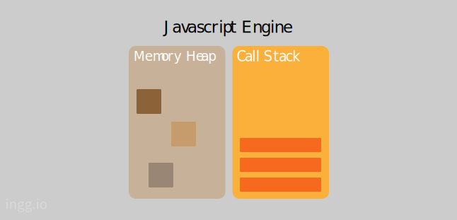

- **_Memory Heap_** : 메모리 할당이 일어나는 곳
- **_Call Stack_** : 코드 실행에 따라 호출 스택이 쌓이는 곳

<br>

#### 호출 스택 (Call Stack)

자바스크립트는 기본적으로 작업을 싱글스레드로 처리한다. 즉, 단 하나의 호출 스택을 사용한다. 호출 스택에 쌓인 함수나 코드를 위에서부터 아래로 차례차례 실행한다. 그리고 하나의 작업이 끝나면 **pop**하고 바로 아래의 함수나 코드를 실행한다. 작업을 차례대로 실행하므로 하나의 작업이 끝날 때까지 또 다른 작업을 실행하지 않는다.

다음과 같은 코드를 살펴보자.
```js
function first(){
    second();
    console.log("첫번째");
}
function second(){
    third();
    console.log("두번째");
}
function third(){
    console.log("세번째");
}
first();
```
먼저 _first_ 함수가 호출되고, 그안의 _second_ 함수가 호출되고, 마지막에 _third_ 함수가 호출된다. 

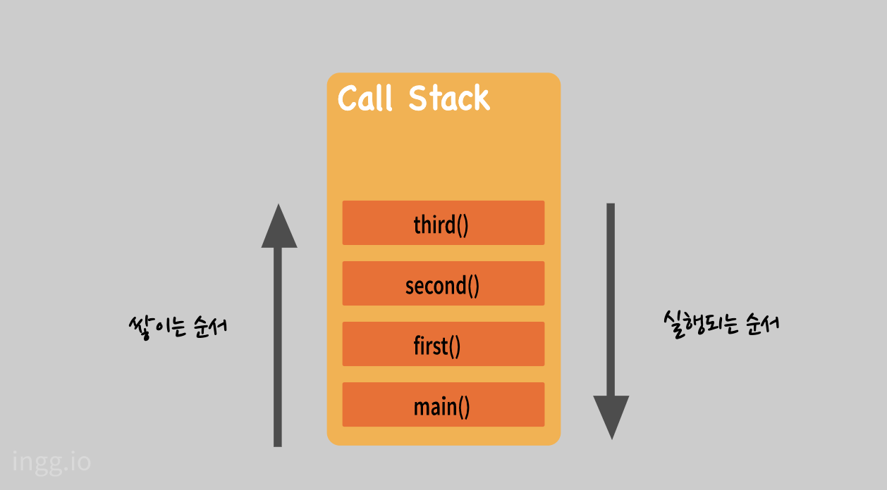

`main()` 함수는 처음 실행시 전역 컨텍스트(함수가 호출 되었을때 생성되는 환경)이다. 함수의 실행이 완료되면 호출 스택에서 지워진다. _third, second, first, main_ 순으로 **pop**되고 _main_ 함수까지 실행완료되면 호출 스택이 비워진다. 따라서 위 코드는 **세번째, 두번째, 첫번째** 순으로 콘솔에 찍힌다.

<!-- 이번에는 setTimeout함수를 이용한 코드를 살펴보자. -->

<br>

### <a name="run"></a>자바스크립트 런타임
<hr>


자바스크립트 엔진 밖에서도 자바스크립트에 관여하는 요소들이 있다. Wep API, Task Queue, Event Loop등이다. 런타임은 특정 언어로 만든 프로그램들을 실행할 수 있는 환경이다. Node.js나 크롬등의 브라우저들은 자바스크립트가 구동되는 환경이기 때문에, 이를 자바스크립트 런타임이라고 한다.


- **_Web API_** : Web API는 브라우저에서 제공되는 API이다. 자바스크립트 엔진에서 정의되지 않았던 setTimeout이나 HTTP 요청(ajax) 메소드, DOM 이벤트 등의 메소드를 지원한다.
- **_Task Queue_** : 이벤트 발생 후 호출되어야 할 콜백 함수들이 기다리는 공간. 이벤트 루프가 정한 순서대로 줄을 서 있으므로 콜백 큐(_Callback Queue_) 라고도 한다.
- **_Event Loop_** : 이벤트 발생 시 호출할 콜백 함수들을 관리하고, 호출된 콜백 함수의 실행 순서를 결정한다.

<br>

#### Task Queue

자바스크립트에서 비동기로 호출되는 함수들은 호출 스택(Call Stack)에 쌓이지 않고 태스크 큐(Task Queue)로 보내진다. 

```js
console.log("A");
setTimeout(function() {
  console.log("B");
}, 0);
console.log("C");
```

위 코드는 **"A", "B", "C"** 순으로 콘솔에 표시될 것 같지만 그렇지 않다. 실행 결과는 **"A", "C", "B"** 순으로 콘솔에 찍힌다. `setTimeout`함수로는 인수로 받은 콜백 함수를 일정 시간이 지난 후 실행하도록 예약하는 처리만 하고, 그다음 바로 다음 코드가 실행되기 때문이다.

<br>

### <a name="async"></a>비동기적 자바스크립트

<hr>

비동기처리란 특정 코드가 종료되지 않았어도 대기하지 않고 다음 코드를 실행하는 자바스크립트의 특성이다. 

이번에는 아래의 코드가 어떻게 비동기로 작동하는지 자세히 알아보자. 


```js
console.log("시작");

setTimeout(function(){
    console.log("3초후 실행");
}, 3000);

console.log("끝");

// 시작
// 끝
// 3초후 실행
```
<br>

1. 먼저 전역 컨텍스트 _main()_ 함수가 Call Stack에 쌓이고 _console.log("시작")_ 이 Call Stack에 쌓인다. **"시작"**이 콘솔에 찍힌다. 


2. _console.log("시작")_ 이 리턴되며 Call Stack에서 제거된다.

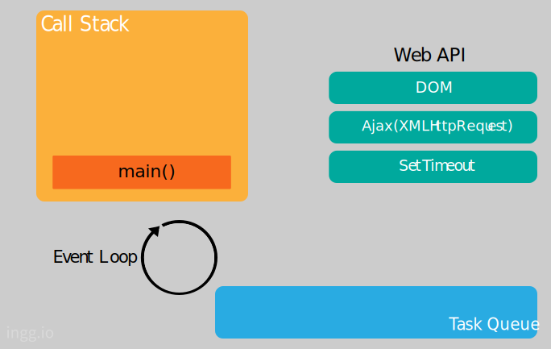

2. setTimeout함수가 실행되면서 Call Stack에 setTimeout함수가 들어간다.

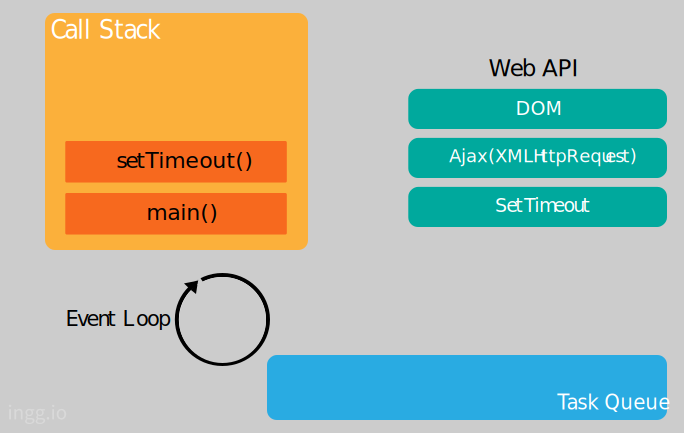

3. setTimeout함수는 자바스크립트 엔진이 처리하지않고 **Web API**가 처리하므로 Callback함수를 전달하고, setTimeout작업을 요청한다.

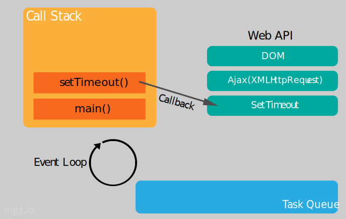


4. Call Stack에서는 setTimeout작업이 제거된다.

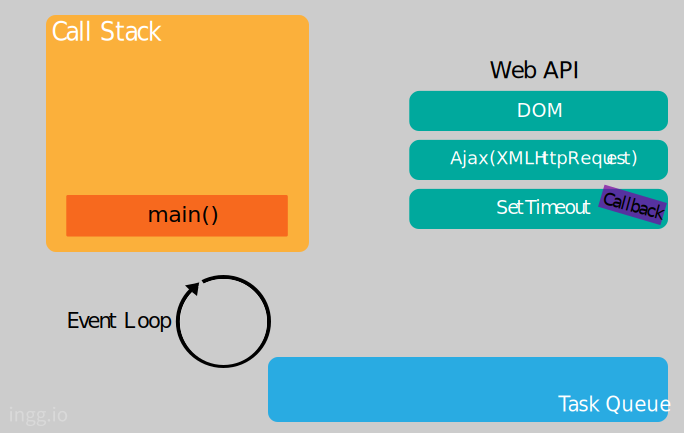
<!-- t5 -->

5. _console.log("끝")_ 이 호출되어 Call Stack에 쌓인다. **"끝"**이 콘솔에 찍힌다.


6. _console.log("끝")_ 이 리턴되며 Call Stack에서 제거된다.


7. _main()_ 함수가 리턴되며 Call Stack에서 제거된다. 

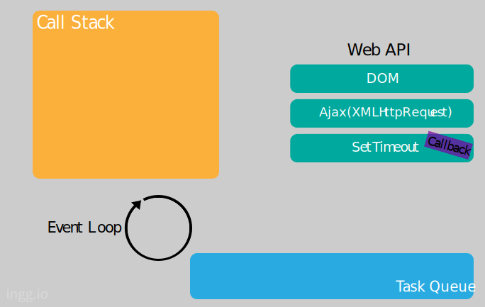


8. **Web API**는 setTimeout 작업을 실행한다. 3초를 센 후 **Task Queue**로 _Callback_ 함수를 보낸다.

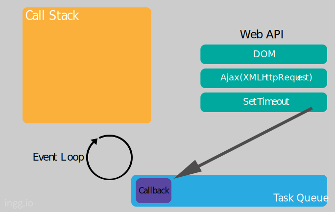

9. Event Loop는 Call Stack이 비어있으면 Task Queue에서 함수를 하나씩 꺼내 Call Stack에 넣고 실행한다.

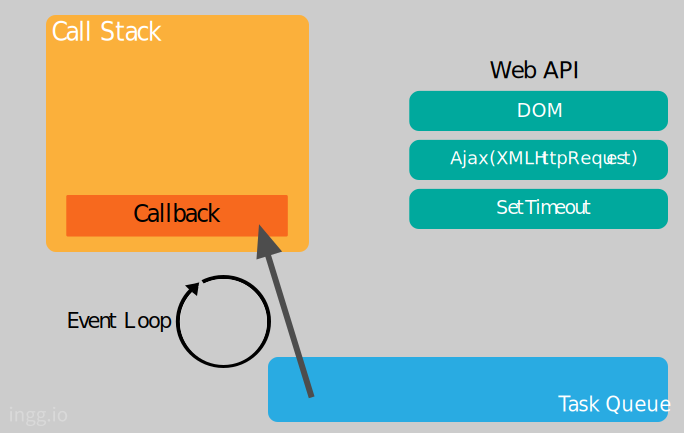

10. _console.log("3초후 실행")_ 이 호출되고 Call Stack에 쌓인다. **"3초후 실행"**이 콘솔에 찍힌다.

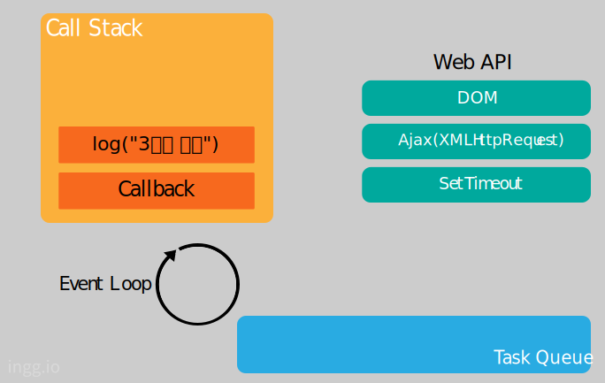

11. _console.log("3초 후 실행")_ 이 리턴되고 Call Stack에서 제거된다. 차레로 _Callback_ 함수도 제거된다. Event Loop는 Task Queue에 콜백 함수가 들어올 때까지 계속 대기한다.

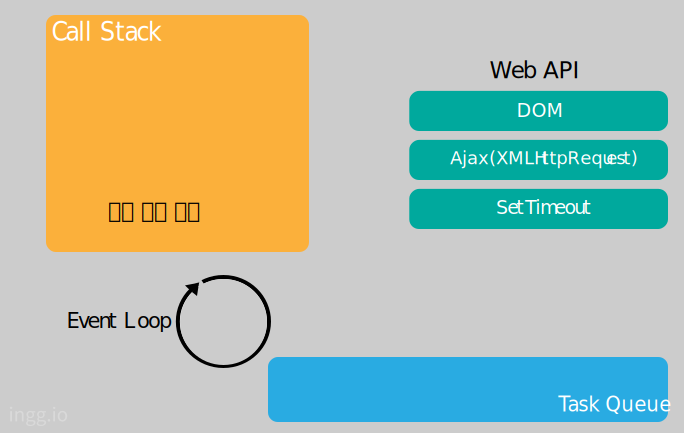


만약 Call Stack에 함수들이 너무 많이 차있으면 3초후 실행되지 않을 수도 있다. Event Loop는 Call Stack이 비어있을 때만 Task Queue의 함수를 Call Stack으로 가져오기 때문이다. 이게 setTimeout() 시간이 정확하지 않을 수도 있는 이유이다.

#### 자바스크립트에서 비동기처리가 필요한 이유

화면에서 서버로 데이터를 요청했을 때 서버가 언제 그 요청에 대한 응답을 할지도 모르는 상태에서 다른 코드를 실행 안하고 기다릴 수는 없기 때문이다. 

<br>

### <a name="callback"></a>콜백함수


<hr>

하지만 실행 순서가 중요한 상황도 있다. 이런 상황에서 코드를 실행 순서에 따라 실행하려고 할때 주로 콜백함수를 중첩하는 방법을 사용한다. 

예를 들어 위에서와 같이 setTimeout을 사용하거나, api요청을 보낸 후 응답을 받아오는 경우 등 바로 실행될 수 없는 조건이 담긴 함수가 있는 상황이 있다. 이런 문제를 해결하기 위한 방법 중 하나가 콜백함수다. 다른 함수의 실행이 끝날 때까지 특정 코드가 실행되지 않게 기다려 주므로 비동기 작업을 순차적으로 실행할 수 있는 것이다.


```js
function f(callback, ...){
    ...
    callback();
    ...
}
f(a, ...);

이 코드에서 함수 f의 인자로 넘겨진 함수 a가 콜백함수이다.
```

콜백함수란 위와같이 다른 함수에 인수로 넘겨지는 함수이다. 함수의 실행이 끝나면 지정한 콜백함수를 실행해 주도록 함수에 요청할 때 사용한다.


#### callback 예시

```js
function first(callback){
    setTimeout(function(){
        console.log("첫번째");
        callback();
    }, 3000);
}

function second(){
    console.log("두번째");
}

first(function(){
    second();
});

// 첫번째
// 두번째
```

_first_ 함수가 실행되고 3초후에 **"첫번째"**를 콘솔에 찍고, 인수로 받은 콜백함수를 실행하면서 _second_ 함수가 실행되어 **"두번째"**가 콘솔에 찍힌다.

<br>

### <a name="promise"></a>ES6부터 추가된 프로미스(Promise)
<hr>

```js
function say(callback){
    setTimeout(function(){
        callback();
    }, 3000);
}
say(function(){
    console.log("A");
    say(function(){
        console.log("B");
        say(function(){
            console.log("C");
        });
    });
});

// A
// B
// C
// 3초후에 "A"를 표시하고, 3초후에 "B"를 표시하고, 마지막으로 3초후에 "C"를 표시한다.
```
이렇게 콜백함수를 여러 개 중첩하면 작업내용을 이해하기 어려워진다. 이것을 콜백 지옥(Callback Hell)이라고도 한다. `Promise`를 이용하면 콜백 헬을 극복하고 비동기 처리도 간결하게 작성할 수 있다.

Promise를 사용하려면 먼저 **Promise객체**를 생성해야 한다.
```js
const promise = new Promise(function(resolve, reject){
    ...
});

// Arrow Function
const promise = new Promise((resolve, reject) => {
    ...
});
```

- **_resolve_** : 함수 안의 처리가 끝났을 때 호출해야하는 콜백함수. 어떠한 값도 인수로 넘길 수 있다. 다음 처리를 실행하는 함수에 전달된다.
- **_reject_** : 함수 안의 처리가 실패했을 때 호출해야하는 콜백함수. 어떠한 값도 인수로 넘길수 있다. 주로 오류 메시지 문자열을 인수로 사용한다.

<br>

#### then/catch 메서드

```js
promise.then(ouFulfilled);
```
```js
promise.catch(onRejected);

```
프로미스(promise) 내부에서 _resolve_ 가 호출되면 _then_ 이 실행되고, _reject_ 가 호출되면 _catch_ 가 실행된다. _resolve_ 와 _reject_ 에 넣어준 인자는 각각 _then_ 과 _catch_ 의 매개변수에서 받을 수 있다.

```js
// 2의 거듭제곱을 구하는 예시

const promise = new Promise((resolve, reject) => {
  setTimeout(() => {
    const input = parseInt(prompt("10미만 숫자를 입력하시오"));
    if (input < 10) {
      resolve(input);
    } else {
      reject(`오류: ${input}은 10 이상이거나 숫자가 아닙니다.`);
    }
  }, 2000);
});

promise
  .then(num => {
    console.log(`2^${num} = ${Math.pow(2, num)}`);
  })
  .catch(error => {
    console.log(error);
  });

//Promise {<pending>}
// 2^7(입력) = 128
```
코드를 입력하면 2초뒤 "10미만 숫자를 입력하시오"라는 입력창이 뜬다. 입력한 숫자가 10미만이면 _then_ 으로 넘긴 함수가 실행되고, 그렇지 않으면 _catch_ 에 넘긴 함수가 실행된다.

<br>

#### then의 두번째 인수

```js
promise.then(onFulfilled, onRejected);
```
_then_ 메서드에 두 번째 인수로 실패 콜백함수를 지정할 수 있다. 그러면 _then_ 메서드에서 처리할 내용과 _catch_ 메서드에서 처리할 내용을 _then_ 메서드 하나로 담을 수 있다.

위의 **_then/catch_** 예시를 아래와 같이 수정할 수 있다.

```js{13-18}
const promise = new Promise((resolve, reject) => {
  setTimeout(() => {
    const input = parseInt(prompt("10미만 숫자를 입력하시오"));
    if (input < 10) {
      resolve(input);
    } else {
      reject(`오류: ${input}은 10 이상이거나 숫자가 아닙니다.`);
    }
  }, 2000);
});

promise.then(
  num => {
    console.log(`2^${num} = ${Math.pow(2, num)}`);
  },    // 처리가 성공으로 끝날때 호출
  error => {
    console.log(error);
  }     //처리가 실패로 끝날때 호출
);
```

<br>

#### Promise가 실행하는 콜백함수에 인수 넘기기

_buySomething_ 함수에 넘긴 인수를 **Promise** 객체가 실행하는 익명 함수 안에서 사용하는 예제이다. 

```js
function buySomething(nowMoney){
    return new Promise((resolve, reject) => {
        setTimeout(() => {
            const pay = parseInt(prompt("금액 입력"));
            const remain = nowMoney - pay;
            if(remain >= 0){
                console.log(`${pay}원 지불`);
                resolve(remain);
            }else{
                reject(`잔액부족: 현재 잔액${nowMoney}원`);
            }
        }, 2000);
    });
}

buySomething(1000)
    .then((remain) => {
        console.log(`잔액: ${remain}원`);
    })
    .catch((error) => {
        console.log(error);
    });

// 금액 입력: 200(입력)
// 200원 지불
// 잔액: 800원
```
현재금액(_nowMoney_)을 인수로 넘겨 실행하면 지불할 금액을 2초후 입력할 수 있다. 차액이 0이상이면 _then_ 에 넘긴 함수가 **"잔액"을 표시**, 0미만으로 부족하면 _catch_ 에 넘긴 함수가 **"잔액부족" 오류 메세지를 표시**한다.

<br>

#### Promise로 비동기 처리 연결하기

_then_ 이나 _catch_ 에서 다시 다른 _then_ 이나 _catch_ 를 붙일 수 있다. 이전 _then_ 의 return값을 다음 _then_ 의 매개변수로 넘긴다. 프로미스를 return한 경우 프로미스가 수행된 후 다음 _then_ 또는 _catch_ 가 호출된다.

```js{21-28}
function buySomething(nowMoney){
    return new Promise((resolve, reject) => {
        setTimeout(() => {
            const pay = parseInt(prompt("금액 입력"));
            const remain = nowMoney - pay;
            if(remain >= 0){
                console.log(`${pay}원 지불`);
                resolve(remain);
            }else{
                reject(`잔액부족: 현재 잔액${nowMoney}원`);
            }
        }, 2000);
    });
}

buySomething(1000)
    .then((remain) => {
        console.log(`잔액: ${remain}원`);
        return buySomething(remain);
    })
    .then((remain) => {
        console.log(`잔액: ${remain}원`);
        return buySomething(remain);
    })
    .then((remain) => {
        console.log(`잔액: ${remain}원`);
        return buySomething(remain);
    })
    .catch((error) => {
        console.log(error);
    });
```

금액 입력을 여러번 받게 수정했다. 
```
100원 지불
잔액: 900원
200원 지불
잔액: 700원
400원 지불
잔액: 300원
100원 지불
```

> #### 위에서는 then이 모두 같은 Promise객체를 반환하지만, then마다 다른 Promise객체를 반환해서 다른 비동기 처리를 연결하여 순차적으로 실행하게 할 수도 있다.

<br>

#### Promise.all

프로미스 여러 개를 한번에 실행할 수 있는 방법이 있다. 지금까지는 비동기 처리 여러 개를 직렬로 연결해서 순차적으로 실행 했지만 **Promise**객체의 **all** 메서드를 이용하면 비동기 처리 여러 개를 병렬로 할 수 있다.

```js
Promise.all(iterable);
```

- **_iterable_** : Array와 같이 순회(반복) 가능한(iterable) 객체. 예를 들어 **Promise**객체가 요소로 들어있는 배열을 넘기면 **Promise.all** 메서드는 그 안의 요소로 들어있는 모든 **Promise** 객체를 병렬로 실행한다.

```js{1,4,7,10,16-26}
function buySomething(name, nowMoney) {
  return new Promise((resolve, reject) => {
    setTimeout(() => {
      const pay = parseInt(prompt(`${name} : 금액 입력`));
      const remain = nowMoney - pay;
      if (remain >= 0) {
        console.log(`${name} : ${pay}원 지불`);
        resolve(remain);
      } else {
        reject(`${name} : 잔액부족: 현재 잔액${nowMoney}원`);
      }
    }, 2000);
  });
}

Promise.all([
  buySomething("John", 500),
  buySomething("Mary", 1000),
  buySomething("Bill", 1500)
])
  .then(remain => {
    console.log(remain);
  })
  .catch(error => {
    console.log(error);
  });
```

```
John : 200원 지불
Mary : 600원 지불
Bill : 1000원 지불
▶︎(3) [300, 400, 500]
```

<br>

#### Promise.race


```js
Promise.race(iterable);
```

**Promise.race** 메서드는 가장 먼저 종료한 **Promise**객체 결과만 다음 작업으로 보낸다. 먼저 종료한 작업이 성공하면 성공 콜백을 호출하고 실패하면 실패 콜백을 호출한다. 위의 **Promise.all** 예제에서 `all`을 `race`로 바꾸고 입력값을 그대로 입력해보면 

```
John : 200원 지불
300 (성공 콜백함수가 출력한 값)
Mary : 600원 지불
Bill : 1000원 지불
```
나머지 작업도 실행되긴하지만 가장 먼저 종료한 작업의 결과값만 반환한다.

<br>

### <a name="await"></a>async/await

<hr>

프로미스가 콜백 지옥을 해결했다지만, 아직 장황한 코드는 여전하다. **async/await** 문법은 프로미스를 사용한 코드를 한번 더 깔끔하게 해준다. **async/await**은 노드 7.6버전부터 지원되며, ECMAScript2017의 공식 스펙으로 최신 문법이다.

```js
async function 함수명(){
  await 비동기처리_메서드명();
}
```

<br>

위에서 했던 지불 금액을 입력하고 잔액을 반환하는 Promise예제를 **async/await** 문법으로 바꿔보자.

```js{16-24}
function buySomething(nowMoney) {
  return new Promise((resolve, reject) => {
    setTimeout(() => {
      const pay = parseInt(prompt("금액 입력"));
      const remain = nowMoney - pay;
      if (remain >= 0) {
        console.log(`${pay}원 지불`);
        resolve(remain);
      } else {
        reject(`잔액부족: 현재 잔액${nowMoney}원`);
      }
    }, 2000);
  });
}

async function testAsync() {
  try {
    const remain = await buySomething(1000);
    console.log(`잔액: ${remain}원`);
  } catch (error) {
    console.log(error);
  }
}
testAsync();
```

```
금액 입력: 200(입력)
200원 지불
잔액: 800원
```

**_try/catch_** 문으로 로직을 감쌌다. **async/await** 문법에서는 프로미스의 `.catch` 메서드와 같이 `try/catch` 문의 `catch{}` 가 에러를 처리한다.

```
금액 입력: 2000(입력)
잔액부족: 현재 잔액1000원
```

화살표 함수도 **_async_** 와 같이 사용할 수 있다.

```js
const testAsync = async () => {
  try {
    const remain = await buySomething(1000);
    console.log(`잔액: ${remain}원`);
  } catch (error) {
    console.log(error);
  }
};
testAsync();
```