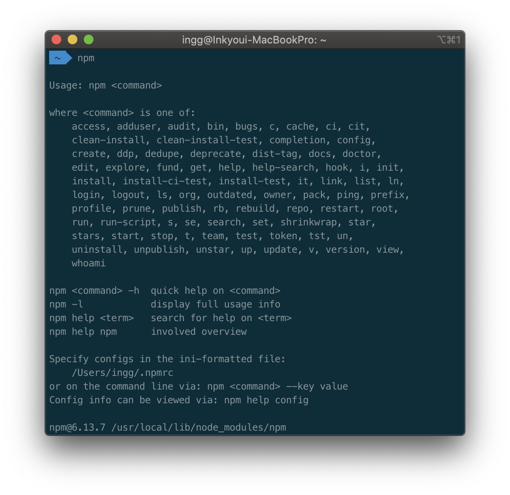

**NPM**이란 노드 패키지 매니저(**Node Package Manager**)이다.
자바스크립트로 만들어놓은 라이브러리들을 **_npm_**에 올리면 그러한 라이브러리를 다운 받을때 사용하며 프로젝트를 관리할때도 사용한다.

**_npm_** 버전정보는 `npm -v` 또는 `npm --version`으로 확인할 수 있다.
**_npm_** 은 **_node.js_** 설치시 같이 설치되기 때문에 보통 따로 설치하지 않아도 된다.

**_npm_** 명령어로 간단한 설명을 볼 수 있다.



## 패키지 설치

**_npm_**에 업로드된 노드 모듈을 패키지라고 한다. 패키지 설치는 `install`을 이용한다.

```js
npm install <package>
```

<br>

패키지를 전역 설치하려면 `-g` 옵션을 지정한다. 모든 프로젝트가 공통으로 사용한다면 패키지를 전역으로 설치한다.

```js
npm install -g <package>
```

<br>

반대로 `npm uninstall <package>`는 패키지를 제거한다.

<br>

## 개발 프로젝트 세팅

`npm init` 은 프로젝트를 초기화 한다. 몇가지 정보를 입력한 후에 `package.json` 파일이 생성 된다.
정보를 디폴트로 설정하려면 `--yes` 또는 `-y` 옵션을 지정하면 된다.

```js
npm init

// 또는
npm init -y
```

<br>

> 참고로 NPM을 실행할때는 꼭 프로젝트폴더에 package.json이 있는 폴더에서 실행한다. 없는곳에서 실행한다면 package.json를 못읽어서 또다른 곳에 만들어버린다.

<br>

## package.json

**_Node.js_**는 package.json 파일안에 프로젝트의 모든 정보를 기록한다.

```
{
  "name": "test2",
  "version": "1.0.0",
  "description": "About NPM",
  "main": "index.js",
  "scripts": {
    "test": "echo \"Error: no test specified\" && exit 1"
  },
  "author": "",
  "license": "ISC"
}
```

명령어를 추가할 수도 있다. **_package.json_**의 **_scripts_** 부분에 키를 추가하면 된다.

```js
{
  "scripts": {
    "<script_name>": "Example"
  }
}
```

<br>

추가한 명령어는 `run`옵션을 지정하여 실행한다.

```js
npm run <script_name>
```

<br>

## Semantic Versioning (유의적 버전)

패키지를 설치하면 **_package.json_** 의 `dependencies` 에 새롭게 추가한 패키지가 추가되며 버전이 표시된다. 유의적 버전은 이 버전 번호를 어떻게 정하는지를 명시하는 규칙이라고 볼 수 있는데, 버전은 `1.0.4`와 같은 형식이고 각각 `Major, Minor, Patch (주, 부, 수)` 를 뜻한다.

- **_Major releases_** : 기존 버전과 호환되지 않게 API가 바뀜
- **_Minor releases_** : 기존 버전과 호환되면서 새로운 기능을 추가
- **_Patch releases_** : 기존 버전과 호환되면서 버그를 수정한 것

<br>

버전의 범위 규칙은 다음과 같고 주로 **캐럿(^)**을 사용한다.

- 캐럿기호 `^` : 동일한 Major 범위에서 특정 버전보다 큰 모든 것을 포함한다. 예를 들어 **^1.0.4**표기는 **1.0.4**부터 **2.0.0**미만 까지이다.
- 틸드기호 `~` : 동일한 Minor 범위에서 특정 버전보다 큰 모든 것을 포함한다.
- 비교기호 `>, <, =, >=, <=`
- 포괄적 범위 `-` : 양쪽에 공백이 있어야 한다.
- 결합 `||`

**예시)**

```js
"dependencies": {
  "my_dep": "^1.0.4",
  "another_dep1": "~2.2.0",
  "another_dep2": "1.0.0 - 1.2.0",
  "another_dep3": ">1.2.3"
},
```

<!-- reference
https://semver.org/
https://docs.npmjs.com/ -->
