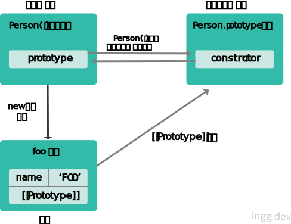
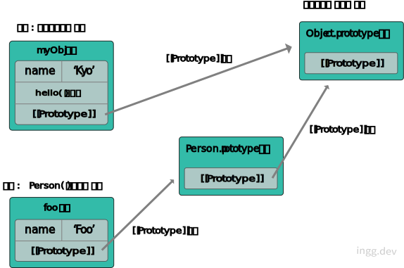
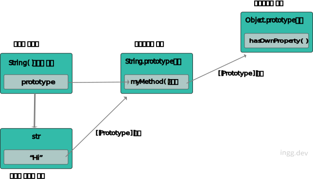
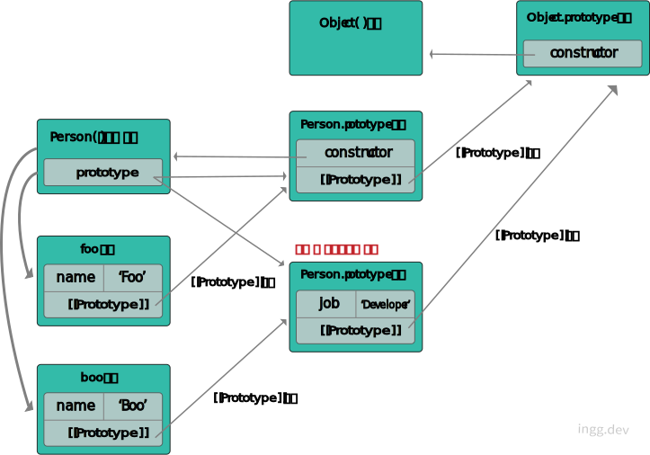

자바스크립트의 모든 객체는 자신의 부모 역할을 하는 객체와 연결되어 있다. 이 부모 객체를 프로토타입 객체라고 한다. 모든 객체는 자신의 프로토타입을 가리키는 `[[Prototype]]` 이라는 숨겨진 프로퍼티를 가진다. 이러한 링크를 프로토타입 링크라고한다.

<br>

---

### 📌 Contents
 
1. [prototype 프로퍼티 vs [[Prototype]]](#prototype_property) 
2. [프로토타입 체이닝이란?](#prototype_chain)
3. [프로토타입 객체에 메서드 추가하기](#prototype_method)
4. [디폴트 프로토타입 변경하기](#prototype_change)

---

<br>

### <a name="prototype_property"></a>prototype 프로퍼티 vs \[[Prototype]]

<hr>

**모든 객체는** 자신을 생성한 생성자 함수의 `prototype 프로퍼티`가 가리키는 **프로토타입 객체**를 자신의 부모 객체로 설정하는 `[[Prototype]]` 링크로 연결한다.

```js
function Person(name) {
  this.name = name;
}

const foo = new Person("FOO");
```
```js{7-9, 17-19}
console.dir(Person);
// ▼ ƒ Person(name)
//      arguments: null
//      caller: null
//      length: 1
//      name: "Person"
// ▼ prototype:
//     ▶︎ constructor: ƒ Person(name)
//     ▶︎ __proto__: Object
// ▶︎ __proto__: ƒ ()
// [[FunctionLocation]]: VM40:1
// [[Scopes]]: Scopes[1]

console.dir(foo);
// ▼ Person
//     name: "FOO"
//   ▼ __proto__:
//       ▶︎ constructor: ƒ Person(name)
//       ▶︎ __proto__: Object
```


<br>


그림으로 나타내면, 아래와 같다. **_Person()_** 생성자 함수의 `prototype 프로퍼티` 와 **_foo_** 객체의 `__proto__ 프로퍼티` 가 같은 프로토타입 객체를 가리키고 있는 것을 볼 수 있다. 이 프로토타입 객체는 `constructor` 프로퍼티가 **_Person()_** 생성자 함수를 가리키고 있다.

<br>



<br>

### <a name="prototype_chain"></a>프로토타입 체이닝이란?

<hr>

```js
const obj = {
  name: "foo",
};

obj.hasOwnProperty("name"); // true
obj.hasOwnProperty("age"); // false
```

`hasOwnProperty()` 메서드는 이 메서드를 호출한 객체에 인자로 넘긴 문자열 프로퍼티나 메서드가 있는지 없는지 체크하는 API 함수인데, obj 객체에 이 _**hasOwnProperty()**_ 메서드가 없음에도 에러가 발생하지 않는 이유가 바로 프로토타입 체이닝 때문이다.

위에서 객체 리터럴로 생성한 객체는 내장 생성자 함수 **_Object()_** 로 생성된 것인데, 이것도 함수 객체이므로 **prototype 프로퍼티**가 **Object.prototype 객체**를 자신의 프로토타입으로 연결한다.

이렇게 특정 객체의 프로퍼티나 메서드에 접근할 때, 접근하려는 프로퍼티나 메서드가 없으면 `[[Prototype]]` 링크를 따라 부모 역할을 하는 프로토타입 객체의 프로퍼티를 차례대로 검색하는 것을 **프로토타입 체이닝**이라고 한다.

<br>

### 생성자 함수와 프로토타입 체이닝

<hr>

```js
function Person(name, age) {
  this.name = name;
  this.age = age;
}

const foo = new Person("FOO", 33);

console.log(foo.hasOwnProperty("name")); // true
```

```js{7-9}
console.dir(Person);
// ▼ ƒ Person(name, age)
//    arguments: null
//    caller: null
//    length: 2
//    name: "Person"
// ▼ prototype:
//    constructor: ƒ Person(name, age)
//    __proto__: Object
// __proto__: ƒ ()
// [[FunctionLocation]]: VM1355:1
// [[Scopes]]: Scopes[1]
```

foo 객체의 프로토타입 객체는 Person 생성자 함수의 `prototype 프로퍼티` 가 가리키는 객체 **_Person.prototype_** 이다. 

따라서 **_foo.hasOwnProperty()_** 메서드를 호출하면, **_foo_** 객체의 부모 객체인 **_Person.prototype_** 객체에서 **_hasOwnProperty()_** 메서드를 찾는데, 여기엔 `constructor` 프로퍼티만 존재하므로 다시 프로토타입 체이닝이 **_Object.prototype_** 객체로 이루어진다. 

_**Object.prototype**_ 객체에는 해당 메서드가 존재하므로 오류가 발생하지 않고 **_true_** 가 출력된다.

<br>

### 결국 종점은 Object.prototype 객체

<hr>

```js
// 객체 리터럴
const myObj = {
  name: "Kyo",
  hello: function () {
    console.log("Hi, " + this.name);
  },
};

myObj.hello(); // Hi, Kyo
console.log(myObj.hasOwnProperty("name")); // true

// Person 생성자 함수
function Person(name, age) {
  this.name = name;
  this.age = age;
}

const foo = new Person("Foo", 25);
console.log(foo); // Person {name: "Foo", age: 25}
console.log(foo.hasOwnProperty("name")); // true
```


<br>

객체 리터럴 방식이든 생성자 함수 방식이든 객체는 프로토타입 체이닝이 이루어지면서 **_Object.prototype_** 객체에 있는 프로퍼티와 메서드에 접근이 가능하다는 것을 알 수 있다. 자바스크립트에서는 결국 **_Object.prototype_** 객체가 프로토타입 체이닝의 종점이다.

<br>




<br>

### <a name="prototype_method"></a>프로토타입 객체에 메서드 추가하기

<hr>

**_Object.prototype_** 에 정의된 메서드들은 모든 객체의 표준 메서드라고 볼 수 있다. 이처럼 숫자, 문자열, 배열 등의 표준 메서드들도, 프로토타입인 **_Number.prototype_**, _**String.prototype**_, **_Array.prototype_** 등에 정의 되어있고 마찬가지로 **_Object.prototype_** 으로 연결된다. 이러한 프로토타입 객체에 사용자 정의 메서드를 추가할 수도 있다. 


```js
String.prototype.myMethod = function () {
  console.log("This is my string prototype method");
};

const str = "Hi!";
str.myMethod(); // This is my string prototype method
```

```js{3}
console.dir(String.prototype);
// ▼ String
//    myMethod: ƒ ()
//    anchor: ƒ anchor()
//    big: ƒ big()
//    blink: ƒ blink()
//    bold: ƒ bold()
//    charAt: ƒ charAt()
//    charCodeAt: ƒ charCodeAt()
//    codePointAt: ƒ codePointAt()
//    concat: ƒ concat()
//    constructor: ƒ String()
//    endsWith: ƒ endsWith()
//    ...(생략)
```

<br>

**_console.dir_** 을 찍어보면 위에서 생성한 `myMethod()` 메서드가 추가되어 있고, 문자열 API 처럼 사용 가능하다. 물론 **_String.prototype_** 도 종점이 **_Object.prototype_** 이므로 **_hasOwnProperty()_** 와 같은 메서드를 사용할 수도 있다.




<br>

또한 프로토타입 객체도 자바스크립트 객체이므로 일반 객체와 같이 동적으로 프로퍼티를 추가하거나 삭제할 수도 있다.

```js
function Person(name) {
  this.name = name;
}

const foo = new Person("Foo");

Person.prototype.hello = function () {
  console.log("Hi");
};

foo.hello(); // Hi
```

<br>

### <a name="prototype_change"></a>디폴트 프로토타입 변경하기

<hr>

디폴트 프로토타입 객체는 함수가 생성될 때 같이 생성된다. 디폴트 프로토타입 객체를 다른 일반 객체로 변경할 수도 있다. 이때, 생성자 함수의 프로토타입 객체가 변경되면 그 이전에 생성된 객체들은 기존 링크를 유지하지만, 이후부터 생성된 객체는 변경된 프로토타입 객체로 **[[Prototype]** 링크가 연결된다.

```js
function Person(name) {
  this.name = name;
}

// 변경 시점 이전
console.log(Person.prototype.constructor); // ƒ Person(name){...}

const foo = new Person("Foo");

// 디폴트 프로토타입 객체 변경
Person.prototype = {
  job: "Developer",
};

// 변경 시점 이후
console.log(Person.prototype.constructor); // ƒ Object() { [native code] }

const boo = new Person("Boo");

console.log(foo.job); // undefined
console.log(boo.job); // Developer

console.log(foo.constructor); // ƒ Person(name){...}
console.log(boo.constructor); // ƒ Object() { [native code] }
```

<br>




<br>

처음 **_Person()_** 함수 생성할 때 디폴트로 생성되는 **_Person.prototype_** 객체는  자신과 연결된 생성자 함수를 가리키는 **_constructor_** 프로퍼티만 가진다. 프로토타입 객체를 변경하기 전이므로 **_foo.job_** 은 프로토타입 체이닝이 일어나도 **_undefined_** 가 출력된다.

**_job_** 프로퍼티를 가진 객체로 프로토타입 프로퍼티를 변경 후에는, **_job_** 프로퍼티만 있으므로 디폴트 프로토타입에 있는 **_constructor_** 가 없는 것을 볼 수 있다. 그리고 변경한 프로토타입 객체는 객체리터럴 방식이므로 **_Object.prototype_** 에 체이닝된다. 

변경 후에 생성된 **_boo_** 객체는 디폴트 프로토타입 객체가 아니라, 변경된 프로토타입 객체로 체이닝되어 **'Developer'** 가 출력된다.