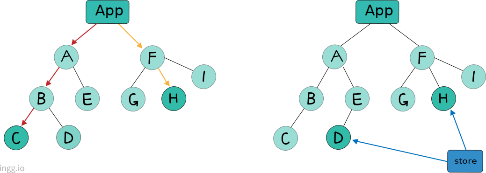
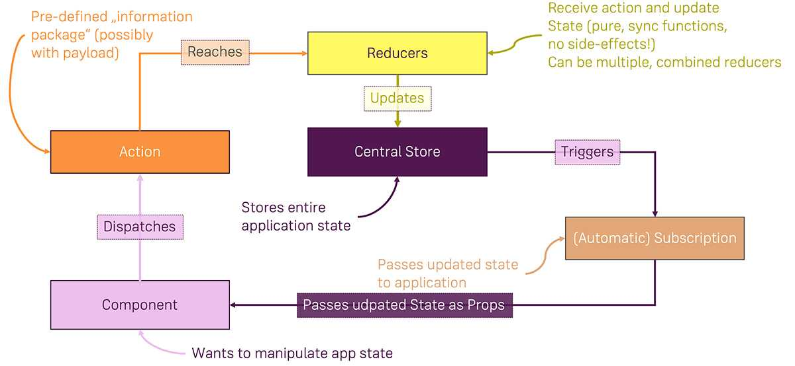
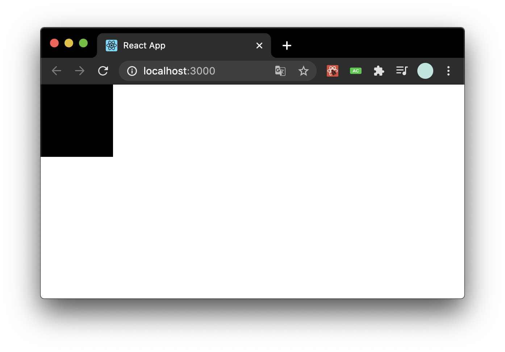
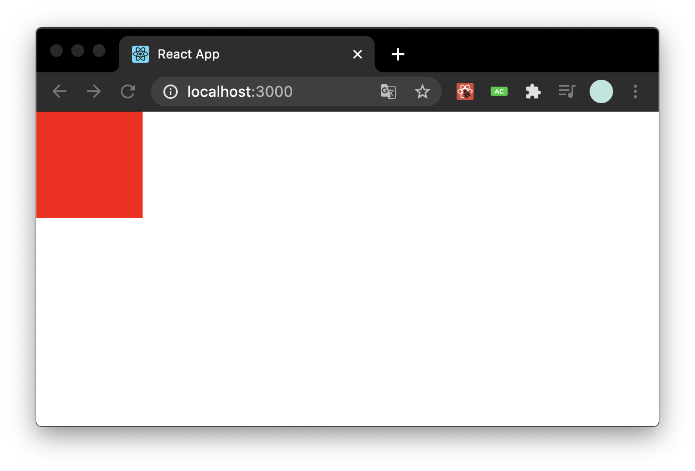
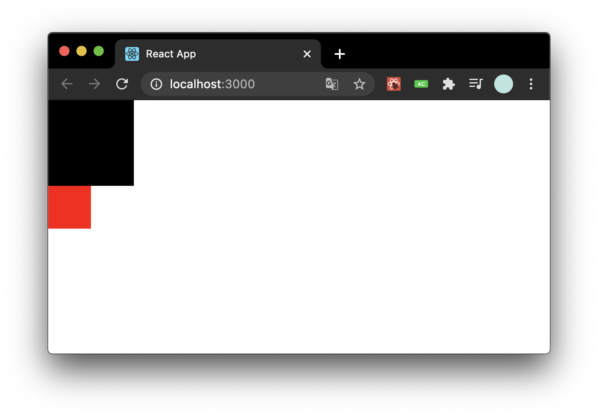
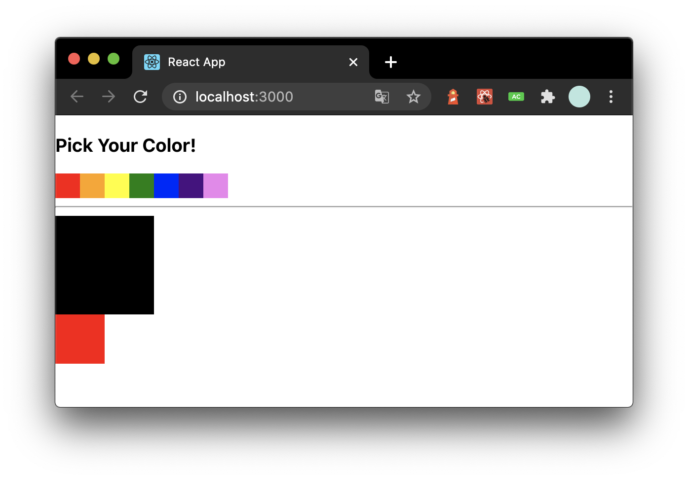

<br>

### 📌 Contents

1. [Redux란?](#what-redux)
2. [Context API란?](#what-context)
3. [Context API vs Redux](#can-replace)

---

<br>

#### Intro

프로젝트에서 전역적으로 필요한 상태를 관리할때, 리액트 애플리케이션은 컴포넌트 간에 데이터를 `props` 로 전달하기 때문에 컴포넌트에서 필요한 데이터가 있으면 주로 루트 컴포넌트인 **App**의 _state_ 에 넣어서 관리한다.



이러한 방식은 컴포넌트 A에서 B, C, D, E ... 까지 값을 전달하기 위해 여러 컴포넌트를 거쳐야 한다. Redux를 사용하면 상태값을 컴포넌트에 종속시키지 않고, 상태 관리를 컴포넌트의 바깥에서 관리할 수 있게 된다. 따라서 Redux 같은 상태 관리 라이브러리를 사용하면 전역 상태 관리 작업을 편하게 할 수 있다.

<br>

### <a name="what-redux"></a>Redux란?

<hr/>

Redux는 중앙에서 React 앱의 상태를 관리하는 데 사용된다. `상태(State)`는 사용자 인터페이스를 올바르게 렌더링하는 데 필요한 데이터를 나타낸다. 예시는 다음과 같다:

- 장바구니의 제품
- 사용자가 HTTP요청이 완료되기를 기다리고 있는지에 대한 정보

Redux는 React에 기술적으로 종속되는 라이브러리가 아니고, 다른 기술에서도 사용되지만 Redux는 특히 React에서 많이 사용된다.

Redux는 4개의 요소로 구성된다.

1. 직접 액세스하거나 변경할 수 없는 **단일 중앙 집중식 상태**(single, centralized state). 즉, 전역객체(global JS object)라고 말할 수 있다.
2. 전역 상태를 변경하고 업데이트하는 로직이 포함된 **리듀서(Reducer)함수**. (필요한 모든 변경 사항과 함께 이전 상태의 새 복사본을 반환해서)
3. 리듀서 함수가 실행되도록 트리거하기 위해 디스패치(dispatch)될 수 있는 **액션(Action)**
4. 전역 상태에서 데이터를 가져오기 위한 **구독(Subscriptions)**



상태를 조작하려는 컴포넌트가 있을때, 미리 정의된 정보 패키지인 액션(**action**)을 디스패치(**dispatch**)한다. 디스패치는 액션을 발생시키는 것이라고 생각하면 된다. 그러면 이 액션은 변화를 일으키는 함수인 리듀서(**reducer**)라는 것에 도달하고, 리듀서는 스토어(**store**)의 상태를 업데이트한다.

그리고 해당 스토어의 상태가 변경되면, 다른 컴포넌트들로부터 해당 스토어에 대한 구독(**subscription**)을 가질 수 있고, 구독은 스토어에서 트리거된다.

이제 만약 업데이트에 관심있는 컴포넌트가 있으면 구독을 설정할 수 있고 업데이트에 대한 정보를 받아서 새로운 상태를 얻을 수 있다.

짧게 요약하면, 다음과 같은 흐름이다.

`dispatch(action) -> Reducer 작동 -> store의 state변경 -> 변경된 state가 state를 구독(subscribe)하고 있는 컴포넌트에게 전달`

<br>

리액트 앱에서는 일반적으로 몇가지 액션이나 액션 생성기가 있다. (예를들어 비동기 작업을 지원하기위해 사용되는 _redux thunk_)

```js
export const ADD_PRODUCT_TO_CART = "ADD_PRODUCT_TO_CART";
export const REMOVE_PRODUCT_FROM_CART = "REMOVE_PRODCUT_FROM_CART";

export const addProductToCart = (product) => {
  return (dispatch) => {
    setTimeout(() => {
      dispatch({
        type: ADD_PRODUCT_TO_CART,
        payload: product,
      });
    }, 700);
  };
};

export const removeProductFromCart = (productId) => {
  return (dispatch) => {
    setTimeout(() => {
      dispatch({
        type: REMOVE_PRODUCT_FROM_CART,
        payload: productId,
      });
    }, 700);
  };
};
```

<br>

그 다음 리듀서(reducer)로 전역 상태를 업데이트 한다.

```js
import { ADD_PRODUCT_TO_CART, REMOVE_PRODUCT_FROM_CART } from "./actions";

const initialState = {
  products: [
    { id: "p1", title: "Gaming Mouse", price: 29.99 },
    { id: "p2", title: "Harry Potter 3", price: 9.99 },
    // ...
  ],
  cart: [],
};

const shopReducer = (state = initialState, action) => {
  switch (action.type) {
    case ADD_PRODUCT_TO_CART:
      // Shortened! Cart updating logic would be found here
      // See the example project linked above
      return { ...state, cart: updatedCart };
    case REMOVE_PRODUCT_FROM_CART:
      // Shortened, too!
      return { ...state, cart: updatedCart };
    default:
      return state;
  }
};
```

<br>

스토어(store)가 구성되고 루트 어플리케이션 컴포넌트를 둘러싼 형태로 전달된다. (App 컴포넌트를 _react-redux_ 에서 제공하는 _Provider_ 컴포넌트로 감싸준다. 이 컴포넌트를 사용할때는 store를 props로 전달해야 한다.)

```js{12}
// Other imports...
import { createStore, applyMiddleware } from "redux";
import { Provider } from "react-redux";
import reduxThunk from "redux-thunk";

// Other imports...
import shopReducer from "./store/reducers";

const store = createStore(shopReducer, applyMiddleware(reduxThunk));

ReactDOM.render(
  <Provider store={store}>
    <App />
  </Provider>
  document.getElementById("root")
);
```

<br>

그 다음 앱에 있는 어떤 컴포넌트든지 [react-redux](https://github.com/reduxjs/react-redux) 패키지를 통해 전역 Redux store에 연결할 수 있다.

```js{33}
// Other imports...
import { connect } from "react-redux";
import { addProductToCart } from "../store/actions";

class ProductsPage extends Component {
  render() {
    return (
      <React.Fragment>
        <MainNavigation cartItemNumber={this.props.cartItemCount} />
        <main className="products">
          {/*  Shortened: Content gets rendered here! */}
        </main>
      </React.Fragment>
    );
  }
}

const mapStateToProps = (state) => {
  return {
    products: state.products,
    cartItemCount: state.cart.reduce((count, curItem) => {
      return count + curItem.quantity;
    }, 0),
  };
};

const mapDispatchToProps = (dispatch) => {
  return {
    addProductToCart: (product) => dispatch(addProductToCart(product)),
  };
};

export default connect(mapStateToProps, mapDispatchToProps)(ProductsPage);
```

`connect`메서드는 백그라운드에서 구독(subscription)을 설정한다.

```js
connect(mapStateToProps, mapDispatchToProps)(연동할 컴포넌트)
```

`mapStateToProps`는 리덕스 스토어 안의 상태를 컴포넌트의 props로 넘겨주기 위해 설정하는 함수이고, `mapDispatchToProps`는 액션 생성 함수를 컴포넌트의 props로 넘겨주기 위해 사용하는 함수이다.

이것이 Redux이고 간단히 React 앱에서 사용하는 방법이다. React의 Context API는 어떻게 작동할까?

<br>

### <a name="what-context"></a>Context API란?

<hr />

직접 연결되지않은 여러 컴포넌트에서 필요한 state를 어떻게 관리할까? 여러 층의 리액트 컴포넌트를 통해 props를 전달할 수 있다.

```js{2, 8,17}
const Button = (props) => (
  <p className={props.theme.light ? "btn--light" : "btn--dark"}>Click me</p>
);

const Form = (props) => (
  <form>
    <input type="text" />
    <Button theme={props.theme} /> {}
  </form>
);

const App = (props) => {
  const [theme, setTheme] = useState("light");
  // Theme is managed here
  return (
    <div>
      <Form theme={theme} /> {}
    </div>
  );
};
```

그러나 이렇게 props를 전달한다면 필요하지 않은 props를 처리해야하므로 컴포넌트를 재사용하기가 더 어려워진다.

앱의 state 또는 컴포넌트 구조가 변경되면 상당한 리팩토링 작업이 수행된다. 이것이 Redux가 인기를 끈 이유이고, Redux는 이 문제를 해결해준다. Context API도 데이터를 전달하는 비슷한 방법을 제공한다.

<br>

### Context API 사용법

<hr />

#### 새 Context 생성

- **_contexts/color.js_**

```js
import { createContext } from "react";

const ColorContext = createContext({ color: "black" });

export default ColorContext;
```

새 Context를 만들 때는 `createContext`함수를 사용한다. 파라미터에는 해당 Context의 기본 상태를 지정한다.

<br>

#### Consumer

아래에서 _ColorBox_ 라는 컴포넌트를 만들어서 _ColorContext_ 의 색상을 보여주는데, 색을 **_props_** 로 받아오는게 아니라 _ColorContext_ 안의 `Consumer`라는 컴포넌트로 색상을 조회한다.

- **_components/ColorBox.js_**

```js
import React from "react";
import ColorContext from "../contexts/color";

const ColorBox = () => {
  return (
    <ColorContext.Consumer>
      {(value) => (
        <div
          style={{
            width: "100px",
            height: "100px",
            background: value.color,
          }}
        />
      )}
    </ColorContext.Consumer>
  );
};

export default ColorBox;
```

`Cousumer` 사이에 중괄호로 함수를 넣었는데 이것을 **Render Props**라 한다. 컴포넌트의 `children`대신 일반 JSX나 함수를 전달한다.

<br>

이제 컴포넌트를 App에 렌더링하고 서버를 열면 검은박스가 보인다.

- **_App.js_**

```js
import React from "react";
import ColorBox from "./components/ColorBox";

const App = () => {
  return (
    <div>
      <ColorBox />
    </div>
  );
};
export default App;
```



<br>

#### Provider

Provider를 사용하면 Context의 value를 변경할 수 있다.

- **_App.js_**

```js{3,7,11}
import React from "react";
import ColorBox from "./components/ColorBox";
import ColorContext from "./contexts/color";

const App = () => {
  return (
    <ColorContext.Provider value={{ color: "red" }}>
      <div>
        <ColorBox />
      </div>
    </ColorContext.Provider>
  );
};
export default App;
```



Provider를 사용할때는 value값을 꼭 명시해야한다.

```jsx
//Correct
<ColorContext.Provider value={{ color: "red" }}>(생략)</ColorContext.Provider>

//Wrong
<ColorContext.Provider>(생략)<ColorContext.Provider/>
```

<br>

### 동적 Context

<hr />

Context의 값을 업데이트하는 경우 어떻게 할까?

Context의 value에는 무조건 상태값만 있어야 하는 것은 아니다. 함수를 전달할 수도 있다.

- **_contexts/color.js_**

```js
import React, { createContext, useState } from "react";

const ColorContext = createContext({
  state: { color: "black", subcolor: "red" },
  actions: {
    setColor: () => {},
    setSubcolor: () => {},
  },
});

const ColorProvider = ({ children }) => {
  const [color, setColor] = useState("black");
  const [subcolor, setSubcolor] = useState("red");

  const value = {
    state: { color, subcolor },
    actions: { setColor, setSubcolor },
  };
  return (
    <ColorContext.Provider value={value}>{children}</ColorContext.Provider>
  );
};

// const ColorConsumer = ColorContext.Consumer
const { Consumer: ColorConsumer } = ColorContext;

export { ColorProvider, ColorConsumer };

export default ColorContext;
```

_ColorProvider_ 라는 컴포넌트를 새로 만들고 _ColorContext.Provider_ 에서 _value_ 에는 상태는 _state_, 업데이트 함수는 _actions_ 로 묶어 전달했다. 이렇게 객체를 따로 분리하면 나중에 다른 컴포넌트에서 **Context**의 값을 사용할 때 편하다.

<br>

이제 **App** 컴포넌트에서 _ColorContext.Provider_ 를 **_ColorProvider_** 로 대체하고 **ColorBox** 도 _ColorContext.Consumer_ 를 **_ColorConsumer_** 로 대체한다.

<br>

- **_App.js_**

```js{3,7,11}
import React from "react";
import ColorBox from "./components/ColorBox";
import { ColorProvider } from "./contexts/color";

const App = () => {
  return (
    <ColorProvider>
      <div>
        <ColorBox />
      </div>
    </ColorProvider>
  );
};
export default App;
```

- **_components/ColorBox.js_**

```js{2,6,13,16-22,25}
import React from "react";
import ColorConsumer from "../contexts/color";

const ColorBox = () => {
  return (
    <ColorConsumer>
      {(value) => (
        <>
          <div
            style={{
              width: "100px",
              height: "100px",
              background: value.state.color,
            }}
          />
          <div
            style={{
              width: "50px",
              height: "50px",
              background: value.state.subcolor,
            }}
          />
        </>
      )}
    </ColorConsumer>
  );
};

export default ColorBox;
```



<br>

#### 색상 선택 컴포넌트 만들기

이번엔 Context의 _actions_ 에 넣어준 함수를 호출하는 컴포넌트를 만들어 보자.

- **_components/SelectColors.js_**

```js
import React from "react";

const colors = ["red", "orange", "yellow", "green", "blue", "indigo", "violet"];

const SelectColors = () => {
  return (
    <div>
      <h3>Pick Your Color!</h3>
      <div style={{ display: "flex" }}>
        {colors.map((color) => (
          <div
            key={color}
            style={{
              background: color,
              width: "20px",
              height: "20px",
              cursor: "pointer",
            }}
          />
        ))}
      </div>
      <hr />
    </div>
  );
};

export default SelectColors;
```

그 다음 이 컴포넌트를 App컴포넌트에서 ColorBox위에 렌더링한다.

- **_App.js_**

```js{4,10}
import React from "react";
import ColorBox from "./components/ColorBox";
import { ColorProvider } from "./contexts/color";
import SelectColors from "./components/SelectColors";

const App = () => {
  return (
    <ColorProvider>
      <div>
        <SelectColors />
        <ColorBox />
      </div>
    </ColorProvider>
  );
};
export default App;
```



<br>

이제 SelectColors 에서 왼쪽 클릭은 큰 박스 색상을 변경, 오른쪽 클릭은 작은 박스 색상을 변경하게 구현한다.

- **_components/SelectColors.js_**

```js
import React from "react";
import { ColorConsumer } from "../contexts/color";

const colors = ["red", "orange", "yellow", "green", "blue", "indigo", "violet"];

const SelectColors = () => {
  return (
    <div>
      <h3>Pick Your Color!</h3>
      <ColorConsumer>
        {({ actions }) => (
          <div style={{ display: "flex" }}>
            {colors.map((color) => (
              <div
                key={color}
                style={{
                  background: color,
                  width: "25px",
                  height: "25px",
                  cursor: "pointer",
                }}
                onClick={() => actions.setColor(color)}
                onContextMenu={(e) => {
                  e.preventDefault(); //우클릭시 메뉴 뜨는것 방지
                  actions.setSubcolor(color);
                }}
              />
            ))}
          </div>
        )}
      </ColorConsumer>
      <hr />
    </div>
  );
};

export default SelectColors;
```

우클릭 이벤트는 `onContextMenu`를 이용했다. 이제 좌/우 클릭으로 색상을 제어할 수 있다.

<br>

### Consumer 대신 Hook 사용하기

<hr />

#### useContext Hook

`useContext` Hook을 사용하면 함수형 컴포넌트에서 Context를 편하게 사용할 수 있다. ColorBox 컴포넌트를 아래와 같이 수정한다.

```js{2,5,12,19}
import React, { useContext } from "react";
import ColorContext from "../contexts/color";

const ColorBox = () => {
  const { state } = useContext(ColorContext);
  return (
    <>
      <div
        style={{
          width: "100px",
          height: "100px",
          background: state.color,
        }}
      />
      <div
        style={{
          width: "50px",
          height: "50px",
          background: state.subcolor,
        }}
      />
    </>
  );
};

export default ColorBox;
```

이렇게 `useContext` Hook을 사용하면 편하게 Context값을 조회할 수 있다.

참고로 **클래스형 컴포넌트**에서 Context를 좀 더 쉽게 사용하는 방법으로는, `static contextType`을 정의하는 방법이 있다.

<br>

### <a name="can-replace"></a>Context API vs Redux

<hr />

**Context API**는 익숙해지면 비교적 사용하기 편하며, 비동기 작업을 다루는 _redux-thunk_ 같은 패키지가 필요없다는 장점이 있다.

단순히 전역 상태 관리만 한다면 Context API를 사용하는 것만으로 충분하지만, Redux는 단순한 전역적 상태 관리 그 이상의 가치가 있다. 

**Redux**는 더 향상된 성능, 미들웨어 기능, 강력한 개발자 도구, 코드의 높은 유지보수성 등을 제공한다는 장점이 있다.

따라서 Redux를 사용하면 상태를 더 체계적으로 관리할 수 있으므로 프로젝트 규모가 클 경우 Redux를 사용하는 것이 좋다.

<br>

### Reference

- [Maximilian Schwarzmüller - Redux vs React’s Context API](https://academind.com/learn/react/redux-vs-context-api/#will-react-s-context-api-replace-redux)
- [Veloport - 리액트를 다루는 기술](http://www.yes24.com/Product/Goods/78233628?Acode=101)
