---

### 📌 Contents

1. [iOS](#ios-deploy)
2. [Android](#and-deploy)

---

<br>

### <a name="ios-deploy"></a>iOS

<hr />

#### 인증서 생성

앱을 배포하려면 먼저 개발자 등록 후에 인증서 및 프로비저닝 프로파일을 생성할 필요가 있다. 개발자 프로그램 등록을 완료했다면 애플 개발자 사이트(https://developer.apple.com/) 에서 **[ _Account > Certificates, Identifiers & Profiles_ ]** 로 이동한다. 이미 인증서 하나가 있다면 최초로 개발자 등록을 할때 만들어진 개발용 인증서다. 인증서를 선택해서 다운로드하고 키체인에 인증서를 등록하면 된다.

그리고 배포용 인증서가 필요하다. **_키체인 접근 > 인증서 지원 > 인증기관에서 인증서 요청_** 을 실행해서 이메일주소, 일반이름을 클릭하고 **요청 항목**에서 **_디스크에 저장, 본인이 키 쌍 정보 지정_** 을 체크하여 인증서를 생성한다.
**[ Certificates ]** 탭에서 **iOS Distribution**을 선택하고 키체인으로 만든 파일을 업로드 후 배포용 인증서를 다운로드한다.

<br>

#### 프로비저닝 프로파일 생성

프로비저닝 프로파일도 개발용/배포용 두가지가 필요하다. 먼저 개발용은 **[ Profiles ]** 탭에서 **iOS App Development**를 선택하여 식별자를 고르고 프로비저닝 이름을 입력해서 생성한다. 배포용은 **[ Profiles ]** 탭에서 **App Store**를 선택하면 된다.

<br>

#### 빌드

**_ios/[프로젝트이름]/Info.plist_** 에서 다음 내용을 삭제한다. 앱 내부에서 외부 API를 호출할 때, HTTPS만 사용할 수 있게 한다.

> #### 앱을 개발할때는 로컬 서버와 HTTP로 통신하기 때문에 다시 이 부분을 넣어줘야 한다.

```md
<key>NSAppTransportSecurity</key>
<dict>
	<key>NSAllowsArbitraryLoads</key>
	<true/>
	<key>NSExceptionDomains</key>
	<dict>
		<key>localhost</key>
		<dict>
			<key>NSExceptionAllowsInsecureHTTPLoads</key>
			<true/>
		</dict>
	</dict>
</dict>
```

추가로, 사용자 위치 정보를 사용하지 않는다면 이 부분을 제거한다.

```md
<key>NSLocationWhenInUseUsageDescription</key>
<string>Our app requires Location access.</string>
```

<br>


그리고 Xcode에서 시뮬레이터를 **Any ios Device** 로 하고, **Product > Scheme > Edit Scheme** 에서 **Build Configuration**의 **_Debug_** 를 **_Release_** 로 변경한다. 

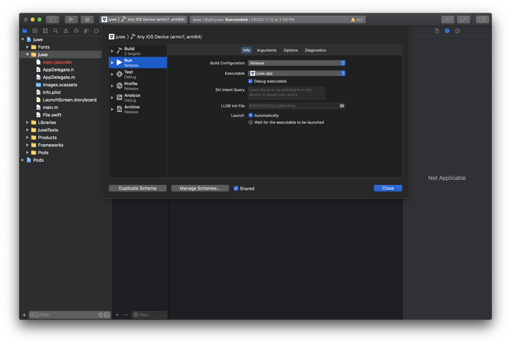

> #### 개발 시에는 다시 Debug로 해야한다.

<br>

이제 **Product > Archive** 로 앱을 빌드한다. 빌드가 완료되면 **Distribute App** 을 눌러서 앱을 앱스토어 커넥트에 업로드한다. 

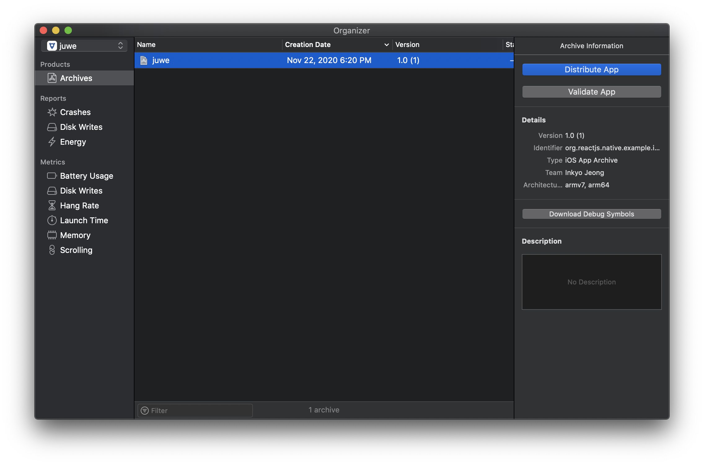

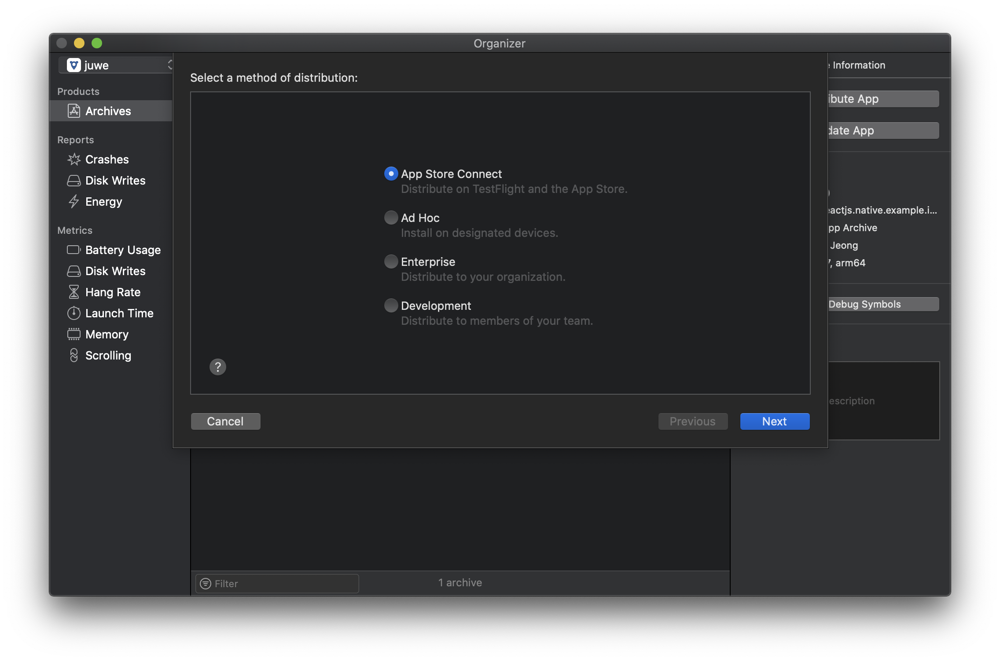


**App Store Connect > Upload** 를 선택하고 **Next**로 이동한다.

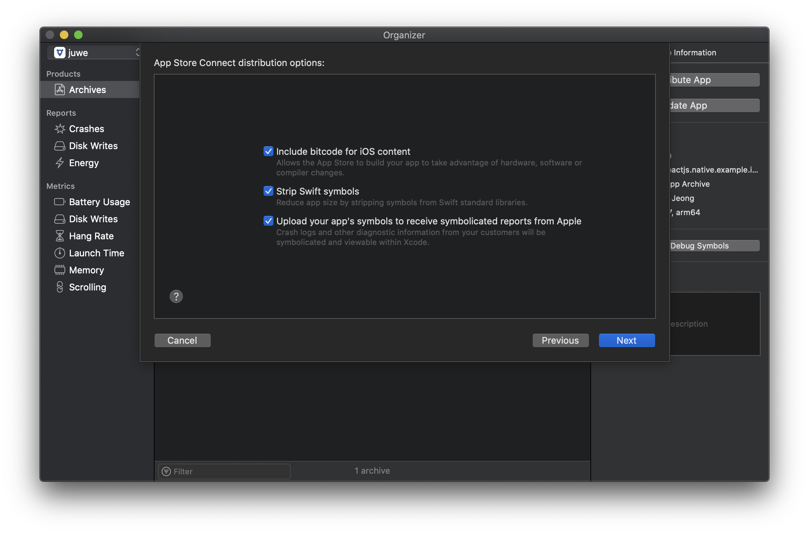

옵션은 모두 체크한 상태에서 **Next**로 이동한다. 이제 **Upload**를 누르고 성공하면 이런 화면을 볼 수 있다.

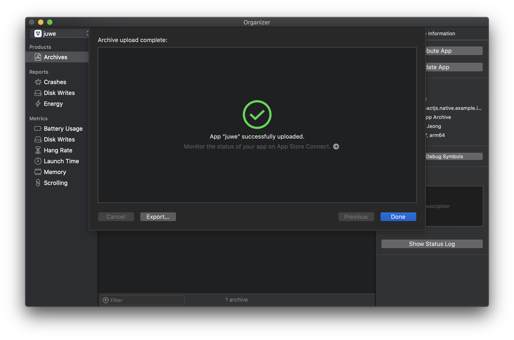

<br>

> #### 빌드시 발생한 오류

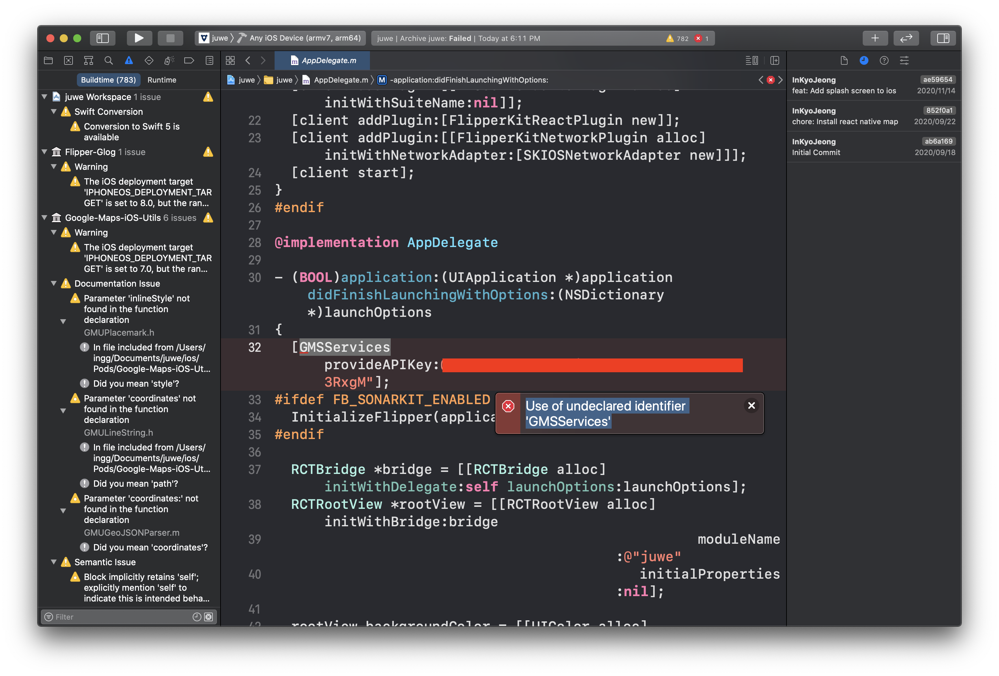


빌드 과정에서 `Use of undeclared identifier 'GMSServices'` 라는 구글맵 관련 오류가 발생하여 실패했는데 **_Import_** 중 제일 하단에있던 GoogleMap을 `ifdef` 상단으로 옮기고 빌드했더니 해결되었다.

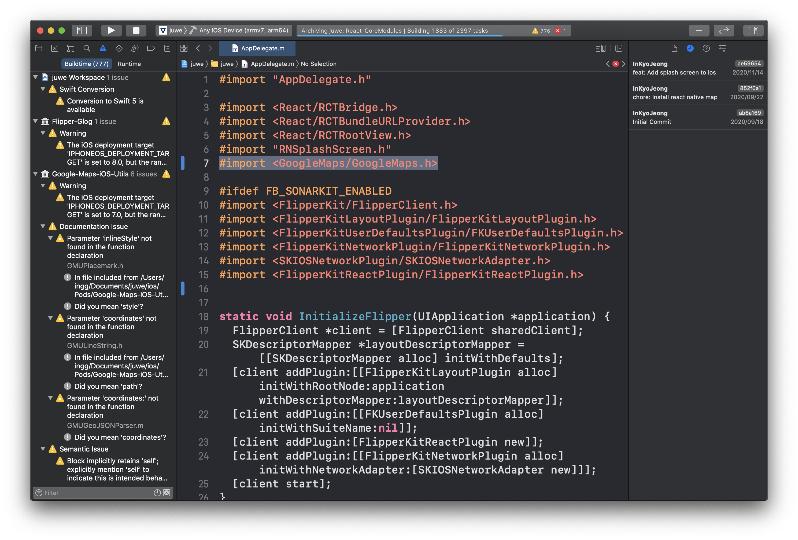

<br>

#### 배포

앱스토어 커넥트(https://appstoreconnect.apple.com/)의 **Testfligh**t로 이동하면 업로드한 앱이 처리중 상태이고 메일이 오는데, 앱 배포준비가 끝났다는 메일을 받을 수 있다. 이제 제출 준비 중 탭에서 빌드 옆의 + 버튼을 눌러 빌드된 앱을 선택하면 된다. 그리고 필요한 앱 스크린샷, 제목, 정보, 등급 등의 정보와 사진을 모두 등록하면 된다.

iPhone 미리보기 및 스크린샷은 6.5형 디스플레이 _(1242x2688)_, 5.5형 디스플레이 _(1242x2208)_ 파일을 필수로 올려야 한다.

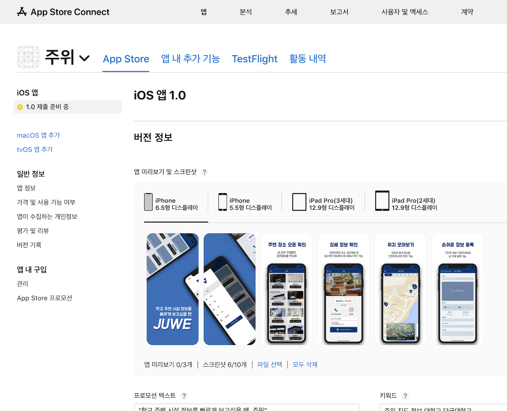

<br>

이제 **심사를 위한 제출**을 누르면 일정 시간이 지난 후, 심사 결과가 이메일로 통보된다.

리젝을 당하면 해명으로 해결하거나, 새로운 빌드가 필요한 경우 버전을 올려서 배포해야 한다. 보통 버전은 **_1.0.0(major.minor.patch)_** 과 같이 세 자리로 관리한다.

> 앱 업데이트 시 _Info.plist_ 의 `ShortVersionString`를 증가시켜야한다.

<br>

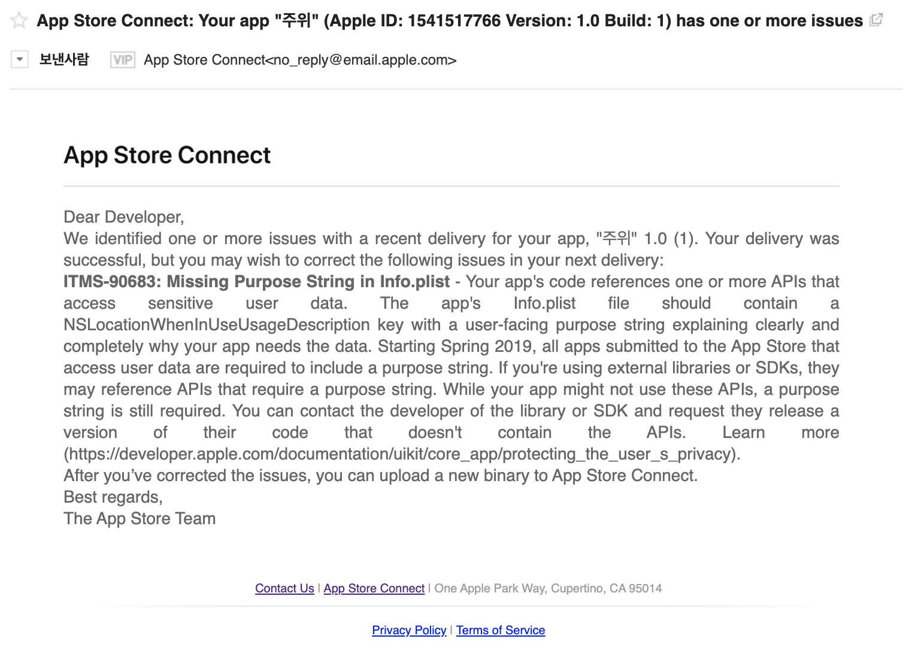

<br>

나의 경우 빌드후에 이런 메일을 받았는데, **_NSLocationWhenInUseUsageDescription_** 이 없어서 발생한 이슈로 보인다.  내 앱은 사용자 위치 정보를 사용하지 않아서 해당 코드를 제거했기 때문에 일단 그대로 제출했고, 심사가 통과됐다. 심사에서 리젝될까봐 걱정했는데, 이런 경우 일단 무시하고 심사 제출해보는 것도 나쁘지 않은 것 같다. 조언해주신 개발자 [yakuza](https://dev-yakuza.posstree.com/ko/)님께 정말 감사드린다.

<br>

### <a name="and-deploy"></a>Android

<hr/>

#### 서명키 생성

1. 먼저 **_/android/app_** 디렉토리에서 명령어로 서명 키를 생성한다. _my-upload-key.keystore_ 파일이 생성된다.

```
$ cd android/app
$ keytool -genkeypair -v -keystore [my-upload-key].keystore -alias [my-key-alias] -keyalg RSA -keysize 2048 -validity 10000
```

<br>

2. **_/android/gradle.properties_** 파일에 다음 내용을 추가한다.

```
MYAPP_RELEASE_STORE_FILE=my-upload-key.keystore
MYAPP_RELEASE_KEY_ALIAS=my-key-alias
MYAPP_RELEASE_STORE_PASSWORD=비밀번호
MYAPP_RELEASE_KEY_PASSWORD=비밀번호
```

<br>

3. **_android/app/build.gradle_** 파일을 다음과 같이 수정한다.

```md{6-13, 18}
...
android {
    ...
    defaultConfig { ... }
    signingConfigs {
        release {
            if (project.hasProperty('MYAPP_RELEASE_STORE_FILE')) {
                storeFile file(MYAPP_RELEASE_STORE_FILE)
                storePassword MYAPP_RELEASE_STORE_PASSWORD
                keyAlias MYAPP_RELEASE_KEY_ALIAS
                keyPassword MYAPP_RELEASE_KEY_PASSWORD
            }
        }
    }
    buildTypes {
        release {
            ...
            signingConfig signingConfigs.release
        }
    }
}
...
```

<br>

#### 빌드

```
$ cd android
$ ./gradlew assembleRelease
```

성공하면 _android/app/build/outputs/apk/release/app-release.apk_ 이 경로에 생성된다. 

<br>

#### 빌드파일 최적화

배포파일의 사이즈를 최적화하려면 **_app/build.gradle_** 를 다음과 같이 수정한다.

```md{2,3,9,11,20}
project.ext.react = [
    entryFile: "index.js",
    enableHermes: true,  // clean and rebuild if changing
]

apply from: "../../node_modules/react-native/react.gradle"


def enableSeparateBuildPerCPUArchitecture = true

def enableProguardInReleaseBuilds = true

...

 buildTypes {
        // debug {
        //     signingConfig signingConfigs.debug
        // }
        release {
            shrinkResources enableProguardInReleaseBuilds
	...
```


이제 다시 아래명령으로 빌드한다.
```
$ ./gradlew app:assembleRelease
```

> 앱 업데이트 시에는 `versionCode`를 꼭 증가시켜야 한다.

빌드가 완료되면 _android/app/build/outputs/apk/release_ 디렉토리에 apk파일 4가지가 생성된다.

- **app-arm64-v8a-release.apk**
- **app-armeabi-v7a-release.apk**
- **app-x86_64-release.apk**
- **app-x86-release.apk**

<br>

만약 다시 빌드하는 과정에서 다음과 같은 오류가 발생한다면,

```
Expiring Daemon because JVM heap space is exhausted
```

**_gradle.properties_** 파일 아래에 다음코드를 추가한다.

```md{2,3}
...
org.gradle.daemon=true
org.gradle.jvmargs=-Xmx2560m
```

<br>

#### 배포

이제 구글 플레이 콘솔(https://play.google.com/console/)에서 앱 만들기를 클릭하여 앱이름, 언어 등을 선택한다. 그리고 **[ 기본 스토어 등록정보 ]** 탭에서 이름, 설명, 개발자 정보, 앱 스크린샷 등의 기본 정보들을 모두 설정한다. 안드로이드는 앱 미리보기 스크린샷(1242x2208), 아이콘(512px), 그래픽이미지(1024x500)가 필요하다.

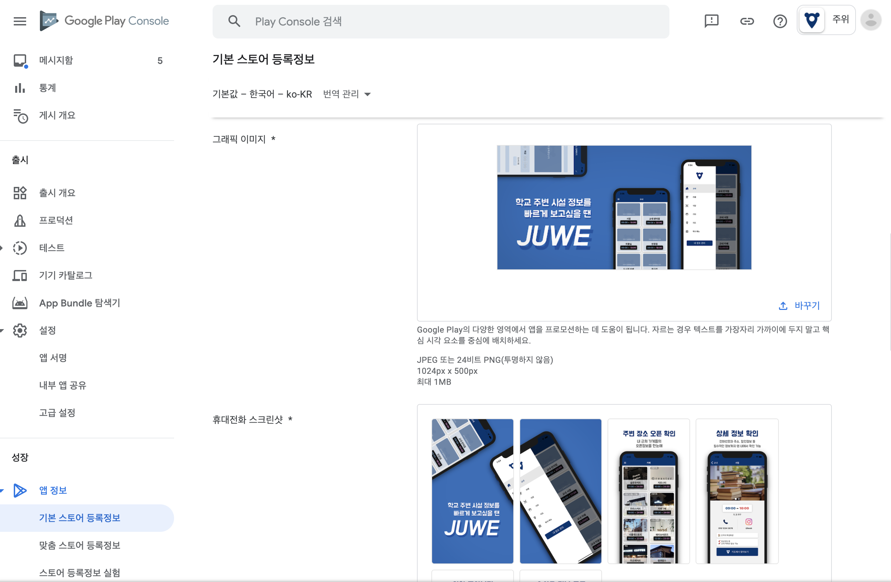

<br>

그리고 **[ 앱 콘텐츠 ]** 탭에서 개인정보처리방침, 광고, 콘텐츠 등급 등을 모두 설정한다.

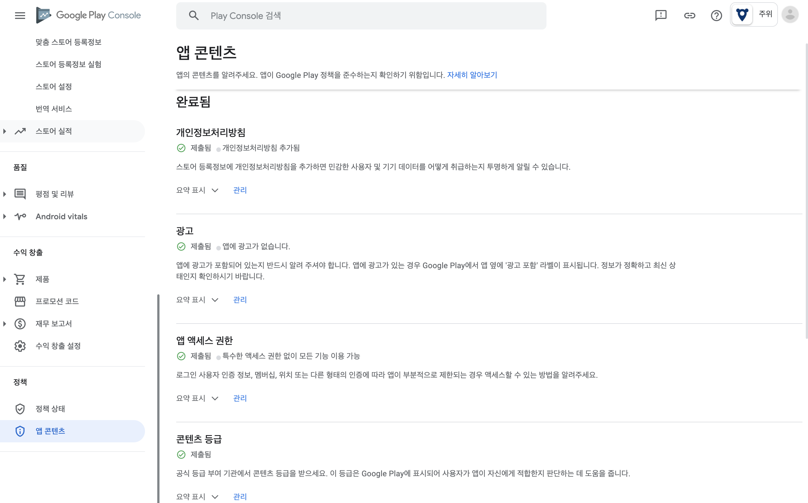

<br>

그 다음 **[ 프로덕션 ]** 탭에서 빌드한 apk파일 4개를 추가한다. **국가/지역**도 설정해야한다. 모두 완료되면 프로덕션 출시 시작 버튼을 눌러 앱을 배포한다.

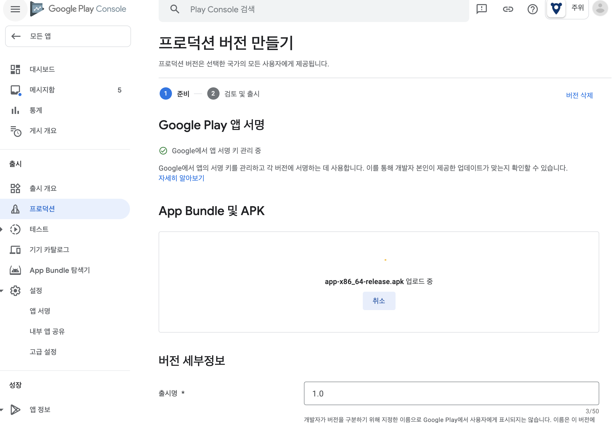

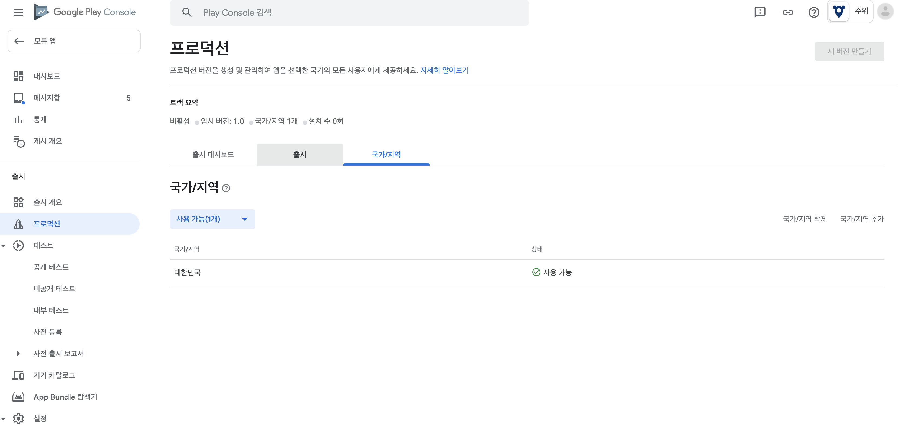


<br>

> #### apk 업로드시 발생한 오류

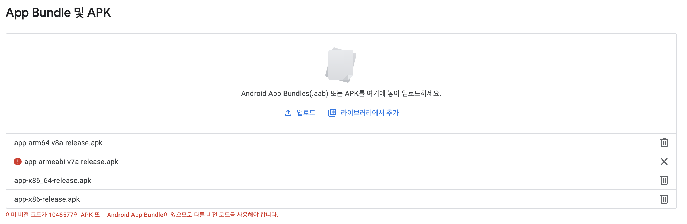


**_android/app/build.gradle_** 에서 **_versionCode_** 를 **1**에서 **2**로 수정하여 해결했다.

```md{6,7}
...
defaultConfig{
    applicationId "com.juwe"
    minSdkVersion rootProject.ext.minSdkVersion
    targetSdkVersion rootProject.ext.targetSdkVersion
    versionCode 2
    versionName "2.0"
    vectorDrawables.useSupportLibrary = true
    multiDexEnabled true
...
```


<br>

### Reference

- https://reactnative.dev/docs/signed-apk-android
- https://dev-yakuza.posstree.com/react-native/android-google-play/