---

### 📌 Contents

1. [설치](#install)
2. [iOS](#ios-apply)
3. [Android](#and-apply)

---

<br>


### <a name="install"></a>설치

<hr />

1. [react-native-splash-screen](https://github.com/crazycodeboy/react-native-splash-screen)을 설치한다.

```
$ yarn add react-native-splash-screen

// or

$ npm install react-native-splash-screen --save
```

<br>

2. **_React Native CLI 0.60+_** 부터는 아래 명령으로 자동 설치한다.

```
cd ios && pod install && cd ..
```

> #### React Native CLI 0.60 아래 버전이라면 별도로 _link_ 해야한다. <br> _react-native link react-native-splash-screen_

<br>

3. **_App.js_** 에서 splash screen을 종료시키는 코드를 추가한다.

```js{1-2, 6-10}
import React, {useEffect} from 'react';
import SplashScreen from 'react-native-splash-screen';

//...

const App = () => {
  useEffect(() => {
    SplashScreen.hide();
  }, []);


  return (
    <Provider store={store}>
      <StatusBar barStyle="dark-content" />
      <NavigationContainer />
    </Provider>
  );
};

export default App;
```

<!-- status bar를 제어하려면 추가한다. -->

<br>

### <a name="ios-apply"></a>iOS

<hr />

프로젝트 루트에서 `open ios/[project_name].xcworkspace`을 실행하여 **Xcode**를 실행한다.

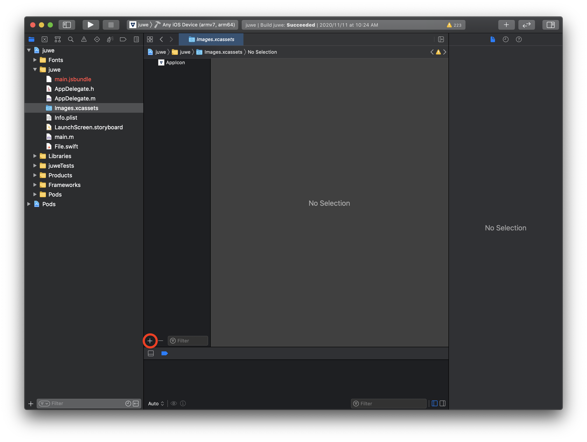

**[project_name] > [project_name] > Imagex.xcassets** 에서 **+** 를 누르고 **Image Set** 을 클릭하여 **SplashIcon** 을 입력한다.

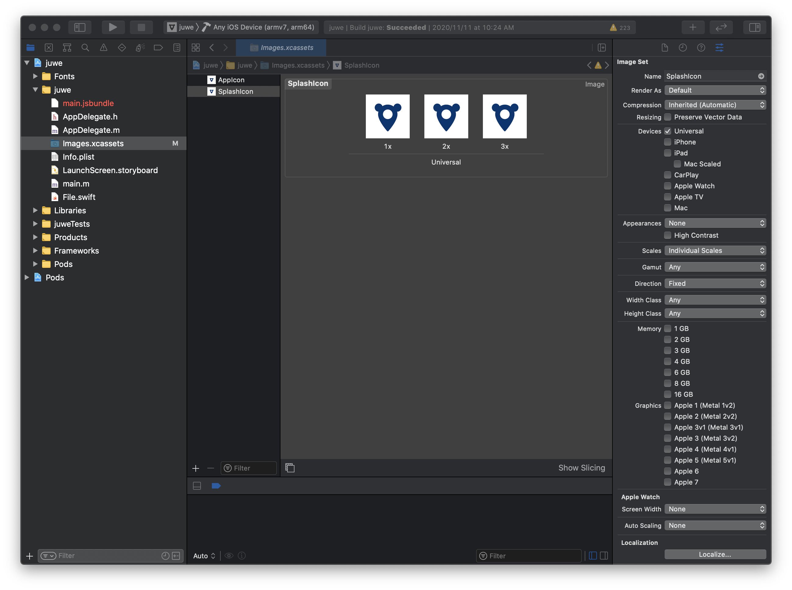


세가지 사이즈(_300px, 600px @x2, 900px @x3_)의 _png_ 파일을 끌어넣을 수 있다. [(예시이미지)](https://github.com/appstud/react-native-splashscreen-tutorial/tree/master/assets/splash_icon)

<br>

#### background 설정

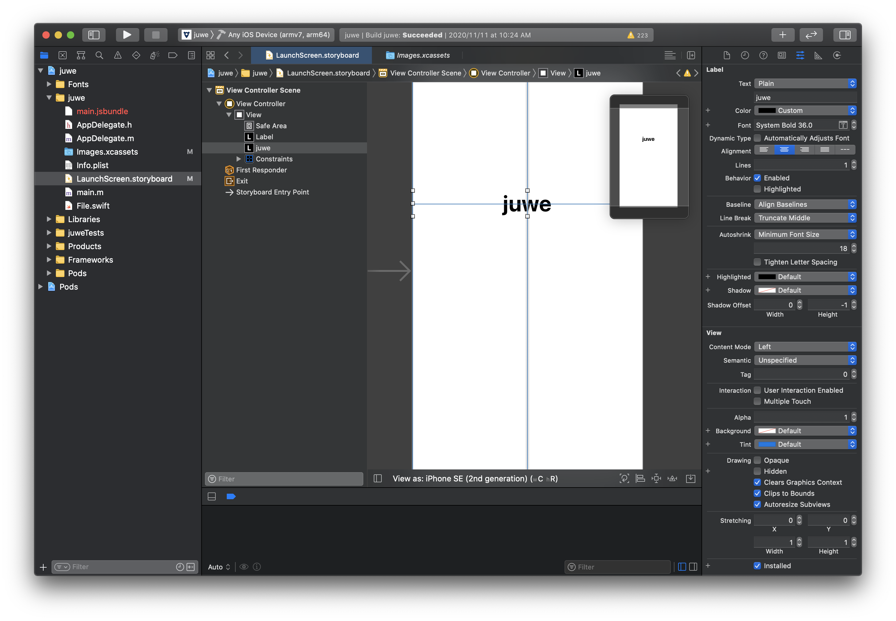


**_LaunchScreen.storyBoard_** 에서 기본적으로 설정되어있는 프로젝트 네임과 _Powered by React Native_ 를 지우고 **Background > custom** 에서 색상을 변경한다. 두번째 탭에서 코드로 변경할 수 있다.

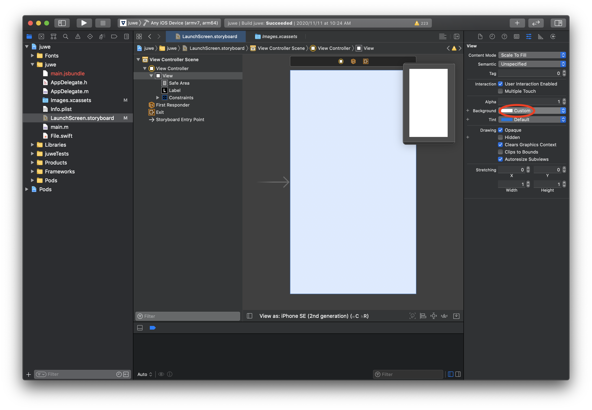

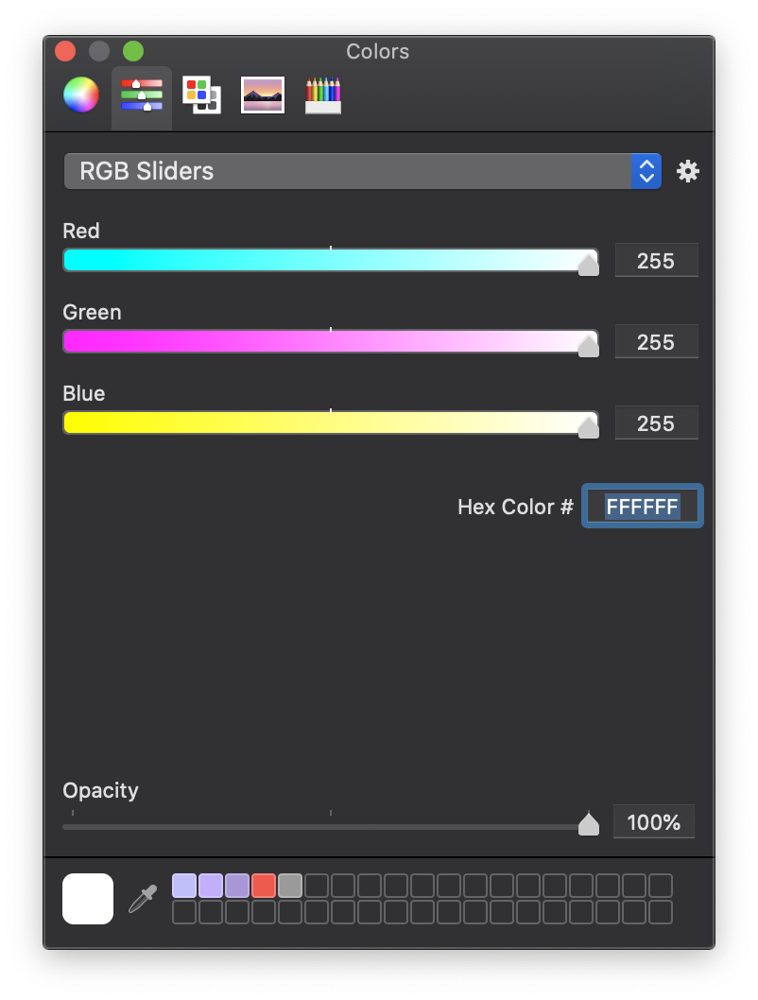


<br>

#### icon 추가

상단의 **+ (Library)** 를 클릭하고 **Image**를 검색하여 **Image View**를 추가한다.


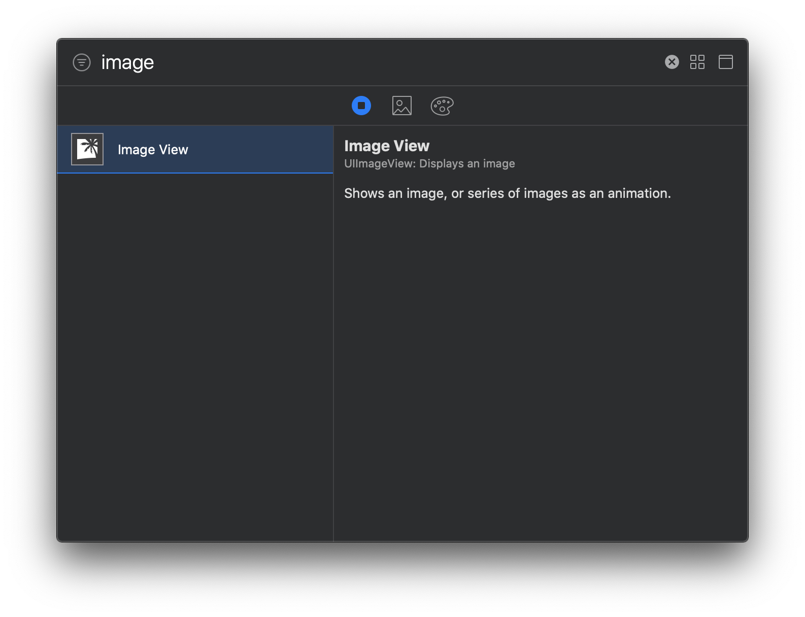

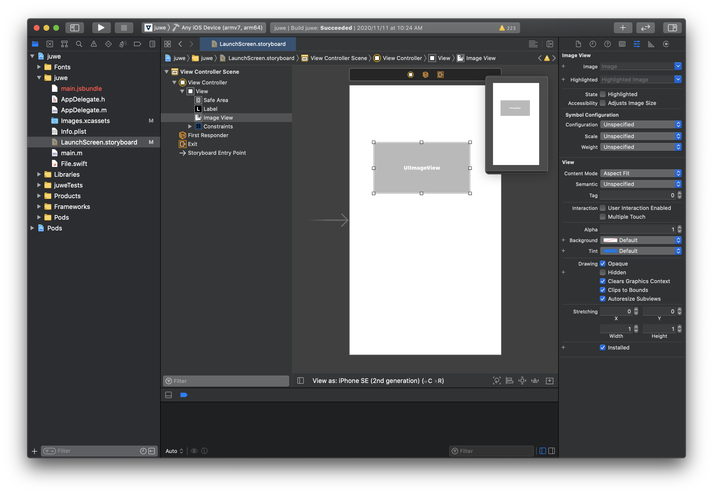

**SplashIcon**를 입력하여 이미지를 선택하고 **Content Mode** 옵션은 **Aspect Fit**로 설정한다.

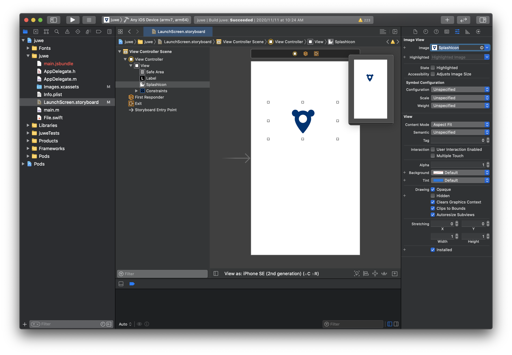


<br>

#### 중앙 정렬

디바이스에 상관없이 중앙 정렬하려면 **Align** 에서 **Horizontally in container**와 **Vertically in container**를 체크하여 추가한다.

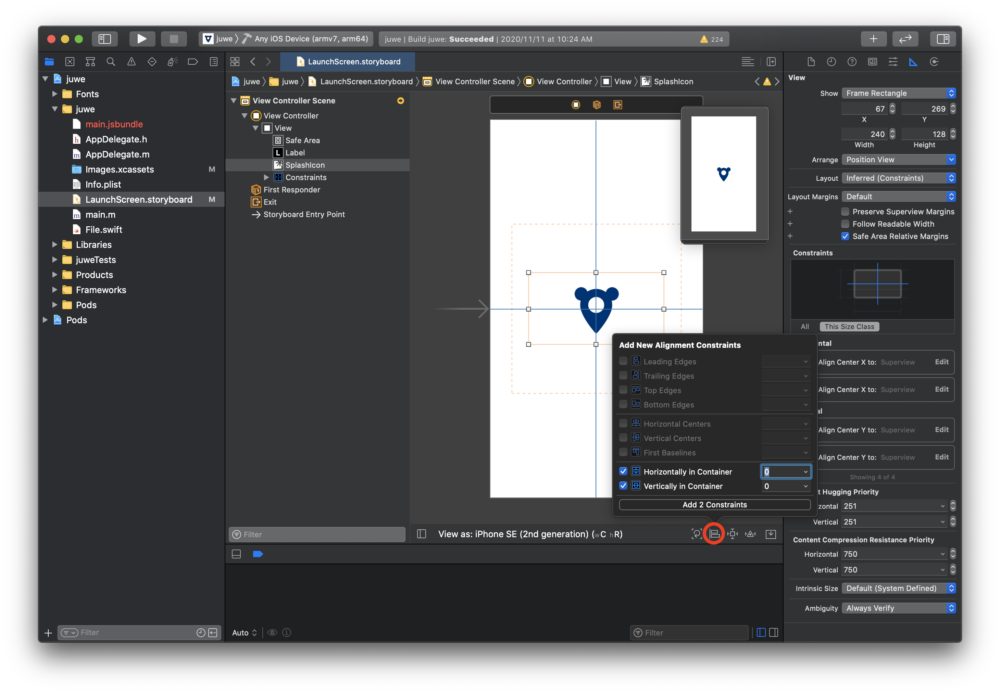


<br>

#### splash-screen 설정

마지막으로 **AppDelegate.m** 에 splash코드를 추가하여 적용하면 된다.

- **[project_name] > [project_name] > AppDelegate.m**

```md{6}
#import "AppDelegate.h"

#import <React/RCTBridge.h>
#import <React/RCTBundleURLProvider.h>
#import <React/RCTRootView.h>
#import "RNSplashScreen.h"
//...

```
```shell{18}
//...
- (BOOL)application:(UIApplication *)application didFinishLaunchingWithOptions:(NSDictionary *)launchOptions
{

  RCTBridge *bridge = [[RCTBridge alloc] initWithDelegate:self launchOptions:launchOptions];
  RCTRootView *rootView = [[RCTRootView alloc] initWithBridge:bridge
                                                   moduleName:@"juwe"
                                            initialProperties:nil];

  rootView.backgroundColor = [[UIColor alloc] initWithRed:1.0f green:1.0f blue:1.0f alpha:1];

  self.window = [[UIWindow alloc] initWithFrame:[UIScreen mainScreen].bounds];
  UIViewController *rootViewController = [UIViewController new];
  rootViewController.view = rootView;
  self.window.rootViewController = rootViewController;
  [self.window makeKeyAndVisible];

  [RNSplashScreen show];
  return YES;
}
//...
```

이제 앱이 로딩되는 동안 스플래시 이미지가 나타나는 것을 볼 수 있다.


<!-- 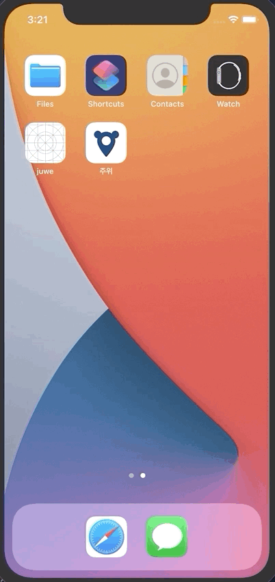 -->

<center></center>


<br>

### <a name="and-apply"></a>Android

<hr />

#### icon 추가

안드로이드에서는 **_android/app/src/main/res_** 에서 다음과 같이 디렉토리에 따라 파일을 추가한다.

- **mipmap-mdpi -> splash_icon.png**
- **mipmap-hdpi -> splash_icon@2x.png**
- **mipmap-xhdpi, mipmap-xxhdpi, mipmap-xxxhdpi -> splash_icon@3x.png**

추가 후, 모든 파일이름은 **splash_icon.png**로 수정한다.

<br>

#### splash-screen 생성

_**android/app/src/main/res**_ 에서 **drawable** 폴더를 만들고 **background_splash.xml** 파일을 생성한다.

- **android/app/src/main/res/drawable/background_splash.xml**

```xml
<?xml version="1.0" encoding="utf-8"?>
<layer-list xmlns:android="http://schemas.android.com/apk/res/android">

    <item
        android:drawable="@color/splashscreen_bg"/>

    <item
        android:width="300dp"
        android:height="300dp"
        android:drawable="@mipmap/splash_icon"
        android:gravity="center" />

</layer-list>
```

그 다음 **_android/app/src/main/res/values_** 의 **colors.xml** 파일을 생성하고 컬러코드(_ex: #ffffff_)를 넣는다.

```xml
<?xml version="1.0" encoding="utf-8"?>
<resources>
    <color name="splashscreen_bg">#ffffff</color>
    <color name="app_bg">#ffffff</color>
</resources>
```

**_android/app/src/main/res/values/styles.xml_** 파일도 아래 코드로 수정한다.

```xml
<resources>

    <!-- Base application theme. -->
    <style name="AppTheme" parent="Theme.AppCompat.Light.NoActionBar">
        <!-- Customize your theme here. -->
        <item name="android:textColor">#000000</item>

        <!-- Add the following line to set the default status bar color for all the app. -->
        <item name="android:statusBarColor">@color/app_bg</item>
        <!-- Add the following line to set the default status bar text color for all the app 
        to be a light color (false) or a dark color (true) -->
        <item name="android:windowLightStatusBar">false</item>
        <!-- Add the following line to set the default background color for all the app. -->
        <item name="android:windowBackground">@color/app_bg</item>
    </style>

    <!-- Adds the splash screen definition -->
    <style name="SplashTheme" parent="Theme.AppCompat.Light.NoActionBar">
        <item name="android:statusBarColor">@color/splashscreen_bg</item>
        <item name="android:background">@drawable/background_splash</item>
    </style>

</resources>
```


<br>

#### splash-screen 설정

**_android/app/src/main/AndroidManifest.xml_** 파일을 수정한다. `intent-filter`태그를 **삭제**하고 `SplashActivity`태그추가, **MainActivity**의 `android:exported="true"`속성을 추가한다.

```xml{10-19, 29}
<!-- ... -->
    <application
      android:name=".MainApplication"
      android:label="@string/app_name"
      android:icon="@mipmap/ic_launcher"
      android:roundIcon="@mipmap/ic_launcher_round"
      android:allowBackup="false"
      android:theme="@style/AppTheme">


        <activity
          android:name=".SplashActivity"
          android:theme="@style/SplashTheme"
          android:label="@string/app_name">
          <intent-filter>
              <action android:name="android.intent.action.MAIN" />
              <category android:name="android.intent.category.LAUNCHER" />
          </intent-filter>
        </activity>

    <!-- ... -->

      <activity
        android:name=".MainActivity"
        android:label="@string/app_name"
        android:configChanges="keyboard|keyboardHidden|orientation|screenSize|uiMode"
        android:launchMode="singleTask"
        android:windowSoftInputMode="adjustResize"
        android:exported="true">

         <!-- 삭제 -->
         <!-- <intent-filter>
             <action android:name="android.intent.action.MAIN" />
             <category android:name="android.intent.category.LAUNCHER" />
         </intent-filter> -->
       

      </activity>
      <activity android:name="com.facebook.react.devsupport.DevSettingsActivity" />
    </application>

</manifest>
```

<br>

- **android/app/src/main/java/com/[package_name]/SplashActivity.java** 파일을 생성하고 아래 코드를 넣는다.

```java
package com.[package_name]; // 패키지 이름 수정

import android.content.Intent;
import android.os.Bundle;
import androidx.appcompat.app.AppCompatActivity;

public class SplashActivity extends AppCompatActivity {
    @Override
    protected void onCreate(Bundle savedInstanceState) {
        super.onCreate(savedInstanceState);

        Intent intent = new Intent(this, MainActivity.class);
        startActivity(intent);
        finish();
    }
}
```

<br>

#### splash-screen 적용

이제 splash screen을 제대로 적용하려면 **android/app/src/main/java/com/[package_name]/MainActivity.java** 에서 다음 코드들을 추가한다.

```java{4-5, 9-13}
package com.[package_name];  // 패키지 이름 수정

import com.facebook.react.ReactActivity;
import org.devio.rn.splashscreen.SplashScreen;
import android.os.Bundle;

public class MainActivity extends ReactActivity {

  @Override
    protected void onCreate(Bundle savedInstanceState) {
        SplashScreen.show(this);
        super.onCreate(savedInstanceState);
    }

    //  Returns the name of the main component registered from JavaScript. This is used to schedule
    //  rendering of the component.

  @Override
  protected String getMainComponentName() {
    return "juwe";
  }
}
```

<br>

그리고 **_android/app/src/main/res_** 위치에 **layout** 폴더를 만들고 **launch_screen.xml**파일을 추가한다. 

- **android/app/src/main/res/layout/launch_screen.xml**

```xml
<?xml version="1.0" encoding="utf-8"?>
<LinearLayout xmlns:android="http://schemas.android.com/apk/res/android"
    android:layout_width="match_parent"
    android:layout_height="match_parent"
    android:background="@drawable/background_splash"
    android:orientation="vertical">
</LinearLayout>
```

<br>

이제 안드로이드에서도 splash screen이 적용된 것을 확인할 수 있다.

<center>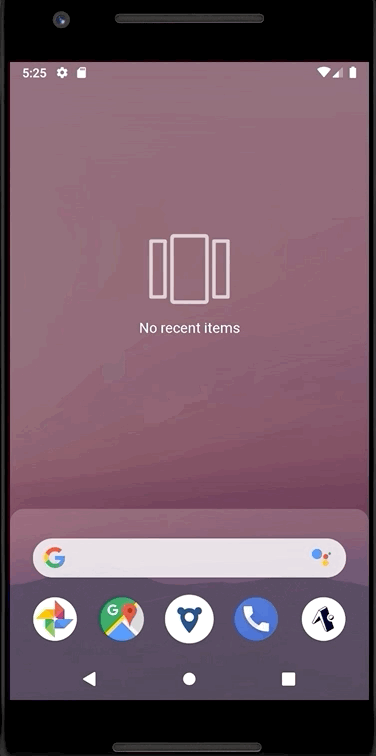</center>
