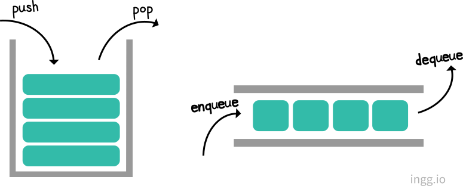
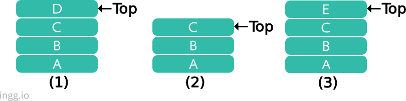
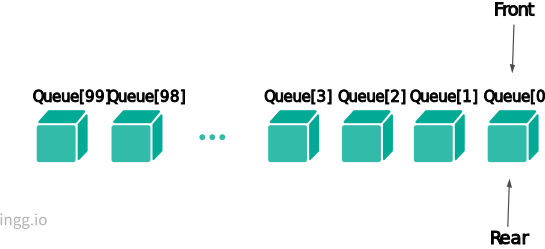
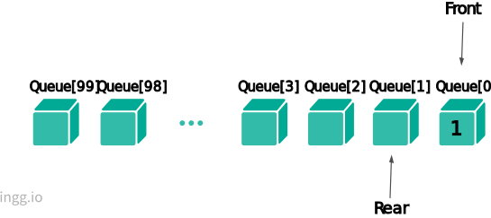

---

### 📌 Contents

1. [스택(Stack)](#stack)
2. [큐(Queue)](#queue)

---

<br>

### <a name="stack"></a>스택(Stack)

<hr>

스택은 **입력과 출력을 한 방향으로 제한한 자료구조**라고 말할 수 있다. 데이터의 삽입과 삭제가 한쪽 끝에서만 이루어진다. 삽입/삭제가 일어나는 쪽을 스택의 **top**이라고 부른다.

- **푸시(push)** : 접시를 찬장에 쌓는다. 즉, 데이터에 순서를 적용해 차례로 저장한다.
- **팝(pop)** : 접시를 사용하기위해 찬장의 가장 위에 있는 접시를 가져온다. 즉, 가장 최신 데이터부터 차례로 가져온다.
- peek(top) : 스택 top의 원소를 제거하지 않고 반환
- empty : 스택이 비었는지 검사

이런 방식을 **LIFO(Last In, First Out)** 이라고 한다. 마지막에 들어간 것이 제일 처음 나온다는 뜻이다.

<br>



```c
push("A");
push("B");
push("C");
push("D");                  //스택의 상태는 (1)이 됨

char *str1 = peek();        //str1은 "D"가 됨
char *str2 = pop();         //str2는 "D"가 되고 스택의 상태는 (2)로 바뀜
push("E");                  //스택의 상태가 (3)으로 바뀜
```

<br>

### <a name="queue"></a>큐(Queue)

<hr>

큐(queue)는 대기행렬이라고 볼 수 있다. 역시 스택과 마찬가지로 일종의 리스트이다. 단, 데이터의 삽입은 한쪽 끝에서, 삭제는 반대쪽 끝에서만 일어난다. 삽입이 일어나는 쪽을 **rear**, 삭제가 일어나는 쪽을 **front**라고 부른다.

- **insert, enqueue, put** : 큐의 rear에 새로운 원소를 삽입하는 연산
- **remove, dequeue, get** : 큐의 front에 있는 원소를 큐로부터 삭제하고 반환하는 연산

큐는 **FIFO(First In, First Out)** 방식이다. 처음 저장한 데이터를 처음 사용한다는 뜻이다.

<br>


<br>

### 배열을 이용한 큐의 구현

<hr>

큐는 스택과 달리 배열을 사용하는 것이 좀 더 편하다. 먼저 배열 하나를 정의하여 큐를 위한 자료구조를 준비한다.

```c
int Queue[MAX];
```

<br>

#### 초기화 함수

```c
void InitializeQueue(void)
{
    Front = Rear = 0;
}
```



큐의 앞과 뒤를 가리키는 **front**와 **rear**변수값을 모두 **0**으로 초기화한다. 100개의 항목을 갖는 배열 Queue에서 front와 rear변수는 첫 번째 인덱스를 가리킨다.

<br>

#### Put() 함수

```c
void Put(int num)
{
    Queue[Rear++] = num;

    if(Rear >= MAX)
        Rear = 0;
}
```

현재 Queue 값에 넣으려는 데이터를 변수 Rear값이 가리키는 곳에 저장하고 Rear 변수값을 하나 증가시킨다. 그러면 Rear는 다음 배열 공간을 가리킨다. 즉 **Put(1)** 함수가 실행되면 1이 Queue[0]에 저장되며 0을 가리키는 변수 Rear는 1증가한다.



만약 변수 Rear가 배열의 크기(MAX)와 같거나 크면 Rear를 0으로 만들어서 다시 배열 Queue의 인덱스가 0부터 시작하도록 한다.

<br>

#### Get() 함수

```c
int Get(void)
{
    int ret;
    ret = Queue[Front++];

    if(Front >= MAX)
        Front = 0;

    return ret;
}
```

배열 Queue에서 Front가 가리키는 곳의 데이터를 ret에 저장하고 반환한다. 그리고 **Put()** 함수의 Rear에서 처럼 만약 Front변수가 배열의 크기보다 크면 0으로 초기화한다.


<br>

**Put()** 함수로 1, 2, 8, 10을 큐에 저장하고 저장되면서 Rear값이 바뀐다. 그리고 **Get()** 함수를 호출하면 큐의 처음 데이터인 Front가 가리키는 데이터 1을 반환하고 Front값이 하나 증가한다.

즉, **Put()** 함수는 매개변수로 받은 int자료형 데이터를 Rear가 가리키는 큐에 저장하고 Rear값을 하나 증가시킨다. **Get()** 함수는 반대로 Front가 가리키는 큐 안의 데이터를 가져온다.

<br>

#### 배열을 사용한 큐 알고리즘

배열을 사용한 큐 자료구조를 이용하는 전체 코드는 다음과 같다.

```c
#include <stdio.h>

#define MAX 100

int Queue[MAX];
int Front, Rear;

void InitializeQueue(void);
void Put(int);
int Get(void);
void DisplayQueue(void);

void InitializeQueue(void)
{
    Front = Rear = 0;
}

void Put(int num)
{
    Queue[Rear++] = num;

    if(Rear >= MAX)
        Rear = 0;
}

int Get(void)
{
    int ret;
    ret = Queue[Front++];

    if(Front >= MAX)
        Front = 0;

    return ret;
}

void DisplayQueue(void)
{
    int i;
    printf("Front->");

    for(i = Front; i < Rear; i++)
        printf("%d->", Queue[i]);

    printf("Rear");
}

void main()
{
    int ret;
    InitializeQueue();

    Put(1);
    Put(2);
    Put(8);
    Put(10);
    Put(13);

    printf("다섯 번의 Put() 함수 호출 후 결과\n");
    DisplayQueue();

    ret = Get();
    ret = Get();
    ret = Get();

    printf("\n세 번의 Get() 함수 호출 후 결과\n");
    DisplayQueue();

    printf("\n두 번의 Get() 함수 호출 후 결과\n");

    ret = Get();
    ret = Get();
    DisplayQueue();
}
```

- 실행 결과

```
다섯 번의 Put() 함수 호출 후 결과
Front->1->2->8->10->13->Rear
세 번의 Get() 함수 호출 후 결과
Front->10->13->Rear
두 번의 Get() 함수 호출 후 결과
```
