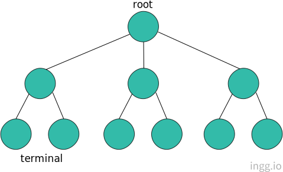
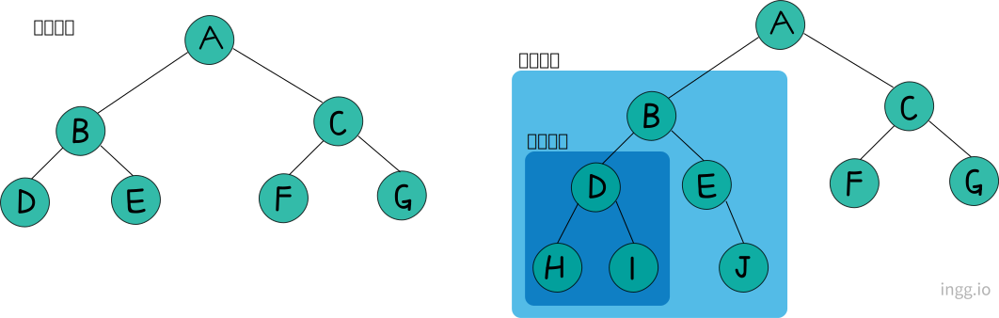
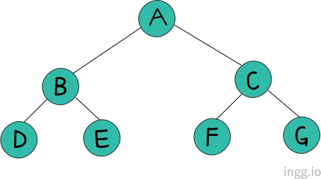
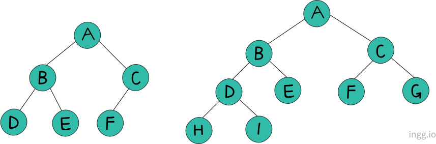
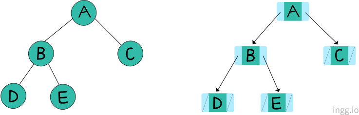
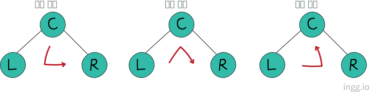
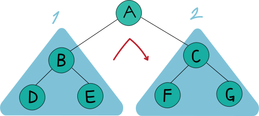
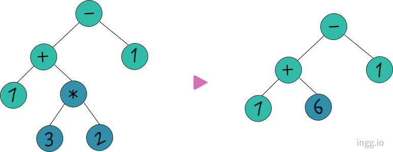
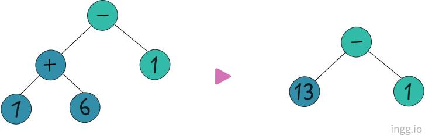
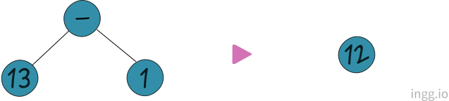

<!--  -->
<center></center>

---

### 📌 Contents

1. [트리란?](#intro)
1. [이진트리](#binarytree)
2. [수식트리](#exptree)

---

<br>


### <a name="intro"></a>트리 개념

<hr>

트리(Tree)는 비선형 자료구조이며, 계층적 자료구조이다. 노드를 표현하는 주요 용어는 다음과 같다.

- 루트 노드(root node) : 연결된 노드가 한군데로 모이는 최상위 노드
- 차수(degree) : 한 노드에 연결된 서브 트리의 개수
- 부모 노드(parent node) : 현재 노드의 바로 상위노드
- 자식 노드(child node) : 부모 노드의 반대 개념
- 형제 노드(sibling node) : 같은 부모 노드를 갖는 노드 사이
- 리프 노드(leaf node) : 최하위 노드. 단말 노드(terminal node) 라고도 한다.

<br>

#### 이진 트리(Binary Tree), 서브 트리(Sub Tree)




각 노드가 최대 두 개의 자식 노드를 가지는 트리를 이진트리라고 하고, 큰 트리에 속하는 작은 트리를 서브 트리라고 한다.

<br>

#### 포화 이진 트리(Full Binary Tree)

<!--  -->

<center></center>


포화 이진 트리는 리프 노드를 제외한 모든 노드가 두 개의 자식을 가지고 있는 트리이다. 즉, 모든 레벨이 꽉 찬 이진 트리를 말한다.

<br>

#### 완전 이진 트리(Complete Binary Tree)




완전 이진 트리는 리프 노드들이 트리의 왼쪽부터 차곡차곡 채워진 트리이다.

<br>

### <a name="binarytree"></a>이진트리 구현

<hr>



이진 트리는 배열과 연결리스트 둘다 구현 가능하지만 연결리스트로 표현하는 것이 더 유연하다.

```c
void MakeLeftSubTree(BTreeNode * main, BTreeNode * sub)
{
    if(main->left != NULL)
        free(main->left);

    main->left = sub;
}

void MakeRightSubTree(BTreeNode * main, BTreeNode * sub)
{
    if(main->right != NULL)
        free(main->right);

    main->right = sub;
}
```

위의 두 함수는 왼쪽 또는 오른쪽 서브트리가 존재하면 해당 트리를 삭제하고 새로운 왼쪽 또는 오른쪽 서브트리를 연결한다.

<br>

### 이진트리 순회

<hr>


둘 이상의 노드로 이뤄진 서브트리를 삭제하려면 모든 노드를 방문해야 한다. 모든 노드를 방문하는 것을 **순회**라고 한다. 순회에는 대표적으로 세 가지 방법이 있다.




- 전위 순회(Preorder Traversal) : 루트 노드를 먼저 방문
- 중위 순회(Inorder Traversal) : 루트 노드를 중간에 방문
- 후위 순회(Postorder Traversal) : 루트 노드를 마지막에 방문

<br>

<!--  -->
<center></center>


높이가 2 이상인 이진 트리는 순회를 재귀적으로 구현하면 된다.

<br>

- 중위 순회 함수

```c
void InorderTraverse(BTreeNode * bt)
{
    InorderTraverse(bt->left);      //왼쪽(1번) 서브트리 순회
    printf("%d \n", bt->data);      //루트노드 방문
    InorderTraverse(bt->right);     //오른쪽(2번) 서브트리 순회
}
```

- 탈출 조건을 추가한 순회

```c{3-4}
void InorderTraverse(BTreeNode * bt)
{
    if(bt == NULL)
        return;

    InorderTraverse(bt->left);
    printf("%d \n", bt->data);
    InorderTraverse(bt->right);
}
```

전위 순회와 후위 순회함수는 아래와 같다. 루트 노드를 방문하는 문장의 위치만 다르다.

- 전위 순회 함수

```c
void PreorderTraverse(BTreeNode * bt)
{
    if(bt == NULL)
        return;

    printf("%d \n", bt->data);
    InorderTraverse(bt->left);
    InorderTraverse(bt->right);
}
```

- 후위 순회 함수

```c
void PostorderTraverse(BTreeNode * bt)
{
    if(bt == NULL)
        return;

    InorderTraverse(bt->left);
    InorderTraverse(bt->right);
    printf("%d \n", bt->data);
}
```

<br>

### <a name="exptree"></a>수식 트리(Expression Tree)

<hr>

수식 트리는 이진 트리를 이용해 수식을 표현한 것이다. 수식 트리는 루트 노드에 저장된 연산자의 연산을 하되, 두 개의 자식 노드에 저장된 두 피연산자를 대상으로 연산을 한다.



<br>




<br>



<br>

#### 후위 표기법 기반 수식트리 구성

중위 표기법의 수식을 수식 트리로 바로 표현하기는 어려우므로 **후위 표기법을 거쳐서** 수식 트리로 표현한다. 후위 표기법 수식에서 앞에 나오는 피연산자와 연산자로 트리 하단을 만들고, 수식 트리 윗부분을 구성해 나간다.

```c
BTreeNode * MakeExpTree(char exp[]);
```

이 함수는 후위 표기법의 수식을 문자열 형태로 입력받고, 수식 트리를 구성하고 수식트리의 루트 노드의 주소값을 반환한다.

```c
// ...(헤더파일 생략)

BTreeNode * MakeExpTree(char exp[])
{
    Stack stack;
    BTreeNode * pnode;

    int expLen = strlen(exp);
    int i;

    StackInit(&stack);

    for(i = 0; i<expLen; i++)
    {
        pnode = MakeBTreeNode();

        if(isdigit(exp[i]))     //피연산자일 경우
        {
            SetData(pnode, exp[i]-'0');     //문자를 정수로 변경
        }
        else        //연산자일 경우
        {
            MakeRightSubTree(pnode, SPop(&stack));
            MakeLeftSubTree(pnode, SPop(&stack));
            SetData(pnode, exp[i]);
        }
        SPush(&stack, pnode);
    }
    return SPop(&stack);
}
```

과정은 다음과 같다.

- 피연산자는 스택으로 옮긴다.
- 연산자는 스택에서 두 개의 피연산자를 꺼내 자식노드로 연결한다.
- 자식 노드를 연결해서 만든 트리는 다시 스택으로 옮긴다.

`if`는 피연산자일 때, `else`는 연산자일 때를 말한다. **_exp[i]-'0'_** 는 문자를 정수로 바꾼다. (0은 _ASCII_ 코드 값으로 48, 1은 49, 2는 50 ... 이므로 문자 '1'을 정수 1로 바꾸려면 '1'-'0'으로 표현하면 된다.)

<br>

### 수식 트리 순회

<hr>

수식 트리를 순회하는 코드는 먼저 노드에 저장된 데이터를 출력하는 함수를 정의하고, 위에서 구현한 순회 함수들을 이용한다.

- 노드에 저장된 데이터를 출력

```c
void PrintNodeData(int data)
{
    if(0<=data && data<=9)
        printf("%d ", data);    //피연산자 출력
    else
        printf("%c ", data);    //연산자 출력
}
```

- 전위 표기법으로 수식 출력

```c
void PrintPrefixTypeExp(BTreeNode * bt)
{
    PreorderTraverse(bt, PrintNodeData);
}
```

- 중위 표기법으로 수식 출력

```c
void PrintInfixTypeExp(BTreeNode * bt)
{
    InorderTraverse(bt, PrintNodeData);
}
```

- 후위 표기법으로 수식 출력

```c
void PrintPostfixTypeExp(BTreeNode * bt)
{
    PostorderTraverse(bt, PrintNodeData);
}
```

<br>

### 수식 트리 계산

<hr>

```c
int EvaluateExpTree(BTreeNode * bt);
```

이 함수는 인자로 전달된 수식트리의 수식을 계산해서 결과를 반환한다.

```c
int EvaluateExpTree(BTreeNode * bt)
{
    int op1, op2;

    op1 = GetData(GetLeftSubTree(bt));      //첫번째 피연산자
    op2 = GetData(GetRightSubTree(bt));     //두번째 피연산자

    switch(GetData(bt))
    {
        ...생략
    }
}
```

이 함수는 두 개의 자식노드의 두 피연산자를 확인하고 부모노드에 저장된 연산자로 연산한다. 그러나 자식 노드에 피연산자가 아닌 서브 트리가 있다면 문제가 된다. 따라서 재귀적으로 다시 바꿀 수 있다.

```c{5-6}
int EvaluateExpTree(BTreeNode * bt)
{
    int op1, op2;

    op1 = EvaluateExpTree(GetLeftSubTree(bt));      //왼쪽 서브 트리 계산
    op2 = EvaluateExpTree(GetRightSubTree(bt));     //오른쪽 서브 트리 계산

    switch(GetData(bt))
    {
        ...생략
    }
}
```

이렇게 하면 서브트리의 서브트리가 있어도 문제가 없다. 여기에 자식노드가 단말노드일 경우를 고려하고 재귀함수 탈출조건을 추가하여 완성한 코드는 아래와 같다.

```c{6-7}
int EvaluateExpTree(BTreeNode * bt)
{
    int op1, op2;

    //단말 노드일 경우
    if(GetLeftSubTree(bt)==NULL && GetRightSubTree(bt)==NULL)
        return GetData(bt);

    op1 = EvaluateExpTree(GetLeftSubTree(bt));
    op2 = EvaluateExpTree(GetRightSubTree(bt));

    switch(GetData(bt))
    {
        case '+';
            return op1+op2;
        case '-';
            return op1-op2;
        case '*';
            return op1*op2;
        case '/';
            return op1/op2;
    }
    return 0;
}
```

서브 트리가 추가로 달려있지 않은 단말노드 주소값이면, 그 단말노드에 저장된 피연산자를 반환한다.
<!-- <br> -->

#### main함수

수식 트리의 main함수 예시이다.

```c
int main(void)
{
    char exp[] = "31+7*";
    BTreeNode * eTree = MakeExpTree(exp);

    printf("전위 표기법으로 출력: ");
    PrintPrefixTypeExp(eTree);

    printf("중위 표기법으로 출력: ");
    PrintInfixTypeExp(eTree);

    printf("후위 표기법으로 출력: ");
    PrintPostfixTypeExp(eTree);

    printf("계산 결과: %d \n", EvaluateExpTree(eTree));

    return 0;
}
```

```
전위 표기법으로 출력: * + 3 1 7
중위 표기법으로 출력: 3 + 1 * 7
후위 표기법으로 출력: 3 1 + 7 *

계산 결과: 28
```
