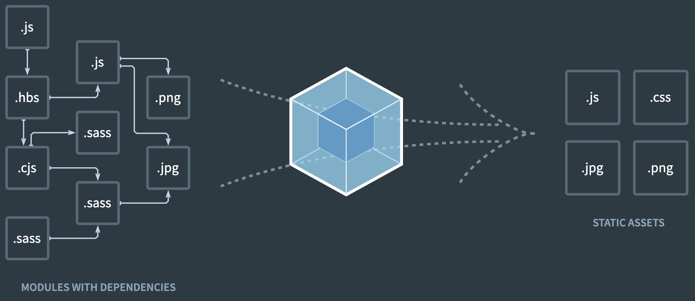
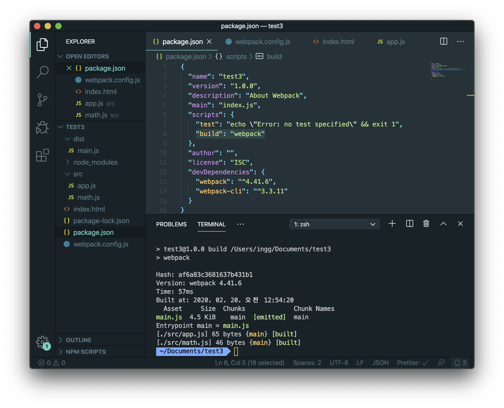

**Webpack**은 여러개 파일을 하나의 파일로 합쳐주는 **모듈 번들러(Module bundler)**이다.<br>

> **Webpack**을 쓰는 이유는 무엇일까?<br>

표준화된 모듈화 기법이 등장한 것은 **ES2015**부터인데, Webpack이 필요한 이유를 알기 위해서는 모듈화 역사를 알아볼 필요가 있다.
<br>

---

### 📌 Contents

1. [Intro](#intro)
2. [IIFE](#iife)
3. [CommonJS와 AMD](#cjs-amd)
4. [Webpack](#webpack)

---

<br>

### <a name="intro"></a>1. Intro

<hr>

#### import / export 구문이 없었던 모듈 이전 상황

자바스크립트는 `script` 태그를 사용하여 외부의 스크립트 파일을 가져올 수는 있지만, 파일마다 독립적인 파일 스코프를 갖지 않고 하나의 **전역 객체(Global Object)**를 공유한다.

예를들어 _math.js_ 와 *app.js*를 스크립트 태그에 넣는다고 하자. *math.js*을 먼저 로딩하고 *app.js*을 로딩한다.

```html{5,6}
<!DOCTYPE html>
<html>
  <head> </head>
  <body>
    <script src="./src/math.js"></script>
    <script src="./src/app.js"></script>
  </body>
</html>
```

이때 각각 같은 변수이름을 사용한다면 가장 뒤에쓰인 스크립트를 기준으로 변수이름이 적용된다.

- _math.js_

```js
function sum(x, y) {
  return x + y;
}
```

<br>

- _app.js_

```js
sum(1, 2)

console.log(sum(1, 2)); // 3
```

<br>

#### 전역 스코프에 함수가 노출되면 생기는 문제점

여기서 문제는 `sum`이 전역스코프에 노출되는 것이다.

```
sum = 1;

sum(3, 4)	//Uncaught TypeError: sum is not a function
```

만약 _sum_ 에 1을 새롭게 할당한다면 이제는 *sum*이라는 함수를 호출할 수 없는 상황이 된다. 즉, 다른파일에서 같은 변수이름을 쓰면 충돌한다. 이렇게 스코프 문제가 발생하고, 의존성 관리 문제도 해결되지 않으므로 모듈화를 구현하기 어렵다.

<!-- + 의존성 관리와 로드시간문제 -->

<!-- script 태그로 모듈을 가져오는 방식은 파일을 가져올 수 있을 뿐, 함수나 객체를 가져올 수 없다. -->
<br>

### <a name="iife"></a>2. IIFE

<hr>

**즉시 실행 함수 표현(IIFE, Immediately Invoked Function Expression)**은 정의되자마자 즉시 실행되는 Javascript Function 를 말한다.

```js
(function() {
  statements
})()
```

<br>

IIFE 내부에서 정의된 변수는 외부 범위에서 접근이 불가능하다.

```js
(function() {
  var aName = "Mary"
})()

aName // Uncaught ReferenceError: aName is not defined
```

<br>

IIFE를 변수에 할당하면 IIFE 자체는 저장되지 않고, 함수가 실행된 결과만 저장된다.

```js
var result = (function() {
  var name = "Mary"
  return name
})()
// 즉시 결과를 생성
result // "Mary"
```

<br>

IIFE는 스코프 문제를 해결했지만 바로 실행한다는 점에서 모듈화의 해결책은 아니다.
이렇게 모듈기능은 반드시 해결해야할 과제였다. 그래서 제안된 것이 **AMD와 CommonJS**이다.

<br>

### <a name="cjs-amd"></a>3.CommonJS와 AMD

<hr>

#### CommonJS

[CommonJS](http://www.commonjs.org/)는 자바스크립트를 브라우저에서뿐만 아니라, 서버사이드 애플리케이션이나 데스크톱 애플리케이션에서도 사용하려고 조직한 자발적 워킹 그룹이다. 대표적으로 서버 사이드 플랫폼인 **_Node.js_**에서 이를 사용한다.

`exports` 키워드로 모듈을 만들고 `require()` 함수로 임포트하는 방식이다.

1. 전역변수와 지역변수를 분리하여 모듈이 독립적인 실행 영역을 갖게 된다.
2. _script_ 태그로 파일을 가져오는 것이 아니라 필요한 함수나 변수를 가져올 수 있다.
3. *exports*와 *require*를 이용하여 의존성 관리도 편해졌다.

이렇게 **CommonJS**는 모듈화의 조건을 충족시키지만 이 방식은 브라우저에서는 필요한 모듈을 모두 내려받을 때까지 아무것도 할 수 없게 된다는 결정적인 단점이 있었다.

#### AMD

**AMD(Asynchronous Module Definition)**는 비동기로 로딩되는 환경에서 모듈을 사용하는 것이 목표다.
이 방식은 `define` 함수 내에 코드를 작성함으로써 스코프 분리가 가능하다.

```
define(['./foo.js', './boo.js'], function(foo, boo){
//
})
```

<!-- 단점 ::: AMD 그리고 이에 기반한 모듈 로더 require.js 에도 문제가 있었습니다. 기술적인 문제라기보다는 레거시의 문제 혹은 대세의 문제였습니다.
첫번째 문제는 서버사이드에서 쓰려고 만든 함수를 브라우저에서 쓰려면 AMD 형식에 맞춰서 다 바꿔주어야 하는 “귀찮음”이 바로 그 문제였습니다. 즉, 같은 내용을 서버사이드 함수로도 쓰고 AMD 형식으로도 써야 합니다. 물론, r.js라는 변환 스크립트를 통해 CJS스타일을 AMD스타일로 변환하는 것을 도와주기는 했습니다만, 모든 상황을 완벽하게 커버하지는 못했습니다.
두번째 문제로, cjs와 amd가 앞다퉈 모듈화기법의 베이스를 만든지 1년 채 안된 2010년 즈음, npm이 등장하고 그때 이후로 많은 개발자들이 자발적으로 node.js의 세계에 자신이 만든 멋진 모듈들을 업로드하기 시작했다는 점입니다. 이들은 대부분 CJS 형식으로 만들어졌습니다. CJS 스타일로 만든 코드를 AMD 스타일로 변환해야할 상황들이 더욱 많아졌습니다.

붉은 선이 npm에 등록된 모듈의 수 입니다. 현재 등록된 모듈의 수만 해도 70만개로, npm 릴리즈 초창기에 해당하는 7년 전에 비해 140배 성장률을 기록하고 있군요.
많은 사람들은 CJS를 사용하고 있었고, 또 그만큼 많은 사람들이 웹에 올리기 위해 AMD 스타일에 맞춰서 변환하고 있었습니다. 무엇인가 변화가 필요했습니다. 귀찮은 과정을 쳐내는, 혹은 통합시켜주는 툴이 필요했습니다 -->
<br>

#### ES6 모듈

ES6에서는 **export**를 이용해 모듈로 만들고 **import**로 가져온다.

- **_math.js_**

```js
export function sum(x, y) {
  return x + y
}
```

<br>

- **_app.js_**

```js
import * as math from "./math.js"
// import {sum} from "./math.js"
// sum만 가져오고 싶다면 이렇게 사용할 수도 있다.

console.log(math.sum(1, 2));
```

`import * as name`은 모든 **export**를 가져오고 `name` 매개 변수는 모듈 객체의 이름으로, **export**를 참조하기위한 일종의 네임 스페이스로 사용된다.

ES6에서는 클라이언트 사이드 자바스크립트에서도 동작하는 모듈 기능을 [추가](https://developer.mozilla.org/en-US/docs/Web/JavaScript/Reference/Statements/import)했다. _script_ 태그에 `type="module"` 속성을 추가하면 모듈로 사용할 수 있다.

```html
<script type="module" src="./src/app.js"></script>
```

이때는 **_app.js_**에서 **_math_**를 가져오기 때문에 **_math.js_**은 따로 로드하지 않아도 된다.

그러나 아직까지는 모든 브라우저에서 지원하지 않기 때문에 브라우저와 무관하게 사용할 수 있는 모듈이 필요하다.
(브라우저의 모듈 지원 상황은 [여기](https://caniuse.com/#search=module)에서 볼 수 있다.)

<br>

### <a name="webpack"></a>4.Webpack

<hr>



그래서 웹팩을 사용한다. 웹팩은 하나의 시작점(**Entry point**)으로부터 의존적인 모듈을 전부 찾아내서 하나의 파일로 만든다. 이 결과물을 **Output**이라고 한다.

#### 4-1. 설치

Webpack4 이후 버전부터는 cli를 같이 설치해야 커맨드라인에서 사용할 수 있다.

```
$ npm install --save-dev webpack

// 특정 버전 설치
$ npm install --save-dev webpack@<version>
```

```
$ npm install --save-dev webpack-cli
```

`--save-dev`옵션이나 `-D`옵션을 추가하여 설치하면 _package.json_ 파일안에서
**_dependencies_**가 아니라 **_devDependencies_**에 기록이 되는데, 라이브러리를 설치할때 어플리케이션에서 직접쓰이는것과 개발환경에 쓰이는 것을 이렇게 분리하여 설치하는 것이 좋다.

```json
// ex)

"dependencies": {
  "react-switch": "^5.0.1"
},
"devDependencies": {
  "prettier": "^1.19.1",
    "webpack": "^4.41.6",
    "webpack-cli": "^3.3.11"
},
```

> cf) npm install (plugin) --save는 빌드시 플러그인이 포함되지만, npm install (plugin) --save-dev로 설치한 플러그인은 --production 빌드시 해당 플러그인이 포함되지않는다.

<br>

#### 4-2. webpack.config.js

**_webpack.config.js_**은 Webpack이 실행될 때 참조하는 설정 파일이다. 최상단에 `webpack.config.js` 파일을 만들면 이를 웹팩에서 자동으로 사용한다.

```js
const path = require("path")

module.exports = {
  mode: "development",
  entry: {
    main: "./src/app.js",
  },
  output: {
    filename: "[name].js",
    path: path.resolve("./dist"),
  },
}
```

첫줄의 **path**는 경로를 만들어주며 **Node.js**에 기본으로깔려있는 패키지이다. 웹팩자체가 노드에서 돌아가기 때문에 이 모듈도 노드형 모듈을 사용한 것이다.
`import path from "path"` 와 같다. (**_webpack.config.js_**는 모던자바스크립트 파일이 아니라서,
import를 쓸 수 없다.)



이제 **_package.json_**의 **_script_** 에 build명령어로 webpack을 추가하고
`npm run build`를 실행하면 결과물이 **_main.js_** 이며 **_dist_** 디렉토리가 생성되는 것을 확인할 수 있다.
**_dist_** 디렉토리 안에는 코드들이 합쳐진 **_main.js_** 가 하위 파일로 생성된다.

- **_index.html_**

```html
<script src="./dist/main.js"></script>
```

따라서 **_index.html_** 에서는 `./src/app.js`가아니라 `./dist/main.js`를 로드하면된다.
이제 모듈을 지원하지않는 브라우저에서도 동작하는 코드가 됐다. 또한 브라우저가 모듈시스템을 지원하지 않아도 되기때문에 *type*을 명시하지 않아도 된다.

<!--
<br>

### 핵심 개념

<br>

- Entry
- Output
- Loaders
- Plugins
- Mode
- Browser Compatibility -->

#### 4-3. Concepts

- _Mode_

*mode*는 `development, production, none`이 있는데
*development*는 개발환경의 결과물을 만들때, 운영환경에서는 *production*을 사용한다.

```js{2}
module.exports = {
  mode: "development",
  ...
```

<br>

- _Entry_

**entry**는 최초 진입점이다. 시작점 경로를 지정하는 옵션이다.
기본값은 `./src/index.js` 이고, 다르게 설정할 수 있다. _(다중엔트리 포인트를 설정할 수도 있다.)_

```js
// webpack.config.js

module.exports = {
  entry: {
    main: "./path/to/my/entry/file.js",
  },
}
```

<br>

- _Output_

**output**은 번들링 결과물을 위치할 경로다. `path.resolve()`함수는 절대경로 주소를 얻어온다.

```js
// webpack.config.js

const path = require("path")

module.exports = {
  output: {
    filename: "bundle.js",
    path: path.resolve(__dirname, "./dist"),
  },
}
```

`[name]`옵션은 entry에서 설정한 값을 포함한다. 주로 다중 엔트리 포인트를 만들때 쓴다.

```js{7}
module.exports = {
  entry: {
    app: "./src/app.js",
    search: "./src/search.js",
  },
  output: {
    filename: "[name].js",
    path: __dirname + "/dist",
  },
}
```

<br>

- _Loader_

로더는 웹팩이 웹 애플리케이션을 해석할 때 자바스크립트 파일이 아닌 것들을 변환할 수 있도록 도와준다.
파일을 다른 언어 *(ex : TypeScript)*에서 *JavaScript*로 변환하거나
인라인 이미지를 데이터 *URL*로 로드 할 수 있다.
또한 자바스크립트 모듈에서 직접 CSS파일을 `import`할 수 있다.

#### Loader를 쓰는 이유

위의 *app.js*에서 *style.css*파일을 만들어 **import**하고 웹팩을 빌드하면 오류가 발생한다.

```css
body {
  background-color: red;
}
```

```js{2}
import * as math from "./math.js"
import "./style.css"

console.log(math.sum(1, 2))
```

```
ERROR in ./src/style.css 1:5
Module parse failed: Unexpected token (1:5)
You may need an appropriate loader to handle this file type, currently no loaders are configured
to process this file. See https://webpack.js.org/concepts#loaders
```

css모듈을 파싱하는 과정에서 오류 메세지가 나오고 적절한 로더를 사용해야 한다고 말해준다.

#### css-loader

*css-loader*를 설치하고 *webpack.config.js*파일에 설정을 추가한다.

```
$ npm install --save-dev css-loader
```

```js{10-16}
//webpack.config.js
module.exports = {
  mode: "development",
  entry: {
   ...
  },
  output: {
    ...
  },
  module: {
    rules: [
      {
        test: /\.css$/,         // .css로 끝나는 모든 파일
        use: "css-loader"       // css-loader를 적용
      }
    ]
  }
};
```

`test`에 사용된 것은 **정규표현식(regular expression)**으로, 로더를 적용할 파일 유형이다. CSS인 파일을 전부 찾아준다.
`/\.(scss|sass)$/`  이렇게 `|`을 넣어서 *scss*와 *sass*파일을 찾게할수도 있다.
`use`는 해당 파일에 적용할 로더의 이름이다.

적용후 빌드하면 **_dist/main.js_**에서 *css*코드가 *js*코드로 변환된 것을 볼 수 있다.

#### style-loader

*style-loader*는 *css*를 **DOM**에 삽입한다. 모듈로 변경된 스타일 시트는 돔에 추가되어야 브라우저가 해석할 수 있다.
*css-loader*로 처리하면 자바스크립트 코드로만 변경되었을 뿐 **DOM**에 적용되지 않았기 때문에 스타일시트가 적용되지 않았다.

```
npm install --save-dev style-loader
```

```js{6}
module.exports = {
  module: {
    rules: [
      {
        test: /\.css$/,
        use: ["style-loader", "css-loader"],
      },
    ],
  },
}
```

따라서 *style-loader*를 이용하면 자바스크립트로 변경된 스타일시트를 동적으로 돔에 추가할 수 있다.
`.css` 확장자로 끝나는 모듈을 읽어 들여 *css-loader*를 적용하는 것이 먼저이므로 *css-loader*앞에 *style-loader*를 쓴다. (오른쪽부터 적용)

이제 빌드하면 html에서 css가 적용된 것을 볼 수 있다.

> **Loader 적용 순서**<br>
> : 여러 개의 로더를 사용하는 경우 로더가 적용되는 순서에 주의해야 한다.
> 로더는 기본적으로 **_오른쪽에서 왼쪽 순 (또는 아래에서 위쪽)_**으로 적용된다.
> 아래 예제에서 실행은 *sass-loader*로 시작하고 *css-loader*로 계속되고 마지막으로 *style-loader*로 끝난다.

```js
module.exports = {
  module: {
    rules: [
      {
        test: /\.css$/,
        use: [
          { loader: "style-loader" },
          {
            loader: "css-loader",
            options: {
              modules: true,
            },
          },
          { loader: "sass-loader" },
        ],
      },
    ],
  },
}
```

\* 기타 다른 로더들은 Webpack의 [Docs](https://webpack.js.org/loaders/)를 참고

<br>

- _Plugin_

웹팩의 기본적인 동작에 추가적인 기능을 제공하는 속성이다.
로더는 파일을 해석하고 변환하는 과정에 관여하는 반면, 플러그인은 해당 결과물의 형태를 바꾸는 역할을 한다.

Plugin은 **클래스** 형태로 정의하고 _apply_ 라는 **메소드**를 정의하며, [event hook](https://webpack.js.org/api/compiler-hooks/)을 tap안에 지정한다.

```js
//helloworld-plugin.js

class HelloWorldPlugin {
  apply(compiler) {
    compiler.hooks.done.tap("Hello World Plugin", stats => {
      /* stats is passed as argument when done hook is tapped. */
      console.log("Hello World!")
    })
  }
}

module.exports = HelloWorldPlugin
```

그 다음 플러그인을 사용하려면 *webpack.config.js*의 `plugins` 배열에 **생성자 함수**로 생성한 객체 인스턴스를 포함한다.

```js{2,15}
const path = require("path");
const HelloWorldPlugin = require("./helloworld-plugin");

module.exports = {
  mode: "development",
  entry: {
      ...
  },
  output: {
      ...
  },
  module: {
      ...
  },
  plugins: [new HelloWorldPlugin()],
}
```

```
$ npm run build

> test3@1.0.0 build /Users/ingg/Documents/test3
> webpack

Hello World!
Hash: b6f189fa57dc5a2bc07
...
```

<br>

#### BannerPlugin

BannerPlugin을 이용해서 결과물에 빌드 정보나 커밋정보를 추가할 수 있다.

```js{3,8-12}
//webpack.config.js
const path = require("path");
const webpack = require("webpack");

module.exports = {
  // ...(생략)
  },
  plugins: [
    new webpack.BannerPlugin({
      banner: "hello world"
    })
  ]
};
```

```js{3}
// dist/main.js

/*! hello world */
/******/ (function(modules) { // webpackBootstrap
/******  ....
```

아래와 같이 빌드 날짜와 시간을 함수로 전달할 수도 있다.

```js
plugins: [
  new webpack.BannerPlugin({
    banner: () => `빌드 날짜: ${new Date().toLocaleString()}`,
  }),
]
```

```js{1}
/*! 빌드 날짜: 2020. 2. 23. 오전 2:03:48 */
/******/ (function(modules) { // webpackBootstrap
/******  ....
```

배너 정보가 많다면 파일로 따로 분리하자.

```js
//banner.js
const childProcess = require("child_process");

module.exports = function banner() {
  const commit = childProcess.execSync("git rev-parse --short HEAD");
  const user = childProcess.execSync("git config user.name");
  const date = new Date().toLocaleString();

  return (
    `commitVersion: ${commit}` + `Build Date: ${date}\n` + `Author: ${user}`
  )
}
```

```js{3-4, 8}
//webpack.config.js
const path = require("path");
const webpack = require("webpack");
const banner = require("./banner.js");

module.exports = {
  // ...(생략)
  plugins: [new webpack.BannerPlugin(banner)],
}
```

`npm run build`하면 이런식으로 _git커밋 버전, git커밋 유저, 날짜_ 가 남겨지는 것을 볼 수 있다.

```js{4-6}
// dist/main.js

/*!
 * commitVersion: 1edb52a
 * Build Date: 2020. 2. 23. 오전 2:16:13
 * Author: InKyoJeong
 *
 */
 ...
```

그밖에 자주사용하는 플러그인으로는 `DefinePlugin`, `HtmlWebpackPlugin`, `CleanWebpackPlugin`, `MiniCssExtractPlugin` 등이 있다.
[(참고)](https://webpack.js.org/plugins/)

<br>

> Reference

- [MDN - IIFE](https://developer.mozilla.org/docs/Glossary/IIFE)
- [JavaScript 표준을 위한 움직임: CommonJS와 AMD](https://d2.naver.com/helloworld/12864)
- [Webpack - concepts](https://webpack.js.org/concepts/)
      <!-- - [lecture-frontend-dev-env](https://github.com/jeonghwan-kim/lecture-frontend-dev-env) -->
- [Webpack - compiler hooks](https://webpack.js.org/api/compiler-hooks/)
 * [참고 : 정규표현식 해석해주는 사이트](https://regexper.com/) 
