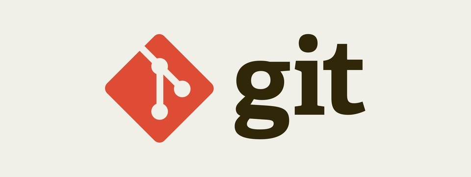

**Git Workflow**란 Git을 이용해 생산적인 방식으로 작업을 수행하는 방법에 대한 권장 사항이다. 이 워크플로우들은 엄격한 규칙이라기보다는 가이드라인으로 삼을 수 있도록 설계되었기 때문에 각자의 필요에 따라 선택하면 된다.
<br>

---

### 📌 Contents

1. [Centralized Workflow](#centralized-workflow)
2. [Feature Branch Workflow](#feature-branch-workflow)
3. [Gitflow Workflow](#gitflow-workflow)
4. [Forking Workflow](#forking-workflow)

---

<br>

### <a name="centralized-workflow"></a>1. Centralized Workflow

<hr>


**Centralized Workflow**는 단일 중앙 레포지토리를 사용하기 때문에 **_master_** 브랜치만 이용한다.

### 1-1. 작동 원리

개발자들은 중앙 레포지토리를 `clone`하여 시작한다. 공식 프로젝트의 변경을 올리려면 로컬 마스터 브랜치를 중앙 레포지토리로 `push`한다.

#### 중앙 레포지토리 초기화


먼저, 누군가 중앙 레포지토리를 서버에 만들어야한다. 만약 새로운 프로젝트라면 빈 레포지토리를 초기화 할 수 있다. 아니면 기존의 Git 또는 SVN 레포지토리를 `import`해야한다.

#### 변경하고 커밋하기

레포지토리가 로컬로 복제되면, 개발자는 표준 Git 커밋 프로세스를 따라 변경할 수 있다.

```
$ git status
$ git add <some-file>
$ git commit -m "<message>"
```

<br>

#### 새로운 커밋을 중앙 저장소로 푸시

로컬 레포지토리에 새로운 변경 내용이 커밋되면 다른 개발자들과 공유하기 위해 `push`되어야한다.

```
$ git push origin master
```

<br>

#### 충돌 관리

만약 개발자의 로컬 커밋이 중앙 레포지토리의 커밋 이력과 충돌한다면, Git은 `push`를 거절한다.


따라서 개발자가 기능을 발행하기 전에 수정된 중앙 커밋을 `fetch`하고 `rebase`해야 한다. 다른 팀원이 이미 변경한 내용에 자신의 변경 내용을 추가하는 것이다.

`rebase`도중에 중앙 저장소의 변경 내용과 충돌이 발생하면 Git은 충돌을 수동으로 해결하라고 한다.

<!-- 충돌을 해결한 후에는 해당 사항을 새로운 커밋으로 만들어 머지나 리베이스를 완료하고 중앙 저장소에 푸시합니다.  -->

문제가 생길 경우 `rebase`를 중단하고 다시 시도할 수 있다.

### 1-2. 예시

<!-- Let’s take a general example at how a typical small team would collaborate using this workflow. We’ll see how two developers, John and Mary, can work on separate features and share their contributions via a centralized repository. -->

John과 Mary 두 개발자가 이 workflow를 이용하여 협업한다고 가정하자.

#### John의 작업


John은 로컬 레포지토리에서 Git 커밋 프로세스에 따라 기능 개발한다. 이 명령은 로컬 커밋을 생성하므로 John은 중앙 레포지토리와 상관없이 원하는 만큼 이 프로세스를 반복 할 수 있다.

#### Mary의 작업


Mary도 같은 프로세스에 따라 로컬 레포지토리에서 기능 개발한다.

#### John의 작업 내용 발행


John이 기능 개발을 끝내면 다른 팀원이 액세스할 수 있게 자신의 로컬 커밋을 중앙 레포지토리로 발행한다.

```
$ git push origin master
```

지역 저장소의 브랜치를 `origin`, 즉 원격 저장소의 **_master_**브랜치로 푸시하라는 명령이다.

John이 `clone`한 이후 중앙 저장소가 변경되지 않았으므로 충돌없이 `push`된다.

#### Mary의 작업 내용 발행 시도


그 다음으로 Mary도 `push`한다면 무슨 일이 일어나는지 살펴보자.

```
$ git push origin master
```

Mary의 커밋 이력은 중앙 저장소의 최신 커밋 이력을 포함하고 있지 않기 때문에, 중앙 저장소는 Mary의 `push`를 거절한다.

```
error: failed to push some refs to '/path/to/repo.git'
hint: Updates were rejected because the tip of your current branch is behind
hint: its remote counterpart. Merge the remote changes (e.g. 'git pull')
hint: before pushing again.
hint: See the 'Note about fast-forwards' in 'git push --help' for details.
```

따라서 Mary는 먼저 John의 업데이트 내용을 자신의 레포지토리로 `pull`한 뒤에 자신의 로컬 커밋 이력과 통합하고 다시 `push`할 필요가 있다.

#### Mary의 rebase


Mary는 `git pull`명령으로 중앙 저장소의 변경 이력을 로컬 저장소로 내려 받는다.
이 명령은 중앙 저장소의 최신 이력을 내려받는 동시에 이를 로컬 이력과 합치는 역할을 한다.

```
$ git pull --rebase origin master
```

`--rebase`옵션은 중앙 레포지토리의 변경 사항과 동기화 한 후 Mary의 커밋을 **_master_**브랜치의 끝으로 이동시킨다.


#### Mary의 merge충돌 해결


만약 Mary와 John이 서로 상관없는 기능 작업을 했다면 `rebase`과정에서 충돌은 거의 일어나지 않는다. 그러나 충돌이 발생한다면 Git은 현재 커밋에서 `rebase`를 멈추고 다음과 같은 메세지를 출력한다.

```
CONFLICT (content): Merge conflict in <some-file>
```


Git의 가장 큰 장점은 병합 충돌을 해결할 수 있다는 것이다. Mary는 `git status`명령으로 충돌된 부분을 찾을 수 있다.

```
# Unmerged paths:
# (use "git reset HEAD <some-file>..." to unstage)
# (use "git add/rm <some-file>..." as appropriate to mark resolution)
#
# both modified: <some-file>
```

그런 다음 Mary는 파일을 수정하고 스테이지에 올린 후 `rebase`를 다시 실행한다.

( `rebase` 의 경우 충돌 부분을 수정 한 후에는 `commit`이 아니라 `rebase`명령에 `--continue` 옵션을 지정하여 실행해야 한다.)

```
$ git add <some-file>
$ git rebase --continue
```

<br>

만약 `rebase`자체를 취소하려면 `--abort` 옵션을 지정하면 된다.

```
$ git rebase --abort
```

#### Mary의 작업 발행 성공


중앙 저장소의 커밋 이력과 로컬 커밋 이력을 모두 합쳤으면, 이제 중앙 저장소에 성공적으로 올릴 수 있다.

```
$ git push origin master
```

<br>

### <a name="feature-branch-workflow"></a>2. Feature Branch Workflow

<hr>

**Feature Branch Workflow**의 핵심은 기능 개발이 **_master_** 브랜치가 아니라 기능별로 나눠진 브랜치에서 이루어 진다는 것이다.

### 2-1. 작동 원리

게발자들은 **_master_** 브랜치에 직접 커밋하지 않고, 새로운 개발을 할 때마다 새로운 브랜치를 만든다.
기능 브랜치들은 `animated-menu-items`또는 `issue-#1061`같이 기술적인 이름을 사용한다.

또한 기능 브랜치를 중앙 저장소로 푸시할 수 있다. 따라서 공식 코드를 건드리지 않고 다른 개발자와 기능을 공유할 수 있다.

### 2-2. Pull Requests

분리된 기능 개발 외에도, 브랜치는 풀 리퀘스트를 이용해서 변경 사항을 논의할 수 있다.
누군가 기능 개발을 마치면 **_master_** 로 직접 병합하지 않고 기능 브랜치를 중앙 저장소에 올리고 **_master_** 에 병합해 달라고 요청한다. 이를 통해 메인 코드베이스에 적용하기 전에 변경을 검토할 수 있다.

풀 리퀘스트가 수락되면, 기능을 게시하는 실제 작업은 **_Centralized Workflow_** 와 거의 동일하다.

### 2-3. 예시

새로운 기능의 풀 리퀘스트에 대해 코드 리뷰를 수행하는 팀의 예시이다.

#### Mary의 작업


Mary는 기능 개발을 하기전에 독립된 브랜치를 만들고 이동한다.

```
$ git branch marys-feature
$ git checkout marys-feature
```

이 브랜치에서 Mary는 기능을 개발하고 커밋한다.

```
$ git status
$ git add <some-file>
$ git commit
```

<br>

#### Mary의 점심 시간


Mary는 아침에 새 브랜치에 몇 가지 커밋을 추가했다. 점심 식사를 하기전 중앙 저장소로 푸시하려고 한다.

```
$ git push -u origin marys-feature
```

> 여기서 `-u` 옵션은 지역 저장소의 브랜치를 원격 저장소의 **_master_** 브랜치에 연결하기 위한 것으로 처음에 한 번만 사용하면 된다.

#### Mary의 기능 개발 완료


점심 식사를 마친 Mary가 기능 개발을 완료한다. **_master_** 브랜치에 병합하기 전에 풀 리퀘스트를 올려 팀 구성원들에게 자신의 작업 완료 사실을 알린다. 물론 그전에 중앙 저장소가 자신의 최신 커밋을 반영하도록 한다.

```
$ git push
```

이제 Mary는 `marys-feature`를 `master`에 병합하는 풀 리퀘스트를 올린다.

#### Bill의 풀 리퀘스트 검토


Bill은 `marys-feature`브랜치를 검토하고 프로젝트에 통합하기전 몇 가지 사항을 변경하기로 결정한다.

#### Mary의 수정


Mary는 수정을 사항을 반영하고 커밋, 푸시한다. 그녀의 모든 활동이 풀 요청에 나타나고 Bill은 계속해서 의견을 남길 수 있다.

또한 Bill은 `marys-feature`브랜치를 자신의 로컬 저장소에 `pull`해서 직접 수정할 수도 있다.

#### Mary의 기능 개발 완료


Bill이 풀 리퀘스트를 수락할 준비가되면 누군가 병합해야한다. (Bill 또는 Mary누구나 수행할 수 있다.)

```
$ git checkout master
$ git pull
$ git pull origin marys-feature
$ git push
```

**_master_** 브랜치로 이동하여 가져온 `marys-feature`브랜치의 내용을 로컬의 **_master_** 브랜치와 병합한다. 마지막으로 병합된 **_master_** 브랜치를 중앙 저장소로 푸시한다.
<br>


### <a name="gitflow-workflow"></a>3. Gitflow Workflow

<hr>

Gitflow Workflow는 [Vincent Driessen](https://nvie.com/posts/a-successful-git-branching-model/)이 처음 제시한 것이다. 프로젝트 릴리즈 중심으로 설계된 엄격한 브랜칭 모델을 제시한다. Gitflow는 출시주기가 예정된 프로젝트에 이상적이다. feature브랜치 외에도 릴리스를 준비, 유지 보수 및 기록하기 위해 개별 브랜치를 사용한다. 물론 Feature Branch Workflow의 모든 이점 (풀 리퀘스트, 효율적인 협업 등)을 활용할 수 있다.

### <a name="forking-workflow"></a>4. Forking Workflow

<hr>

Forking Workflow는 다른 Git Workflow와 근본적으로 다르다. 단일 서버 측 레포지토리를 사용하여 "중앙" 코드베이스로 작동하는 대신 모든 개발자에게 자체 서버 측 리포지토리를 제공한다. 이것은 각 기여자가 두개의 Git 레포지토리(하나는 개인로컬, 하나는 공용서버용)를 가진다는 것을 의미한다. Forking Workflow는 대부분의 오픈 소스 프로젝트에서 볼 수 있다.

<br>


> Reference

- https://www.atlassian.com/git/tutorials/comparing-workflows 를 참고하여 수정 및 번역한 글입니다.
